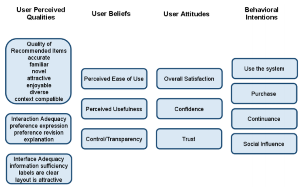
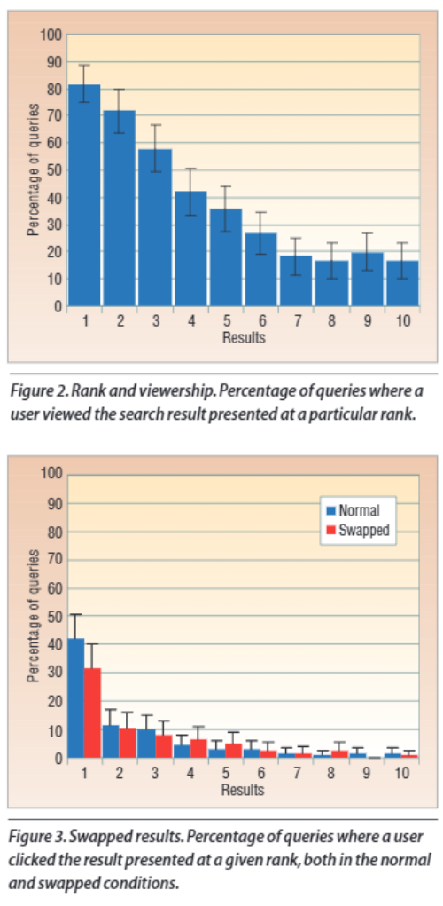

# Introduction to Recommender Systems

## What to focus on

Klíčové pojmy (v tomto byste neměli při zkoušce zaváhat):
 - co je doporučovací systém, co je jeho cílem, typický input & output,
 - základní taxonomie algoritmů (non-personalized, collaborative, content based, knowledge-based, hybrid) + příklady

Klíčové algoritmy (měli byste být schopni je poměrně detailně popsat - tak abych uvěřil, že je případně dokážete i naprogramovat):
 - user/item-based KNN,
 - faktorizace matic (stochastic gradient descend),
 - základní content-based metody (podobnosti CB vlastností a jejich úskalí, TF-IDF, Vector Space Model)
 - item2vec (word2vec pro situaci, kdy zaměníme sekvence zobrazených items za věty)
 - multi-armed bandits (znát detailně alespoň jednu metodu výběru ramen)

Vědět co jsou / na jakém principu fungují / co zhruba obsahují:
 - evaluace doporučovacích systémů ( off-line / user study / A/B testing; cross-validation; click through rate /  conversions / precision / recall / RMSE / nDCG / MAP; proč je nutné provádět evaluaci? Jak poznat že je jeden  doporučovač lepší než jiný?)
 - context-aware recommendation: způsoby zapojení kontextu + typické varianty kontextu (teprve bude probráno),
 - sequence-based / sequence-aware doporučování a vyhodnocování
 - explanations: proč jsou důležité + jak je vytvářet (teprve bude probráno),
 - implicit / explicit feedback: příklady, výhody a nevýhody, jak zpětnou vazbu zpracovávat
 - content-based vs. knowledge-based algoritmy,
 - typické nasazení doporučovacích algoritmů + jaké přístupy se hodí (homepage/kategorie/detail produktu; doporučování v  sociálních sítích; POIs - points of interest; hudební doporučovače; doporučování módy... )
 - typické problémy doporučovacích systémů (sparsity/cold start problem, quality of content, scalability, up-to-date  modely),
 - deep learning (convolutional neural network, autoencoders, recurrent neural networks, 2vec models + kdy se (ne)dají použít, jaké jsou jejich (ne)výhody)

Mít (argumenty podloženou) představu o vhodném návrhu RecSys dle
 - velikosti datové sady, sparsity, kvality CB dat
 - rychlosti stárnutí objektů / fluktuace uživatelů
 - domény + cílů uživatelů a provozovatele
 - cílových zařízeních,...
 - cca v rozsahu co jste dělali ve dvojcích/trojcích na cvičení podle zadaného webu

## Recommender System

### **Definition**

Recommender Systems
 - Users do not know what they want (or do not know how to ask for it)
 - RS tries to understand user’s needs through observed behavior (provide suitable results for these needs without being explicitly asked)
 - Implicit query

> RS are software agents that elicit the interests and preferences of individual consumers […] and make recommendations accordingly. They have the potential to support and improve the quality of the decisions consumers make while searching for and selecting products online. (Xiao & Benbasat 20071)

#### Search Engines

 - Users know in advance what they want (and is able to specify it)
 - Explicit query submitted by the user
 - Evaluation through known „correct“ answers for the query


#### Personalized Adds
 - Except from being stupid most of the time (blame the lack of feedback and devs. vision)
 - Mostly works extra-site, without elementary indication of user’s needs
   - Often, the basic principle of RecSys (mutual benefits) is violated


### Purpose and success criteria

Different perspectives/aspects
 - Depends on domain and purpose
 - No holistic evaluation scenario exists (there is no „correct“ recommender)

Retrieval perspective (search engine)
 - Reduce search costs (you could find it as well, but this is faster)
 - Provide "correct" proposals

Recommendation perspective
 - Serendipity – identify items from the Long Tail


### Approaches

#### Collaborative filtering

> Tell me what is popular among my peers

 - User profile & contextual parameters
 - community data

##### Problems

 - snowball effect
 - **coldstart**

#### Content-based

> Show me more of what I have liked

#### Knowledge-based

> Tell me what fits my needs the best

#### Hybrid

> Composition of before mentioned systems

### Lifecycle

 1. Get User Feedback
 2. Learn user preference
 3. Upon demand,  recommend objects

 - The process is asynchronous  by nature
 - That seriously complicate things

## Algorithms

### Simple non-personalized recommending algorithms

 1. popularity based
 2. > who did this, did that as well
   - SQL aggregation query
   - item to item recommendation

### Simple personalized recommending algorithms

 1. user-based KNN
   - KNN - k nearest neighbours (k items that are the most similar to item X)
   - we have some list of past actions
   - based on list of past actions (like ratings of movies, with some similarity - cosine etc), find KNN


## Collaborative filtering

> Tell me what is popular among my peers

(used to be; < 2014) The most prominent approach to generate recommendations
 - used by large, commercial e-commerce sites
 - well-understood, various algorithms and variations exist
 - applicable in many domains (book, movies, DVDs, ..)

Approach
 - use the "wisdom of the crowd" to recommend items

Basic assumption and idea
 - Users give ratings to catalog items (implicitly or explicitly)
 - Customers who had similar tastes in the past, will have similar tastes in the future

### Approach

Input
 - Only a matrix of given user–item ratings

Output types
 - A (numerical) prediction indicating to what degree the current user will like or dislike a certain item
   - Less relevant nowadays
   - Shown somewhere in the product description
 - A top-N list of recommended items
   - This is what you need in the end anyway

### User-based nearest-neighbor collaborative filtering

Assumption
 - user preferences remain stable and consistent over time
   - solution
     - decay of relevance
     - remove old data
     - detect changes in preference

Technique
- given active user Alice and an item i
  - find a set of users who liked the same items alice in the past and who rated i
  - use e.g. avg of their ratings to predict if alice likes i
  - repeat for all items unseen by the user and recommend the best-rated

To solve:
 1. how to measure similarity of users
    - Pearson correlation (Jaccard similarity, cosine similarity)
      - It takes into account the biases
      - Assumption: what is rated below average was disliked
 2. how many neighbors should be considered
    - can be trained
      - only some degree of similarity wanted etc
 3. how to generate the rating of the item from other users
    - average + weight based deviation


User-based KNN is said to be "memory-based"
 - the rating matrix is directly used to find neighbors / make predictions
   - Everything is calculated at the time of the request
 - does not scale for most real-world scenarios
 - large e-commerce sites / social networks have tens of millions of customers and millions of items

Model-based approaches
 - based on an offline pre-processing or "model-learning" phase
   - Represent users and/or items as a set of features, which are easy to operate with
 - at run-time, only the learned model is used to make predictions
 - models are updated / re-trained periodically
 - large variety of techniques used
 - model-building and updating can be computationally expensive
 - **item-based KNN is an example for model-based approaches**

### Item-based nearest-neighbor collaborative filtering

Similarity between items, not users, to make predictions

> Out of the items rated by user A, we find the most similar items to item i based on rating by other users, and make the prediction based on the rating given by the user A to those similar items.

(Inverse of User based)

Advantage:
 - based on the ratio of users to items and stability of those vectors


 - Pre-processing approach by Amazon.com (in 2003)
 - Calculate all pair-wise item similarities in advance


#### Pros:

 - well-understood, works well in some domains, no knowledge engineering required

#### Cons:
 - requires user community, sparsity problems, no integration of other knowledge sources, no explanation of results


#### Questions:

1. What is the best CF method?
   - In which situation and which domain? Inconsistent findings; always the same domains and data sets; differences between methods are often very small (1/100)
2. How to evaluate the prediction quality?
   - separate lecture on this – gets even more important nowdays
   - MAE / RMSE: What does an MAE of 0.7 actually mean?
   - Serendipity (novelty and surprising effect of recommendations)
     - Not yet fully understood (still true)
4. What about multi-dimensional ratings?
   - not many application domains - instead, what about implicit feedback

### Other approaches

 - Recurrsive CF
 - Graph based
   - Spreading activation
 - Association rule mining
   - Market Basket Analysis
 - Probabilistic methods

## Ratings

### Explicit ratings

 - **Probably the most precise ratings** (ehm... Attribute ratings, reviews, detailed implicit feedback nowadays...)
 - Most commonly used (1 to 5, 1 to 7 Likert response scales, likes/dislikes)
 - Research topics
   - Optimal granularity of scale; indication that 10-point scale is better accepted in movie dom.
     - Different domains addopted other common scales
   - Multidimensional ratings (multiple ratings per movie such as ratings for actors and sound)
     - Booking.com rating

Main problems
 - **Users not always willing to rate many items**
   - number of available ratings could be too small → sparse rating matrices → poor recommendation quality
 - How to stimulate users to rate more items?
 - What else to use?

### Implicit ratings (feedback)

 - Typically collected by the web shop or application in which the recommender system is embedded
 - When a customer buys an item, for instance, many recommender systems interpret this behavior as a positive rating
 - Clicks, page views, time spent on some page, demo downloads …
 - Implicit ratings can be collected constantly and do not require additional efforts from the side of the user
 - Implicit ratings can be used in addition to explicit ones; question of correctness of interpretation

Main problem
 - One cannot be sure whether the user **behavior** is **correctly interpreted**
 - For example, a user might not like all the books he or she has bought; the user also might have bought a book for someone else


## Cold start problem (Data sparsity problems)

How to recommend **new items** (invisible)? What to recommend to **new users** (nothing to recommend to him)?

### Straightforward approaches
 - Ask/force users to rate a set of items
   - they will hate you
 - Use another method (e.g., content-based, demographic or simply non-personalized) in the initial phase
   - bias problems from "previous versions", but generally OK
 - Default voting: assign default values to items that only one of the two users to be compared has rated (Breese et al. 1998)
   - ... And the performance is...

### Alternatives
 - Use better algorithms (beyond nearest-neighbor approaches)
 - Example:
   - In nearest-neighbor approaches, the set of sufficiently similar neighbors might be too small to make good predictions
   - Assume "transitivity" of neighborhoods

### Problem illustration


## Matrix completion (factorization)


### Decomposition how to

Comes from machine learning

Gradient descent

Target function:
 - sum of squared errors + regularization (without it it would be good on training data, not on actual predictions)


 - where  λ  is the weight of the regularization term (i. e., a constant giving the importance of the regularization term)
 - Minimization of the above loss function using stochastic gradient descent (or any other optimization algorithms)

Through derivations of the before mentioned function, or rather the partial loss functions that summed up make up the original one, it adjusts the values of factors

### Algorithm

Input: matrix M with n rows and m columns, integer K,  real number eps, real number lambda
```
Create U and V matrices and initialize their values randomly (U has n rows, K columns; V has K rows, m columns)
While U x V does not approximate M well enough (or the maximal number of iterations is not reached)
    For each known element x of M in a random order
        Let i and j denote the row and column of x
        Let x’ be the dot product of the corresponding row of U and column of V
        err = x’ – x
        for (k=0; k < K; k++)
            u_i,k(i,k) 🡨 u_i,k(i,k) - eps*err*v_k,j(k,j) – lambda*u_i,k(i,k)
            analogous for v_k,j
        end for
    end for
end while
```

### How to set the parameters ε, λ and K ?

 - ε - affects speed/rate and ability of convergence - local VS global min
 - λ - regularization parameter - limits/binds the value (prevents obviously big incorrect values)
 - K - limits the theoretical minimum of the error / how much it can learn

1. Select a subset of the known values of M
2. Execute the previous matrix factorisation algorithm using the selected subset only
3. Evaluate the result of the factorisation using the non-selected known values of M, i.e., check how well the product U x V estimates the non-selected, but known values of M
   - In order to measure how well U x V estimates the non-selected, but known values of M, one can use for example the mean absolute error (MAE) or mean squared error (MSE), see e.g. Wikipedia
4. Repeat steps 2 and 3 for various settings of the values of the parameters, and select the parameter values that give the best result
5. Execute the algorithm using the selected  parameter values using ALL the known values of M, and finally estimate the missing values of M using the product of U and V

### Disadvantages

 - Static set of items and users (what about new ones?)
    - Batch-trained – newest response is never in the models
    - Iterative local updates possible, but new users/items are stil a problem
 - Optimize w.r.t. Irrelevant error (RMSE)
   - training against minimal rating error but we want minimal ranking error
 - Learning rate vs. Regularization hyperparameters
 - Local optimum vs. global optimum
   - More ellaborated optimizers
     - https://ruder.io/optimizing-gradient-descent/
 - Memory-efficient implementation
   - sparse representation of M
   - Sparse matrix in scipy.sparse (i,j,value)


 - some avg rating
 - bias of a user
   - some users rate higher in general
 - bias of an item
   - good in general?
 - latent factors of the user/item
   - multidimensional

### BPR factorization

Takes into account ranking correctness

Instead of rating errors, focus on ranking correctness
 - Triples of user, good and bad object
 - For these pairs, good object should be rated higher than the bad one
 - (unary feedback originally, but graded possible)

We want to keep the relation of rating of good item for a user is higher than rating of bad item

In practice: bought (known) itemss are good, all else is bad (unknown)


 - bad items should be sampled
 - use sigmoid function to translate ranking error values to binary values

=> 3 rules (update for user, good items, bad items) to replace the updates in the original Alg.

## Content-based recommendation

> Show me more of what I have liked

 - While CF – methods do not require any information about the items,
   - it might be reasonable to exploit such information; and recommend fantasy novels to people who liked fantasy novels in the past
 - What do we need:
   - some information about the available items such as the genre ("content")
   - some sort of user profile describing what the user likes (the preferences)
 - The task:
   - learn user preferences
   - locate/recommend items that are "similar" to the user preferences

### What is the "content"?

 - Most CB-recommendation techniques were applied to recommending text documents.
   - Like web pages or newsgroup messages for example.
   - Now also multimedia content (fashion, music) or e-commerce
 - Content of items can also be represented as text documents.
   - With textual descriptions of their basic characteristics.
   - Structured: Each item is described by the same set of attributes

### Task - simple approach

Compute the similarity of an unseen item with the user profile based on the keyword overlap
(e.g. using the Dice coefficient)

### Representation

In a simple impl: usually keywords/tags


#### Problems

 - in particular when automatically extracted as
   - not every word has similar importance
   - longer documents have a higher chance to have an overlap with the user profile

#### Solution - Standard measure: TF-IDF

 - Encodes text documents in multi-dimensional Euclidian space
   - weighted term vector
 - TF (term frequency): Measures the importance of the term => how often a term appears (density in a document)
   - assuming that important terms appear more often
   - normalization has to be done in order to take document length into account
 - IDF (inverse document frequencys): Important terms should be unique to one document => Aims to reduce the weight of terms that appear in all documents
   - May not be relevant in some cases (e.g. Male vs. Female attribute on dating sites)


### Improving the vector space model

 - 2vec models
 - BERT
 - or similar

#### word2vec

 - turn all words to predefined sized vector

 - if the vector of 2 words is similar, they appear in a similar context

# LATER in detail

##### Text / multivalue

text -> vector of words -> similarity vector (vector of all the words with the values meaning word w_i is in the original text) -> use some similarity to compare items/texts...

##### Nominal / value

similar, jsut text with one word

##### Numeric

some difference rate but there are problems:

 - quantiles
 - cumulative distribution function
#### Other

 - rule based improvements - mostly in preprocessing
 - **feature selection** - is the attribute actually important (holiday description)

### Cosine similarity


### Recommending items

Simple method: **nearest neighbors**
 - we have the user history of items, per item we have its weight a set of similar items, we can aggregate over that and show the top k elements of that list

May be relevant for item-based recommendations
 - Most similar items to the currently viewed one
 - Still used in smaller e-commerce (either based on content or collaborative similarity)

Other options?
 - Any aggregation of user’s preferences?

#### Rocchio's method (Vector Space Model)

User positive and user negative vector + distance (stay close to positive and far from negative)

Originally for „conversational“ (interactive/iterative) query retrieval systems
Query-based retrieval: Rocchio's method
The SMART System: Users are allowed to rate (relevant/irrelevant) retrieved documents (feedback)
The system then learns a prototype of relevant/irrelevant documents
Queries are then automatically extended with additional terms/weight of relevant documents

The paradigm fits well also for recommender systems

Some modern loss functions are based on a similar principles (e.g. Contrastive loss for siamese networks)


### Disadvantages

**the bubble**

Overspecialization
 - Algorithms tend to propose **"more of the same"**
 - Or: too similar news items
 - Multicriterial optimization (diversity, novelty), fairness-aware approaches

Keywords alone may not be sufficient to judge quality/relevance of a document or web page
 - up-to-date-ness, usability, aesthetics, writing style
 - **content may also be limited / too short**
 - content may not be automatically extractable (multimedia)
   - Not so big issue today

Ramp-up phase required
 - Some training data is still required
 - Web 2.0: Use other sources to learn the user preferences

### Advantages

no cold-start!!!


## Knowledge-based models

> Tell me what fits my needs the best

Move from recommending similar to recommending better objects

### Motivation

Products with **low number of available ratings** - expensive cars and villas

Time span plays an important role
 - five-year-old ratings for computers
 - user lifestyle or family situation changes

Customers want to **define** their **requirements explicitly**
 - "the color of the car should be black"

### Approaches

1. Constraint-based
   - based on explicitly defined set of recommendation rules _(partially)_ fulfill recommendation rules
2. Case-based
   - Item-based: give me similar items, however with larger display

**(edge of query retrieval and recommender systems)**
 - users specify the requirements
 - systems try to identify solutions
 - if no solution can be found, users change requirements (or partial solution is given)
 - Not always, we may learn knowledge RS rules from collaborative data

#### Constraint-based recommender systems

Knowledge base
 - usually mediates between user model and item properties
 - variables
   - user model features (requirements), Item features (catalogue)
 - set of constraints
   - logical implications (IF user requires A THEN proposed item should possess feature B)
   - hard and soft/weighted constraints
   - solution preferences

Derive a set of recommendable items
 - fulfilling set of applicable constraints
 - applicability of constraints depends on current user model
 - explanations – transparent line of reasoning

##### Tasks

 1. Find a set of user requirements such that a subset of items fulfills all constraints
    - ask user which requirements should be relaxed/modified such that some items exist that do not violate any constraint
 2. Find a subset of items that satisfy the maximum set of weighted constraints
    - similar to find a maximally succeeding subquery (XSS)
    - all proposed items have to fulfill the same set of constraints
    - compute relaxations based on predetermined weights
 3. Rank items according to weights of satisfied soft constraints
    - rank items based on the ratio of fulfilled constraints
    - does not require additional ranking scheme


#### Case-based recommender systems

Items are retrieved using similarity measures

Distance similarity
 - 
   - sim(p, r) expresses for each item attribute value φr(p) its distance to the customer requirement r ∈ REQ
   - w_r is the importance weight for requirement r

In real world, customer  would like to
 - maximize certain properties. i.e. resolution of a camera, "more is better"(MIB)
 - minimize certain properties. i.e. price of a camera, "less is better"(LIB)
 - Target within some values, e.g. Price between x,y


##### Interacting with case-based recommenders

 - Customers maybe not know what they are seeking
 - **Critiquing** is an effective way to support such navigations
 - Customers specify their change requests (price or mpix) that are not satisfied by the current item (entry item)


###### **Compound**

Operate over **multiple properties** can improve the efficiency of recommendation dialogs
You can try to learn attribute-level preferences from the interaction data (if you have them), or apply general policies (item A is better than item B for most settings)


### Limitations

 - cost of knowledge acquisition
   - from domain experts
   - from users
   - from web resources
 - accuracy of preference models
   - very fine granular preference models require many interaction cycles
   - collaborative filtering models preference implicitly
 - independence assumption can be challenged
   - preferences are not always independent from each other
 - No known commercial usage
   - (but the generic concept of price per value with optional personalization is viable)

## RecSys evaluation

> If You want to double your success rate, you should double your failure rate.
(=> experiment a lot)

Types:
 1. Off-line evaluation
    - Based on historical data
    - Aiming to predict hidden part of the data
    - A lot of improvements recently
 2. Lab studies (User Studies)
    - Expressly created for the purpose of the study
    - Extraneous variables can be controlled more easy by selecting study participants
      - Possibility to get more feedback
    - But doubts may exist about participants motivated by money or prizes
    - Participants should behave as they would in a real-world enviroment
 3. Field studies (On-line, A/B testing)
    - Conducted in an preexisting real-world enviroment
    - Users are intrinsically motivated to use a system


### Online studies

Success = more money

A/B testing
 - Evaluate metric as close to the actual target variable as possible
 - Retailer’s target variable is profit
   - i.e. Netflix’s target variable is monthly subscribes
   - Usually, larger overal consumption increase profit
 - Broadcaster’s target variable may be influenceness / total mass of readers

The direct effect on target variables may be too small
 - How much does one small parameter change affect retention of users?

The target variables may be hard to measure directly
- E.g. has long-term effect only / cannot extrapolate all external variables

Proxy variables
 - Loyalty of user, Conversions rate, Basket size / value, Click through rate, Shares / Follows /…


#### Technical metrics

**Always design evaluation metrics with respect to your target variable**


 - **!!Response time!!**
 - Train / re-train / model update time
 - Memory / CPU consumption
   - How large can we grow with current infrastructure?

Recall on objects
 - Is portion of your objects ignored? Are there too many low-profit bestsellers?

Ability to predict
 - Can you calculate recommendations for all users?
 - For which groups of users are we better than baseline?

#### Disadvantage

 - It costs a lot!
 - some users get suboptimal recommendations (solvable)
   - **MULTIARMED BANDITS**
     - use maximum of bandits with minimal regret (the difference of the reward of using too many to using the actual best recsys)
     - Algorithms
       - Epsilon-gready alg
         - we have some stats for recsys 1 through k
         - with propability 1-ε we use the best one, and with ε we choose something else - over time will converge to the best one while not using the sub-par recsys too often
       - Upper confidence bounds
         - 
       - Thompson sampling
         - similar to above, but this uses Beta distribution and based on a random number it chooses


### DarkSide

 - It is possible to incorporate some providers metrics into the recommendation proces
   - i.e. recommend items with higher profit
 - Do that wisely (or, rather, not at all)
   - Your credibility is at stake if someone finds out
   - User trust is in recommendations is one of the most important features determining the long-term effect of recommender  - systems
   - Do not behave like ALZA recently...
     - sued for putting things into shopping carts without users knowing

### Lab studies

 - Same as on-line experiments
 - Questionnaire
   - Features otherwise harder to detect directly
   - Helpfulness / Ease of use / Relevance
   - Trust
   - Novelty to the user etc.
 - Physiological response
   - Eye tracking etc.


 - Key criterion in lab studies is that subjects should well approximate behavior of your real users
   - This may be harder than it seems
   - Carefully consider what tasks to give him/her and then re-think it once more ☺



#### Advantage

 - no real cost in terms of sub-par recomms to real users
 - ability to question afterwards
 - physiological response

#### Disadvantages

 - possible cost
 - are the people in the study actually representative?

### Offline studies

#### Simulation on existing dataset

 - Train / Validation / Test split
   - Random (bootstrap) – only in case of very large datasets
     - **Split data 3 ways**
       - Train
       - Validate
         - mainly if more hyper parameters
         - if best is selected, retrain with train = train + validate
       - Test
         - test the trained model
   - Cross-validation variants
   - **Temporal splits** – better than CV for RecSys (causality problems)
     - however lower support in non-recsys audience
     - also has a problem with the fact that the system is learning on data that is **from a window that is a month ago** (not a real example)
   - Event-based simulation – the best option from causality perspective, most expensive
     - a


Prediction of „correct“ objects
 - According to some metic / metrics

For small data sets:


**Beware of the effect of causality**
 - How did users get to the objects they actually rated?
 - In your data, store available choices
 - In 3rd party data, you may observe general popularity of individual items

Correct evaluation protocol:
 - For each method and set of parameters:
   - Learn model on TRAIN set
   - Evaluate prediction on VALIDATION set
 - Select best parameters for each method
 - For each method:
   - Learn model on TRAIN + VALIDATION set
   - Evaluate prediction on TEST set
 - Compare results

 - **Never use any knowledge of the test set data**
   - E.g. For mean ratings, object similarities etc.

#### Other options:

 - Monte Carlo Cross Validation (select membership to train or test at random)
 - Temporal splits (older data as train set, newer as test set)
   - Prefered if enough data (causality effects)
 - Off-line simulation **(flow of inbound and outbound events)**
   - Important for Reinforcement learning and similar approaches
   - High temporal complexity
 - Various de-biasing techniques (counterfactual / off-policy evaluation, missing-not-at-random)
   - Rather complex topic, hopefully, later today

#### Metrics

 - Relevance of the recommended objects / Ranking metrics
   - User visited / rated / purchased… the objects, which the method recommends
   - **nDCG**, **MAP**, Precision, **Precision@top-k**, Recall, Liftindex, RankingScore,…
 - Rating error metrics
   - User rated some objects, how large is the prediction error on those?
   - MAE, RMSE,…
 - Novelty
   - Does the user already know / visited recommended objects?
   - This may be both positive and negative depending on task
     - However it is always trivial
     - No need of complex system to recommend previously visited objects
 - Diversity
   - Are all the recommendations similar to each other?
   - Relevance vs. Diversity tradeoff
   - **Intra-List Diversity**
 - Coverage
   - how many items were recommended (over time)
 - Serendipity
   - unplanned fortunate discovery
   - new and relevant object


##### Evaluation in information retrieval (IR)


**Precision**: a measure of exactness, determines the fraction of relevant items retrieved out of all items retrieved


**Recall**: a measure of completeness, determines the fraction of relevant items retrieved out of all relevant items


The problem is that that doesnt reflect order and "relevance" => **Limit on top-k**
 - Precision@top-k
 - Recall@top-k


Position within top-k does not matter
 - The list is short enough that user observe it all
 - With increasing k, this becames less applicable

==>

##### Rank aware methods

 - RankScore,
 - Lift index
 - **Normalized Discounted Cumulative Gain**
   - 

 - Rankscore (exponential reduction) < Liftscore (linear red.) < NDCG (log. red.)

###### Mean Average Precision (MAP)

 - a ranked precision metric that places emphasis on highly ranked correct predictions (hits)
 - essentially it is the average of precision values determined after each successful prediction, i.e.


#### Debiasing

##### Biases - Presentation bias


 - What (where) was shown to the user affects what feedback we received
 - How to evaluate novel RS that would recommend something else
   - Than what users received & evaluated
   - Hard question in general, intensive research topic
     - Off-policy evaluation or counterfactual evaluation (what would be the results, if policy B was applied)
     - Part of the feedback received on random(ized) data
     - https://arxiv.org/pdf/1003.0146.pdf (Section 4: evaluation, assuming independence of events)

###### Example



##### Missing not at random for Implicit feedback

 - Classical off-line evaluation expects Missing at random data
 - **absence of (positive) feedback** is either because the item is **unknown positive or irrelevant**
   - For aggregational statistics to be valid, it is important that the chance of being unknown positive or irrelevant is the same for all data with no feedback
   - Not true in real-world for some cases
   - Probability that the item is known by the user => **propensity** (probability - user would use this if it was known to him)
   - Well-known movies may have higher propensity (users ignore them willingly)
     - MISSING NOT AT RANDOM
     - Evaluation should be de-biased accordingly (we need to estimate the propensity)

E.g - I dont rate things I dont like

Paper
 - Thorsten Joachims et al. https://arxiv.org/pdf/1608.04468.pdf; https://ylongqi.com/paper/YangCXWBE18.pdf


