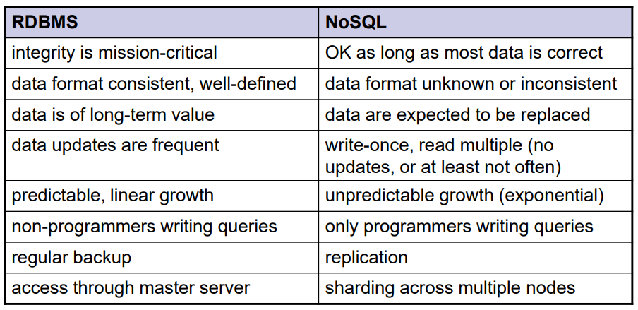

# Modern database systems

## Watched

- [x] Relační model dat, relační databáze. Historický přehled alternativních datových modelů a databázových systémů. Úvod do problematiky Big Data (historie, vlastnosti, datové modely).
- [ ] Přehled a klasifikace databázových systémů a technologií pro efektivní správu a zpracování Big Data.
- [ ] Distribuované souborové systémy. MapReduce – princip, vlastnosti, kritika, alternativní přístupy.
- [ ] Základní principy Big Data managementu. Apache Spark.

- [ ] NoSQL databáze klíč/hodnota.
- [ ] NoSQL databáze sloupcové.
- [ ] NoSQL dokumentové databáze.
- [ ] Grafová data a grafové databáze.

- [ ] Data s více modely. Multi-model databáze.
- [ ] Další typy moderních databází. Jazyk SQL v prostředí Big Data. NewSQL databáze. Databáze polí.
- [ ] Vyhledávací nástroje. Polystores.
- [ ] Pokročilé principy Big Data managementu.

## Outline

- Intro
- Classification
- MapReduce
- BigData management
- KVP dbs
- Column dbs
- Document dbs
- Graph dbs
- Multi-model dbs
- Other dbs types
- Searching
- Advanced principles

## Intro

### Modeling layers

1. Conceptual
   - Highest level of abstraction
   - Modelling of real-world objects and relationships
   - e.g., ER, UML, …
2. Logical
   - Machine interpretable data structures for storing the modelled data
   - e.g., object, relational, object-relational, XML, graph, …
3. Physical
   - How logical database structures are implemented in a specific technical environment
   - e.g., data files, index structures, …

### Relational model

historically the pressumed be all end all model

Advantages:
 - Simplicity
   - of the model
   - of the respective query language
 - After so many years mature and verified database management
systems (DBMSs)
 - Strong mathematical background
 - …

Basic idea:
 - Storing of object and their mutual associations in tables
(relations)
   - A relation R from X to Y is a subset of the Cartesian product X × Y.
 - Row in a table (member of relation) = object/association
 - Column (attribute) = attribute of an object/association
 - Table (relational) schema = name of the schema + list of attributes and their types
 - Schema of a relational database = set of relational schemas

### History

 - First generation: navigational
   - Hierarchical model
   - Network model
 - Second generation: relational
 - Third generation: post-relational
   - Extensions of relational model
     - Object-relational
   - New models reacting to popular technologies
     - Object
     - XML
     - NoSQL (key/value, column, document, graph, …) - Big Data
   - Multi-model systems
   - …
   - Back to the relations
     - NewSQL

## Models

### Hierarchical model

- basically a JSON or an XML

 - forest of trees of records
 - One-to-many relationships
 - First independent = redundancy
   - A record cannot be stored in two different trees without duplication
 - Later links and sharing
 - Data processing: hierarchical, starting from the root, depth-first, leftto-right traversal order
   - First storage on tapes – linear access
   - Later (arrival of discs) direct access thanks to hashing and B-tree
techniques

### Network model (CODASYL)

 - basically a graph

Idea: data records connected through binary relationships
 - Data processing: navigational primitives according to which records are
accessed and updated one at a time
   - Relational query languages: set orientation

### Relational model

 - Optimal for may applications, **BUT**

 - hard to handle many rrelationas/chains or large amount of data

 - New application domains have appeared
   - e.g., GIS
   - Complex data types not supported by the relational model
 - Normalizing data into table form affects performance for
the retrieval of large, complex, and hierarchically
structured data
   - Numerous joins
 - Object-oriented programming languages (OOPLs) have
appeared
   - Defined the concept of user-defined classes

#### Object model and object databases

- Approach I - extend objects with data persistence, i.e., databases
- Approach II - extend databases with objects (`CREATE TYPE`, functions... )

### XML model and databases

 - XML – W3C markup language
   - DTD, XML Schema, XPath, XQuery, XSLT, …
 - XML databases
   - Native vs. XML-enabled
   - Support for XML data type + related technologies

 - SQL/XML - extension to SQL to query and publish XML data/values

## Big data

### Definition

There isnt one - VVV is the closest:

> Gartner: “Big Data” is high volume, high velocity, and/or high variety information assets that require new forms of  processing to enable enhanced decision making, insight discovery and process optimization.

high **v**olume, high **v**elocity, and/or high **v**ariety information assets

 - Gartner
   - Information technology research and advisory
company
   - Founded in 1979 by Gideon Gartner
   - HQ in Stanford, Connecticut, USA
     - /> 5,300 employees
     - /> 12,400 client organizations
   - Provides: competitive analysis reports, industry
overviews, market trend data, product evaluation
reports, …

Characteristics:
 - Volume
   - scale - Data volume is increasing exponentially, not linearly
 - Variety
   - complexity - Various formats, types, and structures (from semi-structured XML to unstructured multimedia)
   - Static data vs. streaming data
 - Velocity
   - speed - Data is being generated fast and need to be processed fast
   - Online Data Analytics
 - Veracity
   - uncertainty - Uncertainty due to inconsistency, incompleteness, latency, ambiguities, or approximations.
 - And there are new V-s like:
   - value,
   - validity,
   - volatility…

### Processing

 - OLTP: Online Transaction Processing (DBMSs)
   - Database applications
   - Storing, querying, multiuser access
 - OLAP: Online Analytical Processing (Data Warehousing)
   - Answer multi-dimensional analytical queries
   - Financial/marketing reporting, budgeting, forecasting, …
 - RTAP: Real-Time Analytic Processing (Big Data
Architecture & Technology)
   - Data gathered & processed in a real-time
     - Streaming fashion
   - Real-time data queried and presented in an online fashion
   - Real-time and history data combined and mined interactively

### Technologies

 - Distributed file
systems
 - **NoSQL databases**
 - Grid computing,
cloud computing
 - MapReduce and
other new
paradigms
 - Large scale
machine learning

### Relational Database Management Systems (RDMBSs)

- Predominant technology for storing structured
data
   - Web and business applications
 - Relational calculus, SQL

### NoSQL

> NoSQL movement = “the whole point of seeking alternatives is that you need to solve a problem that relational databases are a bad fit for”

**Not „no to SQL“**
 - Another option, not the only one
**Not „not only SQL“**
 - Oracle DB or PostgreSQL would fit the definition

Characteristics:
 - being non-relational,
 - distributed,
 - open-source,
 - horizontally scalable

 also:
 - for modern web-scale databases
 - schema-free,
 -  easy replication support,
 -  simple API,
 -  eventually consistent (BASE, not ACID),
 -  support for a huge data amount and more...

#### Relational databases are not going away
 - Compelling arguments for most projects
   - Familiarity, stability, feature set, and available support
 - We should see relational databases as one
option for data storage
   - Polyglot persistence – using different data stores in
different circumstances
   - Search for optimal storage for a particular application
     - Multi-model databases

#### Motivation for NoSQL Databases
 - Huge amounts of data are now handled in realtime
 - Both data and use cases are getting more and
more dynamic
 - Social networks (relying on graph data) have
gained impressive momentum
   - Special type of NoSQL databases: graph databases
 - Full-text has always been treated shabbily by
RDBMS

#### Example

Facebook stack:
 - Cassandra
 - Hadoop/Hive
 - Memcached
 - HBase

Every 60 seconds
 - 317,000 status updates
 - 147,000 photos uploaded
 - 54,000 shared links

#### Advantages

1. Elastic scaling
 - “Classical” database administrators scale up – buy
bigger servers as database load increases
 - Scaling out – distributing the database across multiple
hosts as load increases
2. Big Data
 - Volumes of data that are being stored have increased
massively
 - Opens new dimensions that cannot be handled with
RDBMS
3. Goodbye DBAs (see you later?)
 - Automatic repair, distribution, tuning, … vs. expensive,
highly trained DBAs of RDBMSs
4. Economics
 - Based on cheap commodity servers --> less costs per
transaction/second
5. Flexible Data Models
 - Non-existing/relaxed data schema --> structural changes
cause no overhead

#### Challanges

Over time less and less critical - they are being solved

1. Maturity
 - Still in pre-production phase
 - Key features yet to be implemented
2. Support
 - Mostly open source, result from start-ups
   - Enables fast development
 - Limited resources or credibility
3. Administration
 - Require lot of skill to install and effort to maintain
4. Analytics and Business Intelligence
 - Focused on web apps scenarios
   - Modern Web 2.0 applications
   - Insert-read-update-delete
 - Limited ad-hoc querying
   - Even a simple query requires significant programming expertise
5. Expertise
 - Few number of NoSQL experts available in the market

#### Assumptions

#### NoSQL Data Model

##### Aggregates

 - "inlined data" - duplicates data, but no need for a join, snapshots the data

 - Data model = the model by which the database
organizes data
 - Each NoSQL solution has a different model
   - Key-value, document, column-family, graph
   - First three orient on aggregates
 - Aggregate
   - A data unit with a complex structure
     - Not just a set of tuples like in RDBMS
   - Domain-Driven Design: “an aggregate is a collection
of related objects that we wish to treat as a unit”
     - A unit for data manipulation and management of consistency

Aggregates – aggregate-ignorant
 - RDBMS and graph databases are aggregateignorant

Aggregates – aggregate-oriented
 - Aggregate orientation
   - Aggregates give the database information about
which bits of data will be manipulated together
     - Which should live on the same node
   - Helps greatly with running on a cluster
 - We need to minimize the number of nodes we need to query
when we are gathering data
 - Consequence for transactions
   - NoSQL databases support atomic manipulation of a
single aggregate at a time

##### Materialized Views

 - Pre-computed and cached queries
 - Strategies:
   - Update materialized view when we update the base data
     - For more frequent reads of the view than writes
   - Run batch jobs to update the materialized views at regular
intervals

##### Schemalessness

 - there is usually an implicit schema present

Advantages:
 - Allows to easily change your data storage as we learn more
about the project
 - Easier to deal with non-uniform data

### Analysis Techniques

