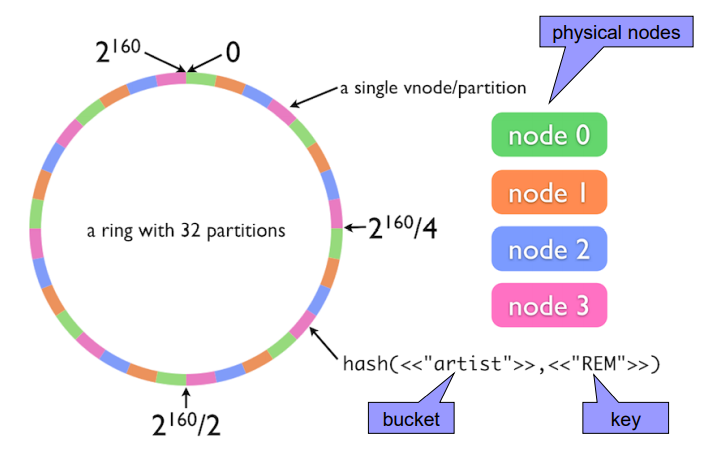
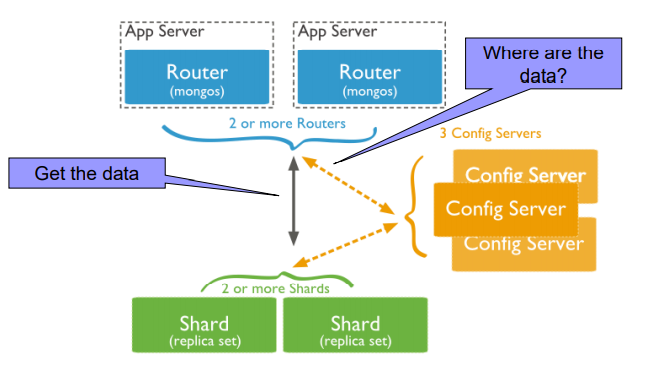
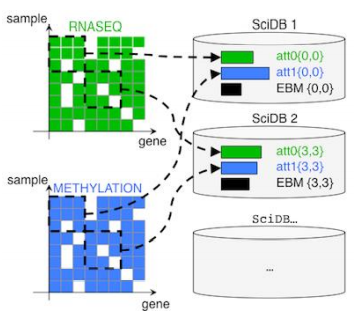

# Modern database systems


## Watched

- [x] Relační model dat, relační databáze. Historický přehled alternativních datových modelů a databázových systémů. Úvod do problematiky Big Data (historie, vlastnosti, datové modely).
- [x] Přehled a klasifikace databázových systémů a technologií pro efektivní správu a zpracování Big Data.
- [x] Distribuované souborové systémy. MapReduce – princip, vlastnosti, kritika, alternativní přístupy.
- [x] Základní principy Big Data managementu. Apache Spark.
- [x] NoSQL databáze klíč/hodnota.

- [x] NoSQL databáze sloupcové.
- [x] NoSQL dokumentové databáze.
- [x] Grafová data a grafové databáze.
- [x] Data s více modely. Multi-model databáze.

- [ ] Další typy moderních databází. Jazyk SQL v prostředí Big Data. NewSQL databáze. Databáze polí.
- [ ] Vyhledávací nástroje. Polystores.
- [ ] Pokročilé principy Big Data managementu.

## Outline

- Intro
- Classification
- MapReduce
- BigData management
- KVP dbs
- Column dbs
- Document dbs
- Graph dbs
- Multi-model dbs
- Other dbs types
- Searching
- Advanced principles

## Intro

### Modeling layers

1. Conceptual
   - Highest level of abstraction
   - Modelling of real-world objects and relationships
   - e.g., ER, UML, …
2. Logical
   - Machine interpretable data structures for storing the modelled data
   - e.g., object, relational, object-relational, XML, graph, …
3. Physical
   - How logical database structures are implemented in a specific technical environment
   - e.g., data files, index structures, …

### Relational model

historically the pressumed be all end all model

Advantages:
 - Simplicity
   - of the model
   - of the respective query language
 - After so many years mature and verified database management
systems (DBMSs)
 - Strong mathematical background
 - …

Basic idea:
 - Storing of object and their mutual associations in tables
(relations)
   - A relation R from X to Y is a subset of the Cartesian product X × Y.
 - Row in a table (member of relation) = object/association
 - Column (attribute) = attribute of an object/association
 - Table (relational) schema = name of the schema + list of attributes and their types
 - Schema of a relational database = set of relational schemas

### History


 - First generation: navigational
   - Hierarchical model
   - Network model
 - Second generation: relational
 - Third generation: post-relational
   - Extensions of relational model
     - Object-relational
   - New models reacting to popular technologies
     - Object
     - XML
     - NoSQL (key/value, column, document, graph, …) - Big Data
   - Multi-model systems
   - …
   - Back to the relations
     - NewSQL


## Models

### Hierarchical model

- basically a JSON or an XML

 - forest of trees of records
 - One-to-many relationships
 - First independent = redundancy
   - A record cannot be stored in two different trees without duplication
 - Later links and sharing
 - Data processing: hierarchical, starting from the root, depth-first, leftto-right traversal order
   - First storage on tapes – linear access
   - Later (arrival of discs) direct access thanks to hashing and B-tree
techniques

### Network model (CODASYL)

 - basically a graph

Idea: data records connected through binary relationships
 - Data processing: navigational primitives according to which records are
accessed and updated one at a time
   - Relational query languages: set orientation

### Relational model

 - Optimal for may applications, **BUT**

 - hard to handle many rrelationas/chains or large amount of data

 - New application domains have appeared
   - e.g., GIS
   - Complex data types not supported by the relational model
 - Normalizing data into table form affects performance for
the retrieval of large, complex, and hierarchically
structured data
   - Numerous joins
 - Object-oriented programming languages (OOPLs) have
appeared
   - Defined the concept of user-defined classes

#### Object model and object databases

- Approach I - extend objects with data persistence, i.e., databases
- Approach II - extend databases with objects (`CREATE TYPE`, functions... )

### XML model and databases

 - XML – W3C markup language
   - DTD, XML Schema, XPath, XQuery, XSLT, …
 - XML databases
   - Native vs. XML-enabled
   - Support for XML data type + related technologies

 - SQL/XML - extension to SQL to query and publish XML data/values

## Big data

### Definition

There isnt one - VVV is the closest:

> Gartner: “Big Data” is high volume, high velocity, and/or high variety information assets that require new forms of  processing to enable enhanced decision making, insight discovery and process optimization.

high **v**olume, high **v**elocity, and/or high **v**ariety information assets

 - Gartner
   - Information technology research and advisory
company
   - Founded in 1979 by Gideon Gartner
   - HQ in Stanford, Connecticut, USA
     - /> 5,300 employees
     - /> 12,400 client organizations
   - Provides: competitive analysis reports, industry
overviews, market trend data, product evaluation
reports, …


Characteristics:
 - Volume
   - scale - Data volume is increasing exponentially, not linearly
 - Variety
   - complexity - Various formats, types, and structures (from semi-structured XML to unstructured multimedia)
   - Static data vs. streaming data
 - Velocity
   - speed - Data is being generated fast and need to be processed fast
   - Online Data Analytics
 - Veracity
   - uncertainty - Uncertainty due to inconsistency, incompleteness, latency, ambiguities, or approximations.
 - And there are new V-s like:
   - value,
   - validity,
   - volatility…

### Processing

 - OLTP: Online Transaction Processing (DBMSs)
   - Database applications
   - Storing, querying, multiuser access
 - OLAP: Online Analytical Processing (Data Warehousing)
   - Answer multi-dimensional analytical queries
   - Financial/marketing reporting, budgeting, forecasting, …
 - RTAP: Real-Time Analytic Processing (Big Data
Architecture & Technology)
   - Data gathered & processed in a real-time
     - Streaming fashion
   - Real-time data queried and presented in an online fashion
   - Real-time and history data combined and mined interactively

### Technologies

 - Distributed file systems
   - e.g., HDFS
 - Distributed databases
   - Primarily **NoSQL databases**
   - And many other types
 - Cloud computing
 - MapReduce and other new paradigms
 - Large scale machine learning
 - Data analytics
   - Batch
   - Real-time
   - Stream

### Relational Database Management Systems (RDMBSs)

- Predominant technology for storing structured
data
   - Web and business applications
 - Relational calculus, SQL

### NoSQL

> NoSQL movement = “the whole point of seeking alternatives is that you need to solve a problem that relational databases are a bad fit for”

**Not „no to SQL“**
 - Another option, not the only one
**Not „not only SQL“**
 - Oracle DB or PostgreSQL would fit the definition

Characteristics:
 - being non-relational,
 - distributed,
 - open-source,
 - horizontally scalable

 also:
 - for modern web-scale databases
 - schema-free,
 -  easy replication support,
 -  simple API,
 -  eventually consistent (BASE, not ACID),
 -  support for a huge data amount and more...

#### Relational databases are not going away
 - Compelling arguments for most projects
   - Familiarity, stability, feature set, and available support
 - We should see relational databases as one
option for data storage
   - Polyglot persistence – using different data stores in
different circumstances
   - Search for optimal storage for a particular application
     - Multi-model databases

#### Motivation for NoSQL Databases
 - Huge amounts of data are now handled in realtime
 - Both data and use cases are getting more and
more dynamic
 - Social networks (relying on graph data) have
gained impressive momentum
   - Special type of NoSQL databases: graph databases
 - Full-text has always been treated shabbily by
RDBMS

#### Example

Facebook stack:
 - Cassandra
 - Hadoop/Hive
 - Memcached
 - HBase

Every 60 seconds
 - 317,000 status updates
 - 147,000 photos uploaded
 - 54,000 shared links

#### Advantages

1. Elastic scaling
 - “Classical” database administrators scale up – buy
bigger servers as database load increases
 - Scaling out – distributing the database across multiple
hosts as load increases
2. Big Data
 - Volumes of data that are being stored have increased
massively
 - Opens new dimensions that cannot be handled with
RDBMS
3. Goodbye DBAs (see you later?)
 - Automatic repair, distribution, tuning, … vs. expensive,
highly trained DBAs of RDBMSs
4. Economics
 - Based on cheap commodity servers --> less costs per
transaction/second
5. Flexible Data Models
 - Non-existing/relaxed data schema --> structural changes
cause no overhead

#### Challanges

Over time less and less critical - they are being solved

1. Maturity
 - Still in pre-production phase
 - Key features yet to be implemented
2. Support
 - Mostly open source, result from start-ups
   - Enables fast development
 - Limited resources or credibility
3. Administration
 - Require lot of skill to install and effort to maintain
4. Analytics and Business Intelligence
 - Focused on web apps scenarios
   - Modern Web 2.0 applications
   - Insert-read-update-delete
 - Limited ad-hoc querying
   - Even a simple query requires significant programming expertise
5. Expertise
 - Few number of NoSQL experts available in the market

#### Assumptions


#### NoSQL Data Model

##### Aggregates

 - "inlined data" - duplicates data, but no need for a join, snapshots the data

 - Data model = the model by which the database
organizes data
 - Each NoSQL solution has a different model
   - Key-value, document, column-family, graph
   - First three orient on aggregates
 - Aggregate
   - A data unit with a complex structure
     - Not just a set of tuples like in RDBMS
   - Domain-Driven Design: “an aggregate is a collection
of related objects that we wish to treat as a unit”
     - A unit for data manipulation and management of consistency

Aggregates – aggregate-ignorant
 - RDBMS and graph databases are aggregateignorant

Aggregates – aggregate-oriented
 - Aggregate orientation
   - Aggregates give the database information about
which bits of data will be manipulated together
     - Which should live on the same node
   - Helps greatly with running on a cluster
 - We need to minimize the number of nodes we need to query
when we are gathering data
 - Consequence for transactions
   - NoSQL databases support atomic manipulation of a
single aggregate at a time

##### Materialized Views

 - Pre-computed and cached queries
 - Strategies:
   - Update materialized view when we update the base data
     - For more frequent reads of the view than writes
   - Run batch jobs to update the materialized views at regular
intervals

##### Schemalessness

 - there is usually an implicit schema present

Advantages:
 - Allows to easily change your data storage as we learn more
about the project
 - Easier to deal with non-uniform data


### Analysis Techniques

 - Association rule learning – discovering interesting relationships, i.e., “association rules,” among variables in large databases
   - e.g., market basket analysis
 - Classification – to identify the categories in which new data points
belong, based on a training set containing data points that have
already been categorized
   - Supervised learning
   - e.g., buying decisions
 - Cluster analysis – classifying objects that split a diverse group into
smaller groups of similar objects
   - Unsupervised learning
 - Data fusion and data integration
 - Signal processing
 - Crowdsourcing - collecting data submitted by a large group of
people or community
 - Data mining - extract patterns from large datasets
   - Involves association rule learning, cluster analysis, classification,
regression, …
 - Time series analysis and forecasting
   - e.g., hourly value of a stock market index
 - Sentiment analysis - identifying the feature/aspect/product about
which a sentiment is being expressed,
   - Determining the type (i.e., positive, negative, or neutral)
   - Determining the degree and strength of the sentiment
 - Visualization, ...

### Cloud computing

 - Way of creating SW
 - Idea: Providing shared IT technologies (HW/SW) and/or
data to computers and other devices on demand
   - Software as a Service (SaaS)
     - For end-users
   - Platform as a Service (PaaS)
     - For developers (tools for SW implementation/deployment)
   - Infrastructure as a Service (IaaS)
     - For providing robust expensive and inaccessible HW
 - Users pay for the usage (rent)
   - Time of usage, size of the data, …
 - Types
   - Private – for internal
usage of a company
   - Public – for anyone
   - Community – for a
selected community
     - Set of customers
   - … and their
combinations

Providers
- MS Azure,
- AWS,
- ...

#### Advantages

 - Users do not have to manage the technologies
   - Buy, install, upgrade, maintain, …
 - Thanks to the Internet can be used anywhere
 - Service provider can provide distinct solutions for
distinct requirements
   - Within the respective capabilities
 - Data stored at server(s) of the cloud can be easily
shared

#### Disadvantages

 - We store our private data on a public cloud
   - Theoretically vulnerable (but the protection techniques are
still being improved)
 - Vendor lock-in
   - Proprietary technologies and solutions
 - High prices
   - For small companies, universities, …

#### Cloud Computing and Big Data

 - We need a cluster of nodes
   - Expensive, demanding installation and maintenance, …

--> Use cloud computing
   - Scalable solutions without the maintenance part
   - For Big Data often cheaper than the HW
     - When the infrastructure is not used, it can be provided to other users
       - E.g. data analysis is done in particular time intervals
   - Easier solutions or even directly particular applications
   - Available “immediately”
 - We can focus on the specific functionality
   - E.g. efficient analytical processing of the data
 - But: the other disadvantages (safety, vendor lock-in) remain

## NoSQL databases

Types:
 - Core:
   - Key-value databases
   - Document databases
   - Column-family (column-oriented/columnar) stores
   - Graph databases
 - Non-core:
   - Object databases
   - XML databases
   - …
 - Further novel extensions:
   - Multi-model databases
   - Array databases
   - NewSQL databases
   - …

## Key-value store

Basic characteristics
 - The simplest NoSQL data stores
 - A simple hash table (map), primarily used when all
access to the database is via primary key
 - A table in RDBMS with two columns, such as ID and
NAME
   - ID column being the key
   - NAME column storing the value
     - A BLOB that the data store just stores
 - Basic operations:
   - Get the value for the key
   - Put a value for a key
   - Delete a key from the data store
 - Simple --> great performance, easily scaled
 - Simple --> not for complex queries, aggregation needs

Providers
- riak
- redis
- memcachedDB, hamsterDB

### Usecases

#### Ideal

Fast, fetch only usecases, no real need to aggregate etc.

 - Storing Session Information
   - Every web session is assigned a unique session_id value
   - Everything about the session can be stored by a single PUT request or retrieved using a single GET
   - Fast, everything is stored in a single object
 - User Profiles, Preferences
   - Every user has a unique user_id, user_name + preferences such as language, colour, time zone, which products the user has access to, …
   - As in the previous case:
     - Fast, single object, single GET/PUT
 - Shopping Cart Data
   - Similar to the previous cases

#### Not

 - Relationships among Data
   - Relationships between different sets of data
   - Some key-value stores provide link-walking features
     - Not usual
 - Multioperation Transactions
   - Saving multiple keys
     - Failure to save any one of them → revert or roll back the rest of the
operations
 - Query by Data
   - Search the keys based on something found in the value part
 - Operations by Sets
   - Operations are limited to one key at a time
   - No way to operate upon multiple keys at the same time

## Column-family stores
(“columnar” or “column-oriented”)

Basic Characteristics
 - Column families = rows that have many columns
associated with a row key
 - Column families are groups of related data that is often
accessed together
   - e.g., for a customer we access all profile information at the same
time, but not orders

Providers:
 - Cassandra
 - google big table, hbase, simpledb

### Example: Cassandra


 - Column = basic unit, consists of a name-value pair
   - Name serves as a key
   - Stored with a timestamp (expired data, resolving conflicts, …)
 - Row ~ value = a collection of columns attached or linked to a key
   - Columns can be added to any row at any time without having to add it to other rows
 - Column family = a collection of similar rows
   - Rows do not have to have the same columns

### Usecases

#### Ideal

Want to see a bit of the value part, have some predefined structure

 - Event Logging
   - Ability to store any data structures → good choice to store event information
 - Content Management Systems, Blogging Platforms
   - We can store blog entries with tags, categories, links, and trackbacks in different columns
   - Comments can be either stored in the same row or moved to a different keyspace
   - Blog users and the actual blogs can be put into different column families

#### Not

 - Systems that Require ACID Transactions
   - Column-family stores are not just a special kind of RDBMSs with variable set of columns!
 - Aggregation of the Data Using Queries
   - (Such as SUM or AVG)
   - Have to be done on the client side
 - For Early Prototypes
   - We are not sure how the query patterns may change
   - As the query patterns change, we have to change the column family design

## Document Databases

"document ~ json, xml"

Basic Characteristics
 - Documents are the main concept
   - Stored and retrieved
   - XML, JSON, …
 - Documents are
   - Self-describing
   - Hierarchical tree data structures
   - Can consist of maps, collections (lists, sets, …), scalar values, nested documents, …
 - Documents in a collection are expected to be similar
   - Their schema can differ
 - Document databases store documents in the value part of the key-value store
   - Key-value stores where the value is examinable

Providers:
- mongodb
- couchdb, rientdb, ravendb

Query language which is expressed via JSON
 - Where clause, sorting, count, sum, showing the execution plan, …

### Data - example

 - Data are similar, but have differences, e.g., in attribute names
   - Still belong to the same collection
 - We can represent
   - A list of cities visited as an array
   - A list of addresses as a list of documents embedded inside the main document


### Usecases

#### Ideal

 - Event Logging
   - Many different applications want to log events
     - Type of data being captured keeps changing
   - Events can be sharded (i.e. divided) by the name of the application or type
of event
 - Content Management Systems, Blogging Platforms
   - Managing user comments, user registrations, profiles, web-facing
documents, …
 - Web Analytics or Real-Time Analytics
   - Parts of the document can be updated
   - New metrics can be easily added without schema changes
     - E.g. adding a member of a list, set,…
 - E-Commerce Applications
   - Flexible schema for products and orders
   - Evolving data models without expensive data migration

#### Not

 - Complex Transactions Spanning Different Operations
   - Atomic cross-document operations
     - Some document databases do support (e.g., RavenDB)

 - Queries against Varying Aggregate Structure
   - Design of aggregate is constantly changing → we need to save the aggregates at the lowest level of granularity
     - i.e. to normalize the data

## Graph Databases

Basic Characteristics
 - To store entities and relationships between these entities
   - Node is an instance of an object
   - Nodes have properties
     - e.g., name
   - Edges have directional significance **(!!!)**
   - Edges have types
     - e.g., likes, friend, …
 - Nodes are organized by relationships
   - Allow to find interesting patterns
   - e.g., “Get all people (= nodes in the graph) employed by Big Co that like (book called) NoSQL Distilled”

Providers:
- neo4j
- rientdb, infinitegraph

### RDBMS vs. Graph Databases

 - When we store a graph-like structure in RDBMS, it is for a single type of relationship
   - “Who is my manager”
 - Adding another relationship usually means a lot of schema changes
 - In RDBMS we model the graph beforehand based on the Traversal we want
   - If the Traversal changes, the data will have to change
   - In graph databases the relationship is not calculated at query time but persisted

### Queries

 - We have to create a relationship between the nodes in
both directions
   - Nodes know about INCOMING and OUTGOING relationships

```java
Node martin = graphDb.createNode();
martin.setProperty("name", "Martin");
Node pramod = graphDb.createNode();
pramod.setProperty("name", "Pramod");
martin.createRelationshipTo(pramod, FRIEND);
pramod.createRelationshipTo(martin, FRIEND);
```

 - Properties of a node/edge can be indexed
 - Indices are queried to find the starting node to begin a traversal

```java
Transaction transaction = graphDb.beginTx();
try
{
    // creating index
    Index<Node> nodeIndex = graphDb.index().forNodes("nodes");

    // adding nodes
    nodeIndex.add(martin, "name", martin.getProperty("name"));
    nodeIndex.add(pramod, "name", pramod.getProperty("name"));
    transaction.success();
}
finally
{
    transaction.finish();
}

// retrieving a node
Node martin = nodeIndex.get("name", "Martin").getSingle();

// getting all its relationships
allRelationships = martin.getRelationships();
```

 - We are interested in determining if there are
multiple paths, finding all of the paths, the
shortest path, …

```java
Node barbara = nodeIndex.get("name", "Barbara").getSingle();
Node jill = nodeIndex.get("name", "Jill").getSingle();
PathFinder<Path> finder1 = GraphAlgoFactory.allPaths(Traversal.expanderForTypes(FRIEND,Direction.OUTGOING), MAX_DEPTH);
Iterable<Path> paths = finder1.findAllPaths(barbara, jill);
PathFinder<Path> finder2 = GraphAlgoFactory.shortestPath(Traversal.expanderForTypes(FRIEND, Direction.OUTGOING), MAX_DEPTH);
Iterable<Path> paths = finder2.findAllPaths(barbara, jill);
```

### Usecases

#### Ideal

 - Connected Data
   - Social networks
   - Any link-rich domain is well suited for graph databases
 - Routing, Dispatch, and Location-Based Services
   - Node = location or address that has a delivery
   - Graph = nodes where a delivery has to be made
   - Relationships = distance
 - Recommendation Engines
   - “your friends also bought this product”
   - “when invoicing this item, these other items are usually invoiced”

#### Not

 - When we want to update all or a subset of entities
   - Changing a property on all the nodes is not a straightforward operation
   - e.g., analytics solution where all entities may need to be updated with a changed property
 - Some graph databases may be unable to handle lots of data
   - Distribution of a graph is difficult

## NoSQL Data Model

Aggregates and NoSQL databases

 - Key-value database
   - Aggregate = some big blob of mostly meaningless bits
     - But we can store anything
   - We can only access an aggregate by lookup based on
its key
 - Document database
   - Enables to see the structure in an aggregate
     - But we are limited by the structure when storing (similarity)
   - We can submit queries to the database based on the
fields in the aggregate

 - Column-family stores
   - A two-level aggregate structure
     - The first key is a row identifier, picking up the aggregate of interest
     - The second-level values are referred to as columns
   - Ways to think about how the data is structured:
     - Row-oriented: each row is an aggregate with column families representing useful chunks of data (profile, order history)
     - Column-oriented: each column family defines a record type (e.g., customer profiles) with rows for each of the records; a row is the join of records in all column families
 - Multi-model stores
   - Combine various data models, including aggreagateoriented
   - Support references and queries across the models

## Apache Hadoop

Distributed filesystem

 - Open-source software framework
 - Running of applications on large clusters of commodity hardware
   - Multi-terabyte data-sets
   - Thousands of nodes
 - Derived from Google's MapReduce and Google File System (GFS)
   - Not open-source

### Modules

 - Hadoop Common
   - Common utilities
   - Support for other Hadoop modules
 - **Hadoop Distributed File System (HDFS)**
   - Distributed file system
   - High-throughput access to application data
 - Hadoop YARN
   - Framework for job scheduling and cluster resource management
 - **Hadoop MapReduce**
   - System for parallel processing of large data sets

### Related projects

 - Avro – a data serialization system
 - **Cassandra** – a scalable multi-master database with no single points
of failure
 - Chukwa – a data collection system for managing large distributed
systems
 - **HBase** – a scalable, distributed column-family database that
supports structured data storage for large tables
 - **Hive** – data warehouse infrastructure that provides data
summarization and ad hoc querying
 - Mahout – scalable machine learning and data mining library
 - Pig – high-level data-flow language and execution framework for
parallel computation
 - ZooKeeper – high-performance coordination service for distributed
applications

### HDFS

 - Free and open source
 - Crossplatform
   - Pure Java
   - Has bindings for non-Java programming languages
 - Fault-tolerant
 - Highly scalable

#### Idea

**“failure is the norm rather than exception”**

 - A HDFS instance may consist of thousands of machines
   - Each storing a part of the file system’s data
 -  Each component has non-trivial probability of failure
 - → **Assumption: “There is always some component that is non-functional.”**
   -  Detection of faults
   -  Quick, automatic recovery

#### Data Characteristics

 - Assumes:
   -  Streaming data access
   -  Batch processing rather than interactive user access
 - Large data sets and files
 - Write-once / read-many
   -  A file once created, written and closed does not need to be
changed
     - Or not often
   -  This assumption simplifies coherency
 - Optimal applications for this model: MapReduce, webcrawlers, …

#### Structure

NameNode, DataNodes
 - Master/slave architecture
 - HDFS exposes file system namespace
 - File is internally split into one or more blocks
   - Typical block size is 64MB (or 128 MB)
 - NameNode = master server that manages the file
system namespace + regulates access to files by clients
   - Opening/closing/renaming files and directories
   - Determines mapping of blocks to DataNodes
 - DataNode = serves read/write requests from clients +
performs block creation/deletion and replication upon
instructions from NameNode
   - Usually one per node in a cluster
   - Manages storage attached to the node that it runs on


##### Namespace
 - Hierarchical file system
   - Directories and files
 - Create, remove, move, rename, ...
 - NameNode maintains the file system
   - Any meta information changes to the file system are
recorded by the NameNode
 - An application can specify the number of replicas
of the file needed
   - Replication factor of the file
   - The information is stored in the NameNode

##### Data Replication
 - HDFS is designed to store very large files across machines in a large cluster
   - Each file is a sequence of blocks
   - All blocks in the file are of the same size
     - Except the last one
     - Block size is configurable per file
 - Blocks are replicated for fault tolerance
   - Number of replicas is configurable per file
 - NameNode receives HeartBeat and BlockReport from each DataNode
   - BlockReport contains a list of all blocks on a DataNode

##### Replica Placement

 - Placement of the replicas is critical to reliability and
performance
 - **Rack-aware** replica placement = to take a node's physical location into account while scheduling tasks and allocating storage
   - Needs lots of tuning and experience
 - Idea:
   - Nodes are divided into racks
   - Communication between racks through switches
   - Network bandwidth between machines on the same rack is
greater than those in different racks
 - NameNode determines the rack id for each DataNode

 - First idea: replicas should be placed on different racks
   - Prevents losing data when an entire rack fails
   - Allows use of bandwidth from multiple racks when reading data
     - Multiple readers
   - Writes are expensive (transfer to different racks)
     - We need to write to all replicas
 - Common case: replication factor is 3
   - Replicas are placed:
     - One on a node in a local rack
     - One on a different node in the local rack
     - One on a node in a different rack
   - Decreases the inter-rack write traffic

##### NameNode

 - Stores HDFS namespace
 - transaction log - **EditLog** - to record every change that occurs to the file system’s meta data
   - E.g., creating a new file, change in replication factor of a file, ..
   - EditLog is stored in the NameNode’s local file system
 - FsImage – entire file system namespace + mapping of blocks to files + file system properties
   - Stored in a file in NameNode’s local file system
   - Designed to be compact
 - Loaded in NameNode’s memory
 - 4 GB of RAM is sufficient

#### Workings

##### NameNode

Startup
1. It reads the FsImage and EditLog from disk
2. It applies all the transactions from the EditLog to the in-memory representation of the FsImage
3. It flushes out this new version into a new FsImage on disk = checkpoint
4. It truncates the edit log

 - Checkpoints are then built periodically
 - Recovery = last checkpointed state

##### DataNode

 - Stores data in files in its local file system
   - Has no knowledge about HDFS file system
 - Stores each block of HDFS data in a separate file
 - Does not create all files in the same directory
   - Local file system might not be support it
   - Uses heuristics to determine optimal number of files per directory
 - When the file system starts up:
   1. It generates a list of all HDFS blocks = BlockReport
   2. It sends the report to NameNode

#### Failures

 - Primary objective: to store data reliably in
the presence of failures
 - Three common failures:
   - NameNode failure
   - DataNode failure
   - Network partition

 - Network partition can cause a subset of DataNodes to
lose connectivity with NameNode
   -  NameNode detects this condition by the absence of a Heartbeat
message
   -  NameNode marks DataNodes without HearBeat and does not
send any IO requests to them
   -  Data registered to the failed DataNode is not available to the
HDFS
 - The death of a DataNode may cause replication factor of
some of the blocks to fall below their specified value →
re-replication
   -  Also happens when replica is corrupted, hard disk fails,
replication factor is increased, …

#### API

 - Java API for application to use
   - Python, C language access available
 - HTTP browser can be used to browse the files of a
HDFS instance
 - Command line interface called the FS shell
   - Lets the user interact with data in the HDFS
   - The syntax of the commands is similar to c
   - e.g., to create a directory /foodir
     - `/bin/hadoop fs –mkdir /foodir`
 - Browser interface is available to view the namespace

### MapReduce Framework

"Divide and conquer"

 - A programming model + implementation
 - Developed by Google in 2008
 - Distributed, parallel computing on large data
   - > Google: “A simple and powerful interface that enables automatic parallelization and distribution of large-scale computations, combined with an implementation of this interface that achieves high performance on large clusters of commodity PCs.”

Programming model in general:
 - Mental model a programmer has about execution of application
 - Purpose: improve programmer's productivity
 - Evaluation: expressiveness, simplicity, performance

#### Models

 - Von Neumann model
   - Executes a stream of instructions (machine code)
   - Instructions can specify
     - Arithmetic operations
     - Data addresses
     - Next instruction to execute
     - …
   - Complexity
 - Billions of data locations and millions of instructions
 - Manages with:
   - Modular design
   - High-level programming languages

 - Parallel programming models
   - Message passing
     - Independent tasks encapsulating local data
     - Tasks interact by exchanging messages
   - Shared memory
     - Tasks share a common address space
     - Tasks interact by reading and writing from/to this space
       - Asynchronously
   - **Data parallelization**
     - Data are partitioned across tasks
     - Tasks execute a sequence of independent operations

#### DaC

 - Divide ~ Map breaks down a problem into sub-problems
   - Processes a key/value pair to generate a set of intermediate key/value pairs
 - Conquer ~ Reduce receives and combines the sub-solutions to solve the problem
   - Processes intermediate values associated with the same intermediate key
 - Many real-world tasks can be expressed this way
   - Programmer focuses on map/reduce code
   - Framework cares about data partitioning, scheduling execution across machines, handling machine failures, managing intermachine communication, ...

##### Formally

Map
 - Input: a key/value pair
 - Output: a set of intermediate key/value pairs
   - Usually different domain
 - (k1,v1) → list(k2,v2)

Reduce
 - Input: an intermediate key and a set of all values for
that key
 - Output: a possibly smaller set of values
   - The same domain
 - (k2,list(v2)) → (k2,possibly smaller list(v2))

###### Example

```java
map(String key, String value):
  // key: document name
  // value: document contents
for each word w in value:
  EmitIntermediate(w, "1");
```

```java
reduce(String key, Iterator values):
  // key: a word
  // values: a list of counts
int result = 0;
for each v in values:
  result += ParseInt(v);
Emit(key, AsString(result));
```


 - distributed grep
   - Map: emits <word, line number> if it matches a supplied pattern
   - Reduce: identity
 - URL access frequency
   - Map: processes web logs, emits <URL, 1>
   - Reduce: sums values and emits <URL, sum>
 - reverse web-link graph
   - Map: <target, source> for each link to a target URL found in a page named source
   - Reduce: concatenates the list of all source URLs associated with a given target URL <target, list(source)>
 - term vector per host
   - “Term vector” summarizes the most important words that occur in a document or a set of documents
   - Map: emits <hostname, term vector> for each input document
     - The hostname is extracted from the URL of the document
   - Reduce: adds the term vectors together, throws away infrequent terms
 - inverted index
   - Map: parses each document, emits <word, document ID>
   - Reduce: sorts the corresponding document IDs, emits <word, list(document ID)>
 - distributed sort
   - Map: extracts the key from each record, and emits <key, record>
   - Reduce: emits all pairs unchanged

#### Application Parts

  1. Input reader
     - Divides the input into appropriate size 'splits'
       - Each assigned to a single Map function
     - Reads data from stable storage
       - e.g., a distributed file system
     - Generates key/value pairs
  2. Map function
     - User-specified processing of key/value pairs
  3. Partition function
     - Map function output is allocated to a reducer
     - Partition function is given the key (output of Map) and the number of reducers and returns the index of the desired reducer
     - Default is to hash the key and use the hash value modulo the number of reducers
  4. Compare function
     - Sorts the input for the Reduce function
  5. Reduce function
     - User-specified processing of key/values
  6. Output writer
     - Writes the output of the Reduce function to stable storage
       - e.g., a distributed file system


#### Flow

 - Execution (Google) – Step 1
   1. MapReduce library in the user program splits the input files into M pieces
      - Typically 16 – 64 MB per piece
      - Controllable by the user via optional parameter
   2. It starts copies of the program on a cluster of machines


 - Execution – Step 2
   - Master = a special copy of the program
   - Workers = other copies that are assigned work by master
   - M Map tasks and R Reduce tasks to assign
   - Master picks idle workers and assigns each one a Map task (or a Reduce task)


 - Execution – Step 3
   - A worker who is assigned a Map task:
     - Reads the contents of the corresponding input split
     - Parses key/value pairs out of the input data
     - Passes each pair to the user-defined Map function
     - Intermediate key/value pairs produced by the Map function are buffered in memory


 - Execution – Step 4
   - Periodically, the buffered pairs are written to local disk
     - Partitioned into R regions by the partitioning function
   - Locations of the buffered pairs on the local disk are passed back to the master
     - It is responsible for forwarding the locations to the Reduce workers


 - Execution – Step 5
   - Reduce worker is notified by the master about data locations
   - It uses remote procedure calls to read the buffered data from local disks of the Map workers
   - When it has read all intermediate data, it sorts it by the intermediate keys
     -  Typically many different keys map to the same Reduce task      -  If the amount of intermediate data is too large, an external sort is used


 - Execution – Step 6
   - A Reduce worker iterates over the sorted intermediate data
   - For each intermediate key encountered:
     -  It passes the key and the corresponding set of intermediate values to the user's Reduce function
     -  The output is appended to a final output file for this Reduce partition


 - Combine
   - After a map phase, the mapper transmits over the network the entire intermediate data file to the reducer
   - Sometimes this file is highly compressible
   - User can specify function combine
     - Like a reduce function
     - It is run by the mapper before passing the job to the reducer
       - Over local data
 - Counters
   - Can be associated with any action that a mapper or a reducer does
     - In addition to default counters
       - e.g., the number of input and output key/value pairs processed
   - User can watch the counters in real time to see the progress of a job

#### Fault Tolerance

 - A large number of machines process a large number of data → fault tolerance is necessary
 - Worker failure
   - Master pings every worker periodically
   - If no response is received in a certain amount of time, master marks the worker as failed
   - All its tasks are reset back to their initial idle state → become eligible for scheduling on other workers

 - Master failure
   - Strategy A:
     - Master writes periodic checkpoints of the master data structures
     - If it dies, a new copy can be started from the last checkpointed state
   - Strategy B:
     - There is only a single master → its failure is unlikely
     - MapReduce computation is simply aborted if the master fails
     - Clients can check for this condition and retry the MapReduce operation if they desire

 - Straggler
   - is a machine that takes an unusually long time to complete one of the map/reduce tasks in the computation
   - Example: a machine with a bad disk
   - Solution:
     - When a MapReduce operation is close to completion, the master schedules backup executions of the remaining in-progress tasks
     - A task is marked as completed whenever either the primary or the backup execution completes

#### Task granularity

 - `M` pieces of Map phase and `R` pieces of Reduce phase
   - Ideally both much larger than the number of worker machines
   - How to set them?
 - Master makes `O(M + R)` scheduling decisions
 - Master keeps `O(M * R)` status information in memory
   - For each Map/Reduce task: state (idle/in-progress/completed)
   - For each non-idle task: identity of worker machine
   - For each completed Map task: locations and sizes of the R intermediate file regions
 - `R` is often constrained by users
   - The output of each Reduce task ends up in a separate output file
 - Practical recommendation (Google):
   - Choose `M` so that each individual task is roughly 16 – 64 MB of input data
   - Make `R` a small multiple of the number of worker machines we expect to use

#### Criticism

David DeWitt and Michael Stonebraker – 2008
1. MapReduce is a step backwards in database access based on
   - Schema describing data structure
   - Separating schema from the application
   - Advanced query languages
2. MapReduce is a poor implementation
   - Instead of indices it uses brute force
3. MapReduce is not novel (ideas more than 20 years old and overcome)
4. MapReduce is missing features common in DBMSs
   - Indices, transactions, integrity constraints, views, …
5. MapReduce is incompatible with applications implemented over DBMSs
   - Data mining, business intelligence, …

#### End

 - FaceBook used MapReduce in 2010
   - Hadoop

but…

 - Google has shifted towards: Google Cloud DataFlow
   - Based on cloud and stream data processing
   - Idea: no need to maintain complex infrastructure
     - Data can be easily read, transformed and analyzed in a cloud

#### Hadoop MapReduce

 - MapReduce requires:
   - Distributed file system
   - Engine that can distribute, coordinate, monitor and gather the results
 - Hadoop: HDFS + JobTracker + TaskTracker
   - JobTracker (master) = scheduler
   - TaskTracker (slave per node) – is assigned a Map or Reduce (or other operations)
     - Map or Reduce run on a node → so does the TaskTracker
     - Each task is run on its own JVM

##### Structure

JobTracker (Master)
 - Like a scheduler:
   1. A client application is sent to the JobTracker
   2. It “talks” to the NameNode (= HDFS master) and locates the TaskTracker (Hadoop client) near the data
   3. It moves the work to the chosen TaskTracker node

TaskTracker (Client)
 - Accepts tasks from JobTracker
   - Map, Reduce, Combine, …
   - Input, output paths
 - Has a number of slots for the tasks
   - Execution slots available on the machine (or machines on the same rack)
 - Spawns a separate JVM for execution of a task
 - Indicates the number of available slots through the hearbeat message to the JobTracker
   - A failed task is re-executed by the JobTracker


##### Job Launching

Job configuration
 - For launching program:
   1. Create a Job to define a job
 - Using class Configuration
   2. Submit Job to the cluster and wait for completion
 - Job involves:
   - Classes implementing Mapper and Reducer interfaces
     - `Job.setMapperClass()`
     - `Job.setReducerClass()`
   - Job outputs
     - `Job.setOutputKeyClass()`
     - `Job.setOutputValueClass()`
   - Other options:
     - `Job.setNumReduceTasks()`
     - …

 - `waitForCompletion()`– waits (blocks) until the job finishes
 - `submit()` – does not block
 - `monitorAndPrintJob()` – monitor a job and print status in real-time as progress is made and tasks fail

Mapper

 - The user provides an instance of Mapper
   - Implements interface `Mapper`
     - Overrides function `map`
   - Emits (k2 ,v2) using `context.write(k2, v2)`
 - Exists in separate process from all other instances of Mapper
   - No data sharing

```java
void map (
    Object key, // input key
    Text value, // input value
    Context context // collects output keys and values)
```

```java
public static class TokenizerMapper extends Mapper<Object, Text, Text, IntWritable>
{
    private final static IntWritable one = new IntWritable(1);
    private Text word = new Text();
    public void map (Object key, Text value, Context context) throws IOException, InterruptedException
    {
        StringTokenizer itr = new StringTokenizer(value.toString());
        while (itr.hasMoreTokens())
        {
            word.set(itr.nextToken());
            context.write(word, one);
        }
    }
}
```

Reducer
```java
reduce(Text key,
Iterable<IntWritable> values,
Context context)
```
 - Keys & values sent to one partition all go to the same reduce task
 - Calls are sorted by key

```java
public static class IntSumReducer extends Reducer<Text,IntWritable,Text,IntWritable>
{
    private IntWritable result = new IntWritable();
    public void reduce (Text key, Iterable<IntWritable> values, Context context) throws IOException, InterruptedException
    {
        int sum = 0;
        for (IntWritable val : values)
        {
            sum += val.get();
        }
        result.set(sum);
        context.write(key, result);
    }
}
```

#### Basic Design Questions to Ask

 - From where will my input come?
 - How is my input structured?
 - Mapper and Reducer classes
 - Do I need to count anything while job is in progress?
 - Where is my output going?
 - Executor class
   - Must I block, waiting for job completion?


## Apache Spark

Data analytics tool

 - Initial release : 2014
 - Unified analytics engine for large-scale data processing
   - Runs on a cluster of nodes
 - Contains:
   - High-level APIs in Java, Scala, Python and R
   - Optimized engine that supports general execution graphs (DAGs)
     - MapReduce has only 2 levels
   - Higher-level tools
     - Spark SQL (SQL and structured data processing)
     - MLlib (machine learning)
     - GraphX (graph processing)
     - Spark Streaming

VS Mapreduce - MapReduce is singlelevel, apache spark is multilevel, can handle an acyclic oriented graph like structure of operations

### Spark application


 = driver program
   - Runs the user’s main function
   - Executes parallel operations on a cluster
     - Independent set of processes
     - Coordinated by SparkContext object in the driver program

 - SparkContext can connect to several types of cluster managers
   - They allocate resources across applications
 - When connected:
   1. Spark acquires executors on nodes in the cluster
      - Processes that run computations and store data for the application
   2. Sends the application code to the executors
      - Defined by JAR or Python files passed to SparkContext
   3. Sends tasks to the executors to run

 - Each application gets its own executor processes which run tasks in multiple threads
   - Pros: isolating of applications
     - Scheduling + executing
   - Cons: data cannot be shared across different Spark applications (instances of SparkContext) without writing it to an external storage system
 - Driver program
   - Must listen for and accept incoming connections from its executors throughout its lifetime
   - Should be run close to the worker nodes
     - Preferably on the same local area network
   - Has a web UI
     - Displays information about running tasks, executors, and storage usage

### Cluster Managers

 - Spark is agnostic to the underlying cluster manager
 - Cluster managers
   - Standalone – a simple cluster manager included with Spark
     - Makes it easy to set up a cluster
   - Apache Mesos – a general cluster manager
     - Can also run Hadoop MapReduce and service applications
   - Hadoop YARN – the resource manager in Hadoop 2
   - Kubernetes – an open-source system for automating deployment, scaling, and management of containerized applications

Initializing Spark
1. Build a SparkConf object
   - Contains information about application
   - appName = application name to show on the cluster UI
   - master = Spark/Mesos/YARN cluster URL or string “local” to run in local mode
2. Create a JavaSparkContext object
   - Tells Spark how to access a cluster

```java
SparkConf conf = new SparkConf().setAppName(appName).setMaster(master);
JavaSparkContext sc = new JavaSparkContext(conf);
```

### Resilient Distributed Dataset (RDD)

 - Immutable collection of elements partitioned across the nodes of the cluster
   - Can be operated on in parallel
   - Can be persisted in memory
   - Automatically recover from node failures
 - Ways to create RDDs:
     1. Parallelizing an existing collection in a driver program
     2. Referencing a dataset in an external storage system
        - e.g., HDFS, HBase, …
        - In general: any offering a Hadoop InputFormat

Parallelized Collections
 - Parallelized collections are created by calling SparkContext’s parallelize method
   - Elements of the collection are copied to form a distributed dataset
   - The distributed dataset (distData) can be operated on in parallel
     - See later

```java
List<Integer> data = Arrays.asList(1, 2, 3, 4, 5);
JavaRDD<Integer> distData = sc.parallelize(data);
```

External Datasets
 - Spark can create distributed datasets from any storage source
supported by Hadoop
   - Local file system, HDFS, Cassandra, HBase, …
 - Supports text files, SequenceFiles, and any other Hadoop
InputFormat
 - Example:
   - Text file RDDs can be created using SparkContext’s textFile method
     - Takes an URI for the file (local, HDFS, …)
     - Reads it as a collection of lines
     - Optional argument: number of partitions of the file
       - Default: one partition for each block of the file (128MB by default in HDFS)
   - Once created, distFile can be acted on by dataset operations

```java
JavaRDD<String> distFile = sc.textFile("data.txt");
```

#### RDD Operations

1. Transformations = create (lazily) a new dataset from an existing one
   - e.g., map = passes each dataset element through a function and returns a new RDD representing the results
2. Actions = return a value to the driver program after running a computation on the dataset
   - e.g., reduce = aggregates all the elements of the RDD using some function and returns the final result to the driver program
 - By default: each transformed RDD may be recomputed each time we run an action on it
   - We may also persist an RDD in memory using the persist (or cache) method
     - Much faster access the next time we query it
   - There is also support for persisting RDDs on disk or replicated across multiple nodes

##### Transformations

 - map(func) Returns a new distributed dataset formed by passing each element of the source through a function func.
 - union(otherDataset) Returns a new dataset that contains the union of the elements in the source dataset and the argument.
   - intersection, distinct
 - filter(func) Returns a new dataset formed by selecting those elements of the source on which func returns true.
 - reduceByKey(func, [numPartitions]) When called on a dataset of (K, V) pairs, returns a dataset of (K, V) pairs where the values for each key are aggregated using the given reduce function func, which must be of type (V,V) => V. The number of reduce tasks is configurable through an optional second argument.
 - sortByKey([ascending], [numPartitions]) When called on a dataset of (K, V) pairs where K implements Ordered, returns a dataset of (K, V) pairs sorted by keys in ascending or descending order, as specified in the Boolean
ascending argument.
 - …

##### Actions
 - reduce(func) Aggregates the elements of the dataset using a function func (which takes two arguments and returns one). The function should be commutative and associative so that it can be computed correctly in parallel.
 - count() Returns the number of elements in the dataset.
 - first() Returns the first element of the dataset.
 - take(n) Returns an array with the first n elements of the dataset.
 - takeOrdered(n, [ordering]) Returns the first n elements of the RDD using either their natural order or a custom comparator.
 - …

##### Shuffle Operations

 - Certain operations trigger a shuffle = mechanism for re-distributing data so that it’s grouped differently across partitions
 - Involves copying data across executors and machines
   - Complex and costly operation
 - Example: reduceByKey
   - Generates a new RDD where all values for a single key are combined into a tuple
     - The key and the result of executing a reduce function against all values associated with that key
   - Problem: not all values for a single key necessarily reside on the same partition or the same machine
   - Shuffle: Spark reads from all partitions to find all the values for all keys, and then brings together values across partitions to compute the final result for each key


##### Example

```java
JavaRDD<String> lines = sc.textFile("data.txt");
JavaRDD<Integer> lineLengths = lines.map(s -> s.length());
int totalLength = lineLengths.reduce((a, b) -> a + b);
```

1. Defines a base RDD from an external file
   - Not loaded in memory or otherwise acted on, due to laziness
   - lines is merely a pointer to the file
2. Defines lineLengths as the result of a map transformation
   - Not immediately computed, due to laziness
3. Runs reduce = action
   - Spark breaks the computation into tasks to run on separate machines
   - Each machine runs both its part of the map and a local reduction, returning its answer to the driver program

##### Passing Functions to Spark

 - In Java, functions are represented by classes
implementing the interfaces in the
org.apache.spark.api.java.function package
 - Two ways to create a function:
1. Use lambda expressions to concisely define an implementation
2. Implement Function interface and pass an instance of it to
Spark
```java
JavaRDD<String> lines = sc.textFile("data.txt");
JavaRDD<Integer> lineLengths = lines.map(new Function<String, Integer>()
{
    public Integer call(String s) { return s.length(); }
});
int totalLength = lineLengths.reduce(new Function2<Integer, Integer, Integer>()
{
    public Integer call(Integer a, Integer b) { return a + b; }
});
```

##### Closures

```java
int counter = 0;
JavaRDD<Integer> rdd = sc.parallelize(data);
rdd.foreach(x -> counter += x);
println("Counter value: " + counter);
```

1. Spark computes the task’s closure
   - Variables and methods visible for the executor to perform computations
2. Spark breaks up the processing of RDD operations into tasks, each executed by an executor
   - The closure is serialized and sent to each executor
3. The variables within the closure sent to each executor are copies
   - The value of counter will still be zero
 - Note: In local mode, in some circumstances the foreach function will actually execute within the same JVM as the driver and will reference the same original counter, and may actually update it
 - Solution: two limited types of shared variables:
   - Broadcast variables
   - Accumulators

###### Broadcast Variables

Driver - write, Node - read
 - Allow the programmer to keep a read-only variable cached on each machine rather than shipping a copy of it with tasks
   - e.g., to give every node a copy of a large input dataset in an efficient manner
 - Created from a variable v by calling `SparkContext.broadcast(v)`
   - Its value can be accessed by calling the value method.

```java
Broadcast<int[]> broadcastVar = sc.broadcast (new int[] {1, 2, 3});
broadcastVar.value();
// returns [1, 2, 3]
```

###### Accumulators

Driver - read, Node - write
 - Only “added” to through an associative and commutative operation
 - Can be used to implement counters (as in MapReduce) or sums
 - A numeric accumulator can be created by calling
`SparkContext.longAccumulator()` or `doubleAccumulator()`
 - Tasks running on a cluster can then add to it using the add method.
 - Only the driver program can read the accumulator’s value, using its
value method.

```java
LongAccumulator accum = jsc.sc().longAccumulator();
sc.parallelize(Arrays.asList(1, 2, 3, 4)).foreach(x -> accum.add(x));
accum.value();
// returns 10
```

### Spark SQL

 - Spark module for structured data processing
 - More information about the structure of both the data and the computation being performed
   - Internally, Spark SQL uses this extra information to perform extra optimizations
 - Interact with Spark SQL: SQL, Dataset API, ...

### RDD vs. DataFrame vs. Dataset

 - RDD = primary API in Spark since its inception
   - Since Spark 1.0
   - Internally each final computation is still done on RDDs

 - DataFrame = data organized into named columns
   - Since Spark 1.3
   - Distributed collection of data, which is organized into named columns
     - Designed to make data processing easier
       - Higher level of abstraction
       - Similar to a table in a relational database or a data frame in R/Python
   - Can be constructed from: structured data files, tables in Hive, external databases, existing RDDs , …
   - API: Scala, Java, Python, R

 - Dataset = a distributed collection of data
   - Since Spark 1.6
   - Provides the benefits of
     - RDDs - strong typing, ability to use powerful lambda functions
     - Spark SQL - optimized execution engine
   - i.e. DataFrame processing
   - Can be constructed from: JVM objects
   - API: Scala, Java

 - Since Spark 2.0: unification of DataFrame and Dataset
 - Two distinct APIs:
   - Untyped API
     - Conceptually: DataFrame ~ collection of generic objects `Dataset<Row>`, where a Row is a generic untyped JVM object
   - Strongly-typed API
     - Conceptually: Dataset ~ collection `Dataset<T>` of strongly-typed JVM objects, dictated by a case class `T`
       - Defined in Scala or a class in Java

### Examples

```java
SparkSession spark = SparkSession.builder().appName("Java Spark SQL basic example").config("spark.some.config.option", "some-value").getOrCreate();

Dataset<Row> df = spark.read().json("examples/src/main/resources/people.json");

df.show();
// +----+-------+
// | age| name|
// +----+-------+
// |null|Michael|
// | 30| Andy|
// | 19| Justin|
// +----+-------+

df.printSchema();
// root
// |-- age: long (nullable = true)
// |-- name: string (nullable = true)

// Select only the "name" column
df.select("name").show();
// +-------+
// | name|
// +-------+
// |Michael|
// | Andy|
// | Justin|
// +-------+
// Select everybody, but increment the age by 1
df.select(col("name"), col("age").plus(1)).show();
// +-------+---------+
// | name|(age + 1)|
// +-------+---------+
// |Michael| null|
// | Andy| 31|
// | Justin| 20|
// +-------+---------+
// Select people older than 21
df.filter(col("age").gt(21)).show();
// +---+----+
// |age|name|
// +---+----+
// | 30|Andy|
// +---+----+

// Count people by age
df.groupBy("age").count().show();
// +----+-----+
// | age|count|
// +----+-----+
// | 19| 1|
// |null| 1|
// | 30| 1|
// +----+-----+
// Register the DataFrame as a SQL temporary view
df.createOrReplaceTempView("people");
Dataset<Row> sqlDF = spark.sql("SELECT * FROM people");
sqlDF.show();
// +----+-------+
// | age| name|
// +----+-------+
// |null|Michael|
// | 30| Andy|
// | 19| Justin|
// +----+-------+
```

#### Views

 - Temporary views are session-scoped
   - Disappear if the session that creates it terminates
 - Global temporary view = a temporary view shared
among all sessions
   - Keeps alive until the Spark application terminates
   - Tied to a system preserved database global_temp
     - df.createGlobalTempView("people");
     - Must use the qualified name to refer it
       - e.g. SELECT * FROM global_temp.people

### Creating Datasets

 - Similar to RDDs
 - Use a specialized Encoder to serialize the
objects for processing or transmitting over the
network
 - Encoders
   - Convert a JVM object of type T to and from the
internal Spark SQL representation
   - Are code generated dynamically
   - Use a format that allows to perform many operations
     - E.g., filtering, sorting and hashing without deserializing

```java
public static class Person implements Serializable {
    private String name;
    private int age;
    public String getName() { return name; }
    public void setName(String name) { this.name = name; }
    public int getAge() { return age; }
    public void setAge(int age) { this.age = age; }
}
// Encoders are created for Java beans
Encoder<Person> personEncoder = Encoders.bean(Person.class);
// DataFrames can be converted to a Dataset by providing a class.
// Mapping based on name
String path = "examples/src/main/resources/people.json";
Dataset<Person> peopleDS = spark.read().json(path).as(personEncoder);
peopleDS.show();
// +----+-------+
// | age| name|
// +----+-------+
// |null|Michael|
// | 30| Andy|
// | 19| Justin|
// +----+-------+
```

### Interoperating with RDDs
 - Converting existing RDDs into Datasets:
   1. Usage of reflection to infer the schema of an RDD
      - Leads to more concise code
   2. Through a programmatic interface that allows to construct a schema and then apply it to an RDD
   - More verbose
   - Allows to construct Datasets when the columns and their types are not known until runtime, i.e. we cannot create a class beforehand

```java
// Create an RDD of Person objects from a text file
JavaRDD<Person> peopleRDD = spark.read().textFile("examples/src/main/resources/people.txt").javaRDD().map(line ->
{
    String[] parts = line.split(",");
    Person person = new Person();
    person.setName(parts[0]);
    person.setAge(Integer.parseInt(parts[1].trim()));

    return person;
});


// Apply a schema to an RDD of JavaBeans to get a DataFrame
Dataset<Row> peopleDF = spark.createDataFrame(peopleRDD, Person.class);
// Register the DataFrame as a temporary view
peopleDF.createOrReplaceTempView("people");
// SQL statements can be run by using the sql methods provided by spark
Dataset<Row> teenagersDF = spark.sql("SELECT name FROM people WHERE age BETWEEN 13 AND 19");

```

```java
// Create an RDD
JavaRDD<String> peopleRDD = spark.sparkContext().textFile("examples/src/main/resources/people.txt", 1).toJavaRDD();

// Convert records of the RDD (people) to Rows
JavaRDD<Row> rowRDD = peopleRDD.map((Function<String, Row>) record ->
{
    String[] attributes = record.split(",");
    return RowFactory.create(attributes[0], attributes[1].trim());
});

// The schema is encoded in a string
String schemaString = "name age";
// Generate the schema based on the string of schema
List<StructField> fields = new ArrayList<>();
for (String fieldName : schemaString.split(" "))
{
    StructField field = DataTypes.createStructField(fieldName,
    DataTypes.StringType, true);
    fields.add(field);
}

StructType schema = DataTypes.createStructType(fields);
// Apply the schema to the RDD
Dataset<Row> peopleDataFrame = spark.createDataFrame(rowRDD, schema);
// Creates a temporary view using the DataFrame
peopleDataFrame.createOrReplaceTempView("people");
// SQL can be run over a temporary view created using DataFrames
Dataset<Row> results = spark.sql("SELECT name FROM people");
```

## NoSQL Overview

- Main objective: to implement a distributed state
   - Different objects stored on different servers
   - The same object replicated on different servers
- Main idea: give up some of the ACID features
   - To improve performance
- Simple interface:
   - Write (=Put): needs to write all replicas
   - Read (=Get): may get only one
- Strong consistency → eventual consistency

Basic Principles
 - Scalability
   - How to handle growing amounts of data without losing performance
 - CAP theorem
 - Distribution models
   - Sharding, replication, consistency, …
   - How to handle data in a distributed manner

### Scalability

Vertical Scaling (scaling up)
 - Traditional choice has been in favour of strong consistency
   - System architects have in the past gone in favour of scaling up (vertical scaling)
     - Involves larger and more powerful machines
 - Works in many cases but…
 - Vendor lock-in
   - Not everyone makes large and powerful machines
     - Who do, often use proprietary formats
   - Makes a customer dependent on a vendor for products and services
     - Unable to use another vendor

#### Vertical Scaling (scaling up)

throwing people (hardware) at problems

 - Higher costs
   - Powerful machines usually cost a lot more than commodity hardware
 - Data growth perimeter
   - Powerful and large machines work well until the data grows to fill it completely
   - Even the largest of machines has a limit
 - Proactive provisioning
   - Applications often have no idea of the final large scale when they start out
   - Scaling vertically = you need to budget for large scale upfront

#### Horizontal Scaling (scaling out)

more clusters

 - Systems are distributed across multiple machines/nodes (horizontal scaling)
   - Commodity machines (cost effective)
   - Often surpasses scalability of vertical approach
 - But…
 - Fallacies of distributed computing:
   - The network is reliable
   - Latency is zero
   - Bandwidth is infinite
   - The network is secure
   - Topology does not change
   - There is one administrator
   - Transport cost is zero
   - The network is homogeneous

### ACID

 - Typical features of transactions we expect, e.g., in traditional relational DBMSs
 - Database transaction = a unit of work (a sequence of related operations) in a DBMS
   - Typical example: transferring $100 from account A to account B
   - In fact two operations that are expected to be performed together:
     - Debit $100 to account A
     - Credit $100 to account B

 - Atomicity – “all or nothing” = if one part of the transaction fails, then the entire transaction fails
 - Consistency – brings the database from one consistent (valid, correct) state to another
   - ICs, triggers, …
 - Isolation – effects of an incomplete transaction might not be visible to another transaction
 - Durability – once a transaction has been committed, it will remain so
   - Power loss, errors, …
 - Distributed systems:
   - Too expensive rules
   - Giving up some ACID feature = improvement of performance

## CAP Theorem

 - Consistency
   - After an update, all readers in a distributed system see the same data
   - All nodes are supposed to contain the same data at all times
   - Example:
     - A single database instance is always consistent
     - If multiple instances exist, all writes must be duplicated before write operation is completed

 - Availability
   - All requests (reads, writes) are always answered, regardless crashes
   - Example:
     - A single instance has an availability of 100% or 0%
     - Two servers may be available 100%, 50%, or 0%

 - Partition Tolerance
   - System continues to operate, even if two subsets of servers get isolated
   - Example:
     - Failed connection will not cause troubles if the system is tolerant


> Theorem: Only 2 of the 3 guarantees can be given in a “shared-data” system.
 - Proven in 2000, the idea is older
 - (Positive) consequence: we can concentrate on two challenges
 - **ACID** properties guarantee Consistency and Availability
   - pessimistic
   - e.g., database on a single machine
 - **BASE** properties guarantee Availability and Partition tolerance
   - optimistic
   - e.g., distributed databases (key/value stores)

### Criticism
 - Not really a “theorem”, since definitions are imprecise
   - The real proven theorem has more limiting assumptions
 - CP makes no “sense”, because it suggest never available
 - No A vs. no C is asymmetric
   - No C = all the time
   - No A = only when the network is partitioned

### Consistency

 - A single-server system is a CA system
 - Clusters naturally have to be tolerant of network partitions
   - CAP theorem: you can only get two out of three
   - Reality: you can trade off a little Consistency to get some Availability
 - It is not a binary decision

### BASE

 - In contrast to ACID
 - Leads to levels of scalability that cannot be obtained with ACID
   - At the cost of (strong) consistency

**B**asically **A**vailable
 - The system works basically all the time
 - Partial failures can occur, but without total system failure

**S**oft State
 - The system is in flux and non-deterministic
 - Changes occur all the time

**E**ventual Consistency
 - The system will be in some consistent state at some time in future


## Distribution Models

 - Scaling out = running the database on a cluster of servers
 - Two orthogonal techniques to data distribution:
   - Replication – takes the same data and copies it over multiple nodes
     - Master-slave or peer-to-peer
   - Sharding – puts different data on different nodes
 - We can use either or combine them

### Single Server

 - No distribution at all
   - The database runs on a single machine
 - It can make sense to use NoSQL with a singleserver distribution model
   - Graph databases
     - The graph is “almost” complete → it is difficult to distribute it

### Sharding
 - Horizontal scalability → putting different parts of the data onto different servers
 - Different people are accessing different parts of the dataset

How to?
 - The ideal case is rare
 - To get close to it we have to ensure that data that is accessed together is stored together
 - How to arrange the nodes:
    1. One user mostly gets data from a single server
    2. Based on a physical location
    3. Distribute across the nodes with equal amounts of the load
 - Many NoSQL databases offer auto-sharding
 - A node failure makes shard’s data unavailable
   - Sharding is often combined with replication

### Replication

#### Master-slave

 - We replicate data across multiple nodes
 - One node is designed as primary (master), others as secondary (slaves)
 - Master is responsible for processing any updates to that data
 - For scaling a read-intensive dataset
   - More read requests → more slave nodes
   - The master fails → the slaves can still handle read requests
     - A slave can be appointed a new master quickly (it is a replica)
 - Limited by the ability of the master to process updates
 - Masters are appointed manually or automatically
   - User-defined vs. cluster-elected


#### Peer-to-peer

 - Problems of master-slave replication:
   - Does not help with scalability of writes
     - The master is still a bottleneck
   - Provides resilience against failure of a slave, but not of a master

 - Peer-to-peer replication: no master
   - All the replicas have equal weight
 - Problem: consistency
   - We can write at two different places: a write-write conflict
 - Solutions:
   - Whenever we write data, the replicas coordinate to ensure that we avoid a conflict
 - At the cost of network traffic
   - But we do not need all the replicas to agree on the write, just a majority


### Combining Sharding and Replication

 - Master-slave replication and sharding:
   - We have multiple masters, but each data item only has a single master
   - A node can be a master for some data and a slave for others
 - Peer-to-peer replication and sharding:
   - A common strategy, e.g., for column-family databases
   - A good starting point for peer-to-peer replication is to have a replication factor of 3, so each shard is present on three nodes

### Consistency

#### Write (update) Consistency

 - Problem: two users want to update the same record (write-write conflict)
   - Issue: lost update
     - A second transaction writes a second value on top of a first value written by a first concurrent transaction
     - The first value is lost to other transactions running concurrently which need, by their precedence, to read the first value
     - The transactions that have read the wrong value end with incorrect results
 - Pessimistic (preventing conflicts from occurring) vs. optimistic solutions (lets conflicts occur, but detects them and takes actions to sort them out)
   - Write locks, conditional update, save both updates and record that they are in conflict, …

#### Read Consistency

 - Problem: one user reads, other writes (read-write conflict)
   - Issue: inconsistent read
 - When a transaction reads object x twice and x has different values
 - Between the two reads another transaction has modified the value of x
 - Relational databases support ACID transactions
 - NoSQL databases usually support atomic updates within a single aggregate
   - But not all data can be put in the same aggregate
 - Update that affects multiple aggregates leaves open a time when clients could perform an inconsistent read
   - Inconsistency window
 - Another issue: replication consistency
   - A special type of inconsistency in case of replication
   - Ensuring that the same data item has the same value when read from different replicas

#### Quorums

 - How many nodes need to be involved to get strong consistency?
 - Write quorum: W > N/2
   - N = the number of nodes involved in replication (replication factor)
   - W = the number of nodes participating in the write
     - The number of nodes confirming successful write
   - “If you have conflicting writes, only one can get a majority.”
 - How many nodes do we need to contact to be sure we have the most up-to-date change?
 - Read quorum: R + W > N
   - R = the number of nodes we need to contact for a read
   - „Concurrent read and write cannot happen.“

## Key-value store

Basic characteristics
 - The simplest NoSQL data store
   - A hash table (map)
   - When all access to the database is via primary key
 - Like a table in RDBMS with two columns:
   - ID = key
   - NAME = value
 - BLOB with any data
 - Basic operations:
   - get the value for a key
   - put a value for a key
     - If the value exists, it is overwritten
   - delete a key from the data store
 - simple --> great performance, easily scaled
 - simple --> not for complex queries, aggregation needs,

Suitable Use Cases; When Not to Use - see before

### Query

 - We can query by the key
 - To query using some attribute of the value column is (typically) not possible
   - We need to read the value to figure out if the attribute meets the conditions
 - What if we do not know the key?
   - Some systems enable to retrieve the list of all keys
     - Expensive
   - Some support searching inside the value
     - Using, e.g., a kind of full-text index
       - The data must be indexed first
       - Riak search (see later)

 - How to design the key?
   - Generated by some algorithm
   - Provided by the user
     - e.g., userID, e-mail
   - Derived from time-stamps (or other data)
 - Typical candidates for storage: session data (with the session ID as the key), shopping cart data (user ID), user profiles (user ID), …
 - Expiration of keys
   - After a certain time interval
   - Useful for session/shopping cart objects

### Riak

 - Open source, distributed database
   - First release: 2009
   - Implementing principles from Amazon's Dynamo
 - OS: Linux, BSD, Mac OS X, Solaris
 - Language: Erlang, C, C++, some parts in JavaScript
 - Built-in MapReduce support
 - Stores keys into buckets = a namespace for keys
   - Like tables in a RDBMS, directories in a file system, …
   - Have a set of common properties for its contents
     - e.g., number of replicas


```java
Bucket bucket = getBucket(bucketName);
IRiakObject riakObject = bucket.store(key, value).execute();

Bucket bucket = getBucket(bucketName);
IRiakObject riakObject = bucket.fetch(key).execute();
byte[] bytes = riakObject.getValue();
String value = new String(bytes);
```

#### Usage

 - HTTP – default interface
   - GET (retrieve), PUT (update), POST (create), DELETE (delete)
   - Other interfaces: Protocol Buffers, Erlang interface
   - We will use curl (curl --help)
 - Command-line tool for transferring data using various protocols
 - Keys and buckets in Riak:
   - Keys are stored in buckets (= namespaces) with common properties
     - `n_val` – replication factor
     - `allow_mult` – allowing concurrent updates
     - …
   - If a key is stored into a non-existing bucket, it is created
   - Keys may be user-specified or generated by Riak
 - Paths:
   - `/riak/<bucket>`
   - `/riak/<bucket>/<key>`

##### Examples

 - List all buckets:
   - `curl http://localhost:10011/riak?buckets=true`
 - Get properties of bucket foo:
   - `curl http://localhost:10011/riak/foo/`
 - Get all keys in bucket foo:
   - `curl http://localhost:10011/riak/foo?keys=true`
 - Change properties of bucket foo:
   - `curl -X PUT http://localhost:10011/riak/foo -H "Content-Type: application/json" -d '{"props" : { "n_val" : 2 } }'`

 - Storing a plain text into bucket foo using a generated key:
   - `curl -i -H "Content-Type: plain/text" -d "My text" http://localhost:10011/riak/foo/`
 - Storing a JSON file into bucket artists with key Bruce:
   - `curl -i -H "Content-Type: application/json" -d '{"name":"Bruce"}' http://localhost:10011/riak/artists/Bruce`
 - Getting an object:
   - `curl http://localhost:10011/riak/artists/Bruce`

 - Updating an object:
   - `curl -i -X PUT -H "Content-Type: application/json" -d '{"name":"Bruce", "nickname":"The Boss"}' http://localhost:10011/riak/artists/Bruce`
 - Deleting an object:
   - `curl -i -X DELETE http://localhost:10011/riak/artists/Bruce`

#### Links

 - Allow to create relationships between objects
   - Like, e.g., foreign keys in relational databases, or associations in UML
 - Attached to objects via Link header
 - Add albums and links to the performer:
   - `curl -H "Content-Type: text/plain" -H 'Link: </riak/artists/Bruce>; riaktag="performer"' -d "The River" http://localhost:10011/riak/albums/TheRiver`
   - `curl -H "Content-Type: text/plain" -H 'Link: </riak/artists/Bruce>; riaktag="performer"' -d "Born To Run" http://localhost:10011/riak/albums/BornToRun`

 - Find the artist who performed the album The River
   - `curl -i http://localhost:10011/riak/albums/TheRiver/artists,performer,1`
     - Restrict to bucket artists
     - Restrict to tag performer
     - 1 = include this step to the result
 - Which artists collaborated with the artist who performed The River
   - `curl -i http://localhost:10011/riak/albums/TheRiver/artists,_,0/artists,collaborator,1`
     - _ = wildcard (any relationship)
     - 0 = do not include this step to the result

#### Riak Search

 - A distributed, full-text search engine
 - Provides the most advanced query capability next to MapReduce
 - Key features:
   - Support for various mime types
     - JSON, XML, plain text, …
   - Support for various analyzers (to break text into tokens)
     - A white space analyzer, an integer analyzer, a no-op analyzer, …
   - Exact match queries
   - Scoring and ranking for most relevant results
   - …

 - First the data must be indexed:
    1. Reading a document
    2. Splitting the document into one or more fields
    3. Splitting the fields into one or more terms
    4. Normalizing the terms in each field
    5. Writing `{Field, Term, DocumentID}` to an index
 - Indexing: `index <INDEX> <PATH>`
 - Searching: `search <INDEX> <QUERY>`

 - Queries:
   - Wildcards: Bus*, Bus?
   - Range queries:
     - `[red TO rum]` = documents with words containing "red" and "rum", plus any words in between
     - `{red TO rum}` = documents with words in between "red" and "rum"
   - AND/OR/NOT and grouping: `(red OR blue) AND NOT yellow`
   - Prefix matching
   - Proximity searches
     - "See spot run"~20 = documents with words within a block of 20
words


> Internals
>
#### Transactions

 - Not ACID, but BASE (Basically Available, Soft state, Eventually consistent)
 - Uses the concept of quorums
   - N = replication factor
     - Default N = 3
   - Data must be written at least at W nodes
   - Data must be found at least at R nodes
 - Values W and R:
   - Can be set by the user for every single operation
   - all / one / quorum / default / an integer value
 - Example:
   - A Riak cluster with N = 5, W = 3
   - Write is reported as successful  reported as a success on > 3 nodes
   - Cluster can tolerate N – W = 2 nodes being down for write operations
 - dw = durable write
   - More reliable write, not just "promised" that started
 - rw = for deletes (read and delete, not just delete eventually inconsistent value)

#### Clustering

 - Center of any cluster: 160-bit integer space (Riak ring) which is divided into equally-sized partitions
 - Physical nodes run virtual nodes (vnodes)
   - vnode is responsible for storing a separate portion of the keys
 - They solve the problem of changing length of intervals
   - Each physical node in the cluster is responsible for: 1/(number of physical nodes) of the ring
   - Number of vnodes on each node: (number of partitions)/(number of physical nodes)
 - Nodes can be added and removed from the cluster dynamically
   - Riak will redistribute the data accordingly
 - Example:
   - A ring with 32 partitions
   - 4 physical nodes
   - 8 vnodes per node



#### Replication

 - Setting called N value
   - Default: N=3
 - Riak objects inherit the N value from their bucket

 - Riak’s key feature: high availability
 - Hinted handoff
   1. Node failure
   2. Neighboring nodes temporarily take over storage operations
   3. When the failed node returns, the updates received by the neighboring nodes are handed off to it


#### Sharing information

 - Gossip protocol
   - Motivation: robust spread of information when people gossip
   - To share and communicate ring state and bucket properties around the cluster
   - Gossiping = sending an information to a randomly selected node
     - According to the acquired information it updates its knowledge about the cluster
   - Each node „gossips":
     - Whenever it changes its claim on the ring
       - Announces its change
     - Periodically sends its current view of the ring state
       - For the case a node missed previous updates

#### Request Anatomy

 - Each node can be a coordinating vnode = node responsible for a request
    1. Finds the vnode for the key according to hash
    2. Finds vnodes where other replicas are stored – next N-1 nodes
    3. Sends a request to all vnodes
    4. Waits until enough requests returned the data
       - To fulfill the read/write quorum
    5. Returns the result to the client

#### Vector Clocks

 - Problem:
   - Any node is able to receive any request
   - Not all nodes need to participate in each request
 - --> We need to know which version of a value is current
   - non human readable - `a85hYGBgzGDKBVIcR4M2cgczH7HPYEpkzGNlsP/VfYYvCwA=`
 - When a value is stored in Riak, it is tagged with a vector clock
   - A part of object’s header
   - Provide a partial ordering of events
 - For each update it is updated to determine:
   - Whether one object is a direct descendant of the other
   - Whether the objects are direct descendants of a common parent
   - Whether the objects are unrelated in recent heritage

#### Siblings

(in order of decreasing probability)

 - Siblings = multiple objects in a single key
   - To have different values on different nodes
   - Allowed by allow_mult = true setting of a bucket
 - Siblings of objects are created in case of:
   - Concurrent writes – two writes occur simultaneously from two clients
   - Stale vector clock – write from a client with an old vector clock value
     - It was changed in the mean time by another node
   - Missing vector clock – write without a vector clock
 - When retrieving an object we can:
   - Retrieve just the list of siblings (their V-tags = IDs)
   - Retrieve all siblings
   - Resolve the inconsistency
     - When allow_mult = false Riak resolves internally
       - timestamp-based, last-write-wins (using vector clocks), …

#### Enterprise

 - Commercial extension of Riak
 - Adds support for:
   - Multi-datacenter replication
     - Using more clusters and replication between them
     - Real-time replication – incremental synchronization
     - Full-sync replication – entire data set is synchronized
   - SNMP (Simple Network Management Protocol) monitoring
     - A built-in SNMP server
     - Allows an external system to query the Riak node for statistics
       - E.g., average get / put times, number of puts / gets…
   - JMX (Java Management Extensions) monitoring
     - Java technology for managing and monitoring applications
     - Resources represented as objects
     - Classes can be dynamically loaded and instantiated

### Redis

 - Open-source database
   - First release: 2009
   - Development sponsored by WMware
 - OS: most POSIX systems like Linux, *BSD, OS X, …
   - Win32-64 experimental version
 - Language: ANSI C
   - Clients for many languages: C, PHP, Java, Ruby, Perl, ...
 - **Not standard key-value features** (rather a kind of document database):
   - Keys are binary safe = any binary sequence can be a key
   - The stored value can be any object
     - strings, hashes, lists, sets and sorted sets
   - Can do range, diff, union, intersection, … operations
     - Atomic operations
     - Not usual, not required for key-value stores


 - In-Memory Data Set
   - Good performance
     - For datasets not larger than memory --> distribution
   - Persistence: dumping the dataset to disk periodically / appending each command to a log
 - Pipelining
   - Allows to send multiple commands to the server without waiting for the replies + finally read the replies in a single step
 - Publish/subscribe
   - Published messages are sent into channels and subscribers express interest in one or more channels
   - e.g., one user subscribes to a channel
     - e.g., subscribe warnings
   - another sends messages
     - e.g., publish warnings "it’s over 9000!"
 - Cache-like behavior
   - Key can have assigned a time to live, then it is deleted

```c
> SET cookie:google hello
OK
> EXPIRE cookie:google 30
(integer) 1
> TTL cookie:google // time to live
(integer) 23
> GET cookie:google
"hello" // still some time to live
> TTL cookie:google
(integer) -1 // key has expired
> GET cookie:google
(nil) // and was deleted
```

#### Data types

##### String

 - Binary safe = any binary sequence
   - e.g., a JPEG image
 - Max length: 512 MB
 - Operations:
   - Set/get the string value of a key: GET/SET, SETNX (set if not set yet)
   - String-operation: APPEND, STRLEN, GETRANGE (get a substring), SETRANGE (change a substring)
   - Integer-operation: INCR, INCRBY, DECR, DECRBY
 - When the stored value can be interpreted as an integer
   - Bit-operation: GETBIT, BITCOUNT, SETBIT

```c
> SET count 10
OK
> GET count
"10"
> INCR count
(integer) 11
> DECRBY count 10
(integer) 1
> DEL count
(integer) 1 // returns the number of keys removed
```

##### List

 - Lists of strings, sorted by insertion order
 - Possible to push new elements on the head (on the left) or on the tail (on the right)
 - A key is removed from the key space if a list operation will empty the list (= value for the key)
 - Max length: 232 – 1 elements
   - 4,294,967,295 = more than 4 billion of elements per list
 - Accessing elements
   - Very fast near the extremes of the list (head, tail)
   - Slow accessing the middle of a very big list
     - O(N) operation

###### Operations

 - Add element(s) to the list:
   - `LPUSH` (to the head)
   - `RPUSH` (to the tail)
   - `LINSERT` (inserts before or after a specified element)
   - `LPUSHX` (push only if the list exists, do not create if not)
 - Remove element(s): `LPOP`, `RPOP`, `LREM` (remove elements specified by a value)
 - `LRANGE` (get a range of elements), `LLEN` (get length), `LINDEX` (get an element at index)
 - `BLPOP`, `BRPOP` remove an element or block until one is available
   - Blocking version of `LPOP`/`RPOP`

```c
> LPUSH animals dog
(integer) 1 // number of elements in the list
> LPUSH animals cat
(integer) 2
> RPUSH animals horse
(integer) 3
> LRANGE animals 0 -1 // -1 = the end
1) "cat"
2) "dog"
3) "horse"
> RPOP animals
"horse"
> LLEN animals
(integer) 2
```

##### Set
 - Unordered collection of non-repeating strings
 - Possible to add, remove, and test for existence of members in O(1)
 - Max number of members: 232 – 1
 -
###### Operations

   - Add element: `SADD`, remove element: `SREM`
   - Classical set operations: `SISMEMBER`, `SDIFF`, `SUNION`, `SINTER`
   - The result of a set operation can be stored at a specified key (`SDIFFSTORE`, `SINTERSTORE`, ...)
   - `SCARD` (element count), `SMEMBER` (get all elements)
   - Operations with a random element: `SPOP` (remove and return random element), `SRANDMEMBER` (get a random element)
   - `SMOVE` (move element from one set to another)

```c
> SADD friends:Lisa Anna
(integer) 1
> SADD friends:Dora Anna Lisa
(integer) 2
> SINTER friends:Lisa friends:Dora
1) "Anna"
> SUNION friends:Lisa friends:Dora
1) "Lisa"
2) "Anna"
> SISMEMBER friends:Lisa Dora
(integer) 0
> SREM friends:Dora Lisa
(integer) 1
```

##### Non-repeating collection of strings

 - Every member is associated with a score
   - Used in order to make the set ordered
 - From the smallest to the greatest
   - May have repeated values
 - Then lexicographical order
 - Possible to add, remove, or update elements in O(log N)

###### Operations:

   - Add element(s): `ZADD`, remove element(s): `ZREM`, increment the score of a member: `ZINCRBY`
   - Number of elements in a set: `ZCARD`
   - Elements with a score in a specified range: `ZCOUNT` (count), `ZRANGEBYSCORE` (get the elements)
   - Set operations (store result at a specified key): `ZINTERSTORE`, `ZUNIONSTORE` , …

```c
> ZADD articles 1 Anna 2 John 5 Tom
(integer 3)
> ZCARD articles
(integer) 3
> ZCOUNT articles 3 10 // members with score 3-10
(integer) 1
> ZINCRBY articles 1 John
"3" // returns new John's score
> ZRANGE articles 0 -1 // outputs all members
1) "Anna" // sorted according score
2) "John"
3) "Tom"
```

##### Hash

 - Maps between string fields and string values
 - Max number of field-value pairs: 232 – 1
 - Optimal data type to represent objects
   - e.g., a user with fields name, surname, age, …

###### Operations

   - `HSET` key field value (set a value to the field of a specified key),
HMSET (set multiple fields)
   - `HGET` (get the value of a hash field), `HMGET`, `HGETALL` (get all
fields and values in a hash)
   - `HKEYS` (get all fields), `HVALS` (get all values)
   - `HDEL` (delete one or more hash fields), `HEXISTS`, `HLEN`
(number of fields in a hash)

```c
> HSET users:sara id 3
(integer) 1
> HGET users:sara id
"3"
> HMSET users:sara login sara group students
OK
> HMGET users:sara login id
1) "sara"
2) "3"
> HDEL users:sara group
(integer) 1
> HGETALL users:sara
1) "id"
2) "3"
3) "login"
4) "sara"
```

#### Transactions

 - Every command is atomic
 - Support for transactions when using multiple commands
   - The commands will be executed in order
   - The commands will be executed as a single atomic operation
   - Either all or none of the commands in the transaction will be executed

```c
> MULTI
OK
> INCR foo
QUEUED
> INCR bar
QUEUED
> EXEC
1) (integer) 1
2) (integer) 1
```

 - Two kinds of command errors:
   - A command may fail to be queued
     - An error before EXEC is called
     - e.g., command may be syntactically wrong, out of memory condition, …
     - Otherwise the command returns QUEUED
   - A command may fail after EXEC is called
     - e.g., an operation against a key with the wrong value (e.g., calling a list operation against a string value)
 - Even when a command fails, all the other commands in the queue are processed
   - No roll-back
     - To speed up processing

```c
> MULTI
OK
> SET a 3
QUEUED
> LPOP a
QUEUED
> SET a 4
QUEUED
> EXEC
1) OK
2) WRONGTYPE Operation against a key holding the wrong kind of value
3) OK
> GET a
"4"
```

```c
> SET foo 1
OK
> MULTI
OK
> INCR foo
QUEUED
> DISCARD
OK
> GET foo
"1"
```

> Internals

#### Replication

 - Master-slave replication
   - A master can have multiple slaves
   - A slave can serve as master for other slaves
     - Can form a graph
   - Slaves are able to automatically reconnect when the masterslave link goes down for some reason
 - Replication is non-blocking on the master side
   - Master continues to serve queries when slaves perform synchronization
 - Replication is non-blocking on the slave side
   - While the slave is performing synchronization, it can reply to queries using the old version of the data
     - Optionally can block if required
   - There is a moment where the old dataset must be deleted and the new one must be loaded = blocking

#### Synchronization (of replicas)

1. Upon (re-)connection to master slave sends SYNC command
2. The master starts background saving
   - Buffers all new commands received that modify the dataset
3. When the background saving is complete, the master transfers the database file to the slave
4. Slave saves it on disk, and then loads it into memory
5. Master sends to the slave also the buffered commands

 - Since Redis 2.8 partial re-synchronization:
   - No full re-synchronization
   - In-memory backlog of the replication stream on master side
   - After re-connecting:
     - Master and slave agree on master ID and replication offset
     - Replication starts from the offset if the ID is the same

#### Sharding

 - Redis Cluster (since version 3.1)
   - Does not use consistent hashing
   - Every key is conceptually part of a hash slot
     - 16384 hash slots in Redis Cluster
     - CRC16 of the key modulo 16384 = its hash slot
   - Every node is responsible for a subset of the hash slots
   - Example:
     - 3 nodes:
       - Node A contains hash slots from 0 to 5500
       - Node B contains hash slots from 5501 to 11000
       - Node C contains hash slots from 11001 to 16383
     - Add a new node D = move some hash slots from nodes A, B, C to D
     - Remove node A = move the hash slots served by A to B and C

####  High-Availability – Redis Sentinel

 - Redis Sentinel – a system designed to help managing Redis instances
   - Monitoring: checks if master and slave instances are working
   - Notification: notifies the system via an API if not
   - Automatic failover: If a master is not working as expected, Sentinel can promote a slave to master
 - Other slaves are reconfigured to use the new master
 - Applications using the server are informed about the new address
 - Distributed system
   - Multiple processes run in the infrastructure
   - Use agreement protocols in order to understand if a master is down and to perform the failover

```c
sentinel monitor mymaster 127.0.0.1 6379 2
// monitor this server, two sentinels must agree on
// failure
sentinel down-after-milliseconds mymaster 60000
// when a server is considered as failed
sentinel failover-timeout mymaster 900000
// maximum time for failover (to recognize its failure)
sentinel can-failover mymaster yes
// can failover be done?
sentinel parallel-syncs mymaster 1
// number of slaves that can be reconfigured to use
// the new master after a failover at the same time
```

## Column-Family Stores

Basic Characteristics

 - Also “columnar” or “column-oriented”
 - Column families = rows that have many columns associated with a row key
 - Column families are groups of related data that is often accessed together
   - e.g., for a customer we access all profile information at the same time, but not orders


Second meaning Column-Oriented
 - Stores data tables as columns rather than as rows
   - Maps data to rowIds = a closer structure to an index
   - More efficient query operations (some of them)
     - E.g. Find all people with name Jones
   - Retrieving a whole row is slower


Usecases and Not via before;

### Apache Cassandra
 - Developed at Facebook
 - Initial release: 2008
 - Stable release: 2013
   - Apache Licence
 - Written in: Java
 - OS: cross-platform
 - Operations:
   - CQL (Cassandra Query Language)
   - MapReduce support
     - Can cooperate with Hadoop (data storage instead of HDFS)


 - Column = basic unit, consists of a name-value pair
   - Name serves as a key
   - Stored with a timestamp (expired data, resolving conflicts, …)
 - Row = a collection of columns attached or linked to a key
 - Column family = a collection of similar rows
   - Rows do not have to have the same columns

#### Column-families vs. Relations
 - We do not need to model all of the columns up front
   - Each row is not required to have the same set of columns
   - Usually we assume similar sets of columns
     - Related data
     - Can be extended when needed
 - No formal foreign keys
   - Joining column families at query time is usually not supported
   - We need to pre-compute the query / use a secondary index


#### Column-families

 - Can define metadata about columns
   - Actual columns of a row are determined by client application
   - Each row can have a different set of columns
 - Static – similar to a relational database table
   - Rows have the same set of columns
   - Not required to have all of the columns defined
 - Dynamic – takes advantage of Cassandra's ability to use arbitrary application-supplied column names
   - Pre-computed result sets
   - Stored in a single row for efficient data retrieval
   - Row = a snapshot of data that satisfy a given query
     - Like a materialized view

#### Columns

 - Column is the smallest increment of data
   - Name + value + timestamp
   - Value can be empty (e.g., materialized views)
 - Can be indexed on their name
   - Using a secondary index
   - Primary index = row key
     - Ensure uniqueness, speeds up access, can influence storage order
 - Types:
   - Expiring – with optional expiration date called TTL
     - Can be queried
   - Counter – to store a number that incrementally counts the occurrences of a particular event or process
     - E.g., to count the number of times a page is viewed
     - Operation increment/decrement with a specified value
     - Internally ensures consistency across all replicas
   - Super – add another level of nesting
     - To group multiple columns based on a common lookup value

##### Super columns

 - super column – a column consisting of a map of columns
   - It has a name and value involving the map of columns
 - super column family – a column family consisting of
super columns
   - vs. standard column family

##### Examples

```sql
CREATE COLUMNFAMILY Fish (key blob PRIMARY KEY);
CREATE COLUMNFAMILY FastFoodEatings (user text PRIMARY KEY)
    WITH comparator=timestamp AND default_validation=int;
CREATE COLUMNFAMILY MonkeyTypes (
    KEY uuid PRIMARY KEY,
    species text,
    alias text,
    population varint
) WITH comment='Important biological records'
    AND read_repair_chance = 1.0;
```

 - Comparator = data type for a column name
 - Validator = data type for a column (or row key) value
 - Data types do not need to be defined
   - Default: BytesType, i.e. arbitrary hexadecimal bytes
 - Basic operations: GET, SET, DEL
 - From new versions of Cassandra and CQL: new strategy
   - But the capabilities remain the same
     - i.e., we can still create tables with arbitrary columns

#### CQL – New Approach

 - Cassandra query language
 - SQL-like commands
   - CREATE, ALTER, UPDATE, DROP, DELETE, TRUNCATE,
INSERT, …
 - Much simpler than SQL
   - Does not allow joins or subqueries
   - Where clauses are simple
   - …
 - Different approach than column families (since CQL 3
called tables)
   - More general
   - Closer to key/value and document databases


```sql
CREATE KEYSPACE Excelsior
WITH replication = {'class': 'SimpleStrategy',
    'replication_factor' : 3};
```
 - Create a key space with a specified replication strategy and parameters
`USE Excelsior;`
 - Set a keyspace as the current working keyspace
```sql
ALTER KEYSPACE Excelsior
WITH replication = {'class': 'SimpleStrategy',
    'replication_factor' : 4};
```
 - Alter the properties of an existing keyspace
`DROP KEYSPACE Excelsior;`
 - Drop a keyspace

```sql
CREATE TABLE timeline (
    userid uuid,
    posted_month int,
    posted_time uuid,
    body text,
    posted_by text,
    PRIMARY KEY (userid, posted_month, posted_time) )
WITH compaction = { 'class' : 'LeveledCompactionStrategy' };
```

 - Creating a table with name, columns and other options
 - Primary key is compulsory
   - Partition key = the first column (or a set of columns if parenthesised)
     - Records are stored on the same node
   - Clustering columns
     - Determine per-partition clustering, i.e., the order for physical storing of rows in a partition!!

```sql
CREATE TABLE excelsior.clicks (
    userid uuid,
    url text,
    date timestamp,
    name text,
PRIMARY KEY (userid, url) );

INSERT INTO excelsior.clicks (userid, url, date, name)
VALUES (3715e600-2eb0-11e2-81c1-0800200c9a66,
    'http://apache.org', '2013-10-09', 'Mary')
USING TTL 86400;
```
 - When the data will expire
```sql
SELECT TTL (name) from excelsior.clicks
    WHERE url = 'http://apache.org' ALLOW FILTERING;
```
 - Determine how much longer the data has to live

#### Collections
 - Collection types:
   - set – a set of unique values
     - Returned in alphabetical order, when queried
   - list – ordered list of elements
     - Can store the same value multiple times
     - Returned sorted according to index value in the list
   - map – name + value pairs
   - Each element is internally stored as one Cassandra
column
=> Each element can have an individual time-to-live

##### Working with a Table – Set

```sql
CREATE TABLE users (
    user_id text PRIMARY KEY,
    first_name text,
    last_name text,
    emails set<text> );

INSERT INTO users (user_id, first_name, last_name, emails)
    VALUES('frodo', 'Frodo', 'Baggins', {'f@baggins.com', 'baggins@gmail.com'});

UPDATE users SET emails = emails + {'fb@friendsofmordor.org'}
    WHERE user_id = 'frodo';

SELECT user_id, emails FROM users WHERE user_id = 'frodo';

UPDATE users SET emails = emails - {'fb@friendsofmordor.org'}
    WHERE user_id = 'frodo';

UPDATE users SET emails = {} WHERE user_id = 'frodo';
```

##### Working with a Table – List

```sql
ALTER TABLE users ADD top_places list<text>;

UPDATE users SET top_places = [ 'rivendell', 'rohan' ]
    WHERE user_id = 'frodo';

UPDATE users SET top_places = [ 'the shire' ] + top_places
    WHERE user_id = 'frodo';

UPDATE users SET top_places = top_places + [ 'mordor' ]
    WHERE user_id = 'frodo';

UPDATE users SET top_places[2] = 'riddermark'
    WHERE user_id = 'frodo';

DELETE top_places[3] FROM users WHERE user_id = 'frodo';

UPDATE users SET top_places = top_places - ['riddermark']
    WHERE user_id = 'frodo';
```

##### Working with a Table – Map

```sql
ALTER TABLE users ADD todo map<timestamp, text>;

UPDATE users SET todo = { '2012-9-24' : 'enter mordor',
    '2012-10-2 12:00' : 'throw ring into mount doom' }
    WHERE user_id = 'frodo';

UPDATE users SET todo['2012-10-2 12:00'] =
    'throw my precious into mount doom'
    WHERE user_id = 'frodo';

INSERT INTO users (user_id, todo) VALUES ('frodo', {
    '2013-9-22 12:01' : 'birthday wishes to Bilbo',
    '2013-10-1 18:00' : 'Check into Inn of Prancing Pony' });

DELETE todo['2012-9-24'] FROM users
    WHERE user_id = 'frodo';
```

#### Queries

`DROP TABLE timeline;`
 - Delete a table including all data

`TRUNCATE timeline;`
 - Remove all data from a table

`CREATE INDEX userIndex ON timeline (posted_by);`
 - Create a (secondary) index
 - Allow efficient querying of other columns than key

`DROP INDEX userIndex;`
 - Drop an index

 - **Remember: no joins, just simple conditions**
   - For simple data reads

`SELECT * FROM users WHERE firstname = 'jane' and lastname='smith' ALLOW FILTERING;`
 - Filtering (WHERE)

`SELECT * FROM emp WHERE empID IN (130,104) ORDER BY deptID DESC;`
 - Ordering (ORDER BY)

 - `select_expression`:
   - List of columns
   - DISTINCT
   - COUNT
   - Aliases (AS)
   - TTL(column_name)
   - WRITETIME(column_name)

 - `relation`:
   - column_name ( = | < | > | <= | >= ) key_value
   - column_name IN ( ( key_value,... ) )
   - TOKEN (column_name, ...) ( = | < | > | <= | >= )
   - ( term | TOKEN ( term, ... ) )

 - `term`:
   - constant
   - set/list/map

 - `GROUP BY`
   - Groups rows of a table according to certain columns
   - Only groupings induced by primary key columns are allowed!
   - Aggregate functions
     - `COUNT`, `MIN`, `MAX`, `SUM`, `AVG`
     - User-defined
     - When a non-grouping column is selected without an aggregate function, the first value encounter is always returned

 - **`ALLOW FILTERING`**
   - Non-filtering queries
     - Queries where we know that all records read will be
returned (maybe partly) in the result set
     - Have predictable performance
   - Attempt a potentially expensive (i.e., filtering)
query
   - ALLOW FILTERING
     - “We know what we are doing”
     - Usually together with LIMIT n


> Internals
#### Writes

 - A write is atomic at the row level
1. When a write occurs:
   1. The data are stored in memory (memtable)
   2. Writes are appended to commit log on disk
      - Durability after HW failure
2. The more a table is used, the larger its memtable needs to be
   - Size > (configurable) threshold    - the data is put in a queue to be flushed to disk
3. The memtable data is flushed to SSTables on disk
   - Sorted string table
4. Data in the commit log is purged after its corresponding data in the memtable is flushed to the SSTable

 - Memtables and SSTables are maintained per table
 - SSTables are immutable
   - --> A row is typically stored across multiple SSTable files
   - --> Read must combine row fragments from SSTables and unflushed Memtables
 - Memory structures for each SSTable:
   - Partition index – a list of primary keys and the start position of rows in the data file
   - Partition summary – a subset of the partition index
     - By default 1 primary key out of every 128 is sampled
     - To speed up searching


#### Write request

 - Goes to any node (coordinator)
   - A proxy between the client application and the nodes
 - Sends a write request to all replicas that own the row being written
   - Write consistency level = how many replicas must respond with success
     - Success = the data was written to commit log and memtable
 - Example:
   - 12 node cluster, replication factor = 3, write consistency level = ONE
   - The first node to complete the write responds back to coordinator
   - Coordinator proxies the success message back to the client

#### Reads

 - Types of read requests a coordinator can send to a
replica:
   - Direct read request – limited by the read consistency level
   - Background read repair request
 - Steps:
   1. The coordinator contacts replicas specified by the read    consistency level
      - Sends requests to those that currently respond fastest
   2. Data from replicas are compared to see if they are consistent
      - The most recent data (based on timestamp) is used
   3. Read repair: The coordinator contacts and compares the data from all the remaining replicas that own the row in the background
      - If the replicas are inconsistent, the coordinator issues writes

#### Updates

 - Insert and update operations are identical
 - Any number of columns can be inserted/updated at the same time
 - Cassandra does not overwrite the rows
   - It groups inserts/updates in the memtable
   - See the example for writes
 - Upsert = insert or update depending on the (non)existence of the data
   - Columns are overwritten only if the timestamp in the new version is more recent
     - Timestamp is provided by the client --> the clients should be synchronized
   - Otherwise the updates are stored into a new SSTable
     - Merged periodically on background using compaction process

#### Deletes

 - Delete of a row = a delete of its columns
 - After an SSTable is written, it is immutable --> a deleted column is not removed immediately
 - A tombstone is written
   - A marker in a row that indicates a column was deleted
   - Signals Cassandra to retry sending a delete request to a replica that was down at the time of delete
 - Columns marked with a tombstone exist for a (configurable) grace period
   - Defined per table
   - When expires, the compaction process permanently deletes the column
 - The same process that merges multiple SSTables
 - If a node is down longer, the node can possibly miss the delete --> deleted data comes back up again
   - Administrators must run regular node repair

#### Compaction Process

 - Cassandra does not insert/update/delete in place
   - Inserts/updates = new timestamped version of the inserted/updated data in another SSTable
   - Delete = tombstone mark for data
 - From time to time compaction has to be done
 - Compaction steps:
   1. Merging the data in each SSTable data by partition key
      - Selecting the latest data for storage based on its timestamp
        - We need synchronization!
      - Remember: SSTables are sorted --> random access is not needed
   2. Evicting tombstones and removing deleted data
   3. Consolidation of SSTables into a single file
   4. Deleting old SSTable files
      - As soon as any pending reads finish using the files

 - Different strategies (specified per table)
 - Simple: trigger compaction when there are more than min_threshold SSTables for a column family
   - SizeTieredCompactionStrategy (default) – creates similar sized SSTables
     - For write-intensive workloads
   - DateTieredCompactionStrategy – stores data written within a certain period of time in the same SSTable
     - For time-series and expiring data
 - Complex: LeveledCompactionStrategy
   - Small fixed-sized (5MB by default) SSTables are organized into levels
   - SSTables do not overlap within a level (= immediate compaction)
   - When a level is filled up, another level is created
     - Each new level is 10x larger
   - For read-intensive workloads
     - 90% of all reads are satisfied from a single SSTable
       - Assuming row sizes are nearly uniform
     - In the worst case we read from all levels

#### Architecture

SIMILAR TO RIAK

 - Peer-to-peer distributed system
   - Assumption: System and hardware failures can and do occur
   - Coordinator = any node responsible for a particular client operation
 - Key components:
   - Virtual nodes – assign data ownership to physical nodes
   - Gossip – exchanging information across the cluster
   - Partitioner – determines how to distribute the data across the nodes
   - Replica placement strategy – determines which nodes to place replicas on
 - Cluster – stores data partitions of a Cassandra ring


##### Gossip

 - Gossip process
   - Runs every second
   - Exchanges state messages with up to 3 other nodes in the cluster
   - Enables to detect failures
 - Gossiped message:
   - Information about a gossiping node + other nodes that it knows about
   - Acquired:
 - Directly = by direct communication
 - Indirectly = second hand, third hand, …
   - Has a version
 - Older information is overwritten with the most current state

##### Partitioner

 - Determines how data is distributed across the nodes
   - Including replicas
 - Hash function for computing the token (hash) of a row key
 - Types of partitioners:
   - Murmur3Partitioner (default) – uniformly distributes data across the cluster based on MurmurHash hash values
     - Non-cryptographic hash function
     - Values from -2^63 to +2^63
   - RandomPartitioner (default for previous versions) – uniformly distributes data across the cluster based on MD5 hash values
     - Values is from 0 to 2^127 -1
   - ByteOrderedPartitioner – orders rows lexically by key bytes
     - “Hash” = hexadecimal representation of the leading character(s) in key
     - Allows ordered scans by primary key
     - Can have problems with load balancing

##### Replication

 - All replicas are equally important
   - There is no primary or master replica
 - When replication factor exceeds the number of nodes,
writes are rejected
   - Reads are served as long as the desired consistency level can
be met
 - Replica placement strategies:

   1. SimpleStrategy
      - Places the first replica on a node determined by the partitioner
      - Additional replicas are placed on the next nodes clockwise in the    ring
      - For a single data center only
        - We can divide the nodes into (optional racks forming) data centers
          - Collection of related nodes, physical or virtual

   2. NetworkTopologyStrategy
      - Places replicas within a data center
        - We set number of replicas per a data center
      1. The first replica is placed according to the partitioner
      2. Additional replicas are placed by walking the ring       clockwise until a node in a different rack is found
         - Motivation: nodes in the same rack often fail at the same
           - e.g., power, cooling, or network issue
      3. If no such node exists, additional replicas are placed in different nodes in the same rack


 - How many replicas to configure in each data
center?
   - Compromise between:
     1. Need for being able to satisfy reads locally
        - Without cross data-center latency
     2. Failure scenarios
   - Most commonly: 2-3 replicas in each data center
   - Can be asymmetric (= different replication factors for different data centers)

###### Snitch

 - Informs about the network topology
   - Determines which data centers and racks are written to and read from
 - All nodes must have exactly the same snitch configuration
 - Various types:
   - SimpleSnitch – does not recognize data centers/racks
   - RackInferringSnitch – racks and data centers are assumed to correspond to the 3rd and 2nd octet of the node's IP address
   - PropertyFileSnitch – uses a user-defined description of the network
   - Dynamic snitching – monitors performance of reads, chooses the best replica based on this history
     - Special case: optimization of read requests
   - …

## Document Databases

Basic Characteristics

 - Documents are the main concept
   - Stored and retrieved
   - XML, JSON, …
 - Documents are
   - Self-describing
   - Hierarchical tree data structures
   - Can consist of maps, collections, scalar values, nested documents, …
 - Documents in a collection are expected to be similar
   - Their schema can differ
 - Document databases store documents in the value part of the key-value store
   - Key-value stores where the value is examinable\

Usecases and nots via before

### mongoDB

 - Initial release: 2009
 - Written in C++
   - Open-source
 - Cross-platform
 - JSON documents
   - Dynamic schemas
 - Features:
   - High performance – indices
   - High availability – replication + eventual consistency + automatic failover
   - Automatic scaling – automatic sharding across the cluster
   - MapReduce support

#### Terminology

 - Each mongoDB instance has multiple databases
 - Each database can have multiple collections
 - When we store a document, we have to choose database and collection


#### Documents

 - Use JSON
 - Stored as BSON
   - Binary representation of JSON
 - Have maximum size: 16MB (in BSON)
   - Not to use too much RAM
   - GridFS tool divides larger files into fragments
 - Restrictions on field names:
   - _id is reserved for use as a primary key
     - Unique in the collection
     - Immutable
     - Any type other than an array
   - The field names cannot start with the $ character
     - Reserved for operators
   - The field names cannot contain the . character
     - Reserved for accessing fields

#### Data Model

 - Documents have flexible schema
   - Collections do not enforce structure of data
   - In practice the documents are similar
 - Challenge: Balancing
   - the needs of the application
   - the performance characteristics of database engine
   - the data retrieval patterns
 - Key decision: references vs. embedded documents
   - Structure of data
   - Relationships between data

##### References

 - Including links / references from one document to another
 - Normalized data models


 - References provide more flexibility than embedding
 - Use normalized data models:
   - When embedding would result in duplication of data not outweighted by read performance
   - To represent more complex many-to-many relationships
   - To model large hierarchical data sets
 - Disadvantages:
   - Can require more roundtrips to the server (follow up queries)

##### Embedded Data

 - Related data in a single document structure
   - Documents can have subdocuments (in a field of array)
   - Applications may need to issue less queries
 - Denormalized data models
 - Allow applications to retrieve and manipulate related data in a single database operation

 - Use embedded data models:
   - When we have “contains” relationships between entities
     - One-to-one relationships
   - In one-to-many relationships, where child documents always appear with one parent document
 - Provides:
   - Better performance for read operations
   - Ability to retrieve/update related data in a single database operation
 - Disadvantages:
   - Documents may significantly grow after creation
     - Impacts write performance
       - The document must be relocated on disk if the size exceeds allocated space
       - May lead to data fragmentation

##### BSON (Binary JSON)

"just so we know"

 - Binary-encoded serialization of JSON documents
   - Allows embedding of documents, arrays, JSON simple data types + other types (e.g., date)


 - byte – 1 byte (8-bits)
 - int32 – 4 bytes (32-bit signed integer)
 - int64 – 8 bytes (64-bit signed integer)
 - double – 8 bytes (64-bit IEEE 754 floating point)

###### BSON Grammar

document ::= int32 e_list "\x00"
 - BSON document
 - int32 = total number of bytes

e_list ::= element e_list | ""
 - Sequence of elements

```cpp
element ::= "\x01" e_name double // Floating point
| "\x02" e_name string           // UTF-8 string
| "\x03" e_name document         // Embedded document
| "\x04" e_name document         // Array
| "\x05" e_name binary           // Binary data
| …                              // ...
e_name ::= cstring
```

```cpp
cstring ::= (byte*) "\x00"
string ::= int32 (byte*) "\x00"
```
 - String = int32 bytes


#### Operations
 - create, update, delete
   - Modify the data of a single collection of documents
 - For update / delete: criteria to select the documents to update / remove

#####  Insertion
`db.inventory.insert( { _id: 10, type: "misc", item: "card", qty: 15 } )`
 - Inserts a document with three fields into collection inventory
   - User-specified _id field

```json
db.inventory.update(
    { type: "book", item : "journal" },
    { $set : { qty: 10 } },
    { upsert : true }
)
```
 - Creates a new document if no document in the inventory collection contains `{ type: "books", item : "journal" }`
   - mongoDB adds the `_id` field and assigns as its value a unique `ObjectId`
   - The result contains fields `type`, `item`, `qty` with the specified values

`db.inventory.save( { type: "book", item: "notebook", qty: 40 } )`
 - Creates a new document in collection inventory if `_id` is not specified or does not exist in the collection


##### Removal

`db.inventory.remove( { type : "food" } )`
 - Removes all documents that have `type` equal to `food` from the inventory collection
`db.inventory.remove( { type : "food" }, 1 )`
 - Removes one document that has `type` equal to `food` from the inventory collection

##### Updates

```json
db.inventory.update(
    { type : "book" },
    { $inc : { qty : -1 } },
    { multi: true }
)
```
 - Finds all documents with `type` equal to `book` and modifies their `qty` field by `-1`

```json
db.inventory.save({
    _id: 10,
    type: "misc",
    item: "placard"
})
```
 - Replaces document with `_id` equal to `10`

#### Querying

 - Targets a specific collection of documents
 - Specifies criteria that identify the returned documents
 - May include a projection that specifies the fields from the matching documents to return
 - May impose limits, sort orders, …

`db.inventory.find( {} )`
`db.inventory.find()`
 - All documents in the collection

`db.inventory.find( { type: "snacks" } )`
 - All documents where the type field has the value snacks

`db.inventory.find( { type: { $in: [ 'food', 'snacks' ] } } )`
 - All documents where value of the type field is either food or snacks

`db.inventory.find( { type: 'food', price: { $lt: 9.95 } } )`
 - All documents where the type field has the value food and the value of the price field is less than ($lt) 9.95

```json
db.inventory.find({
    $or: [
        { qty: { $gt: 100 } },
        { price: { $lt: 9.95 } }
    ]
})
```
 - All documents where the field qty has a value greater than ($gt) 100 or the value of the price field is less than 9.95

```
db.inventory.find(
    { type: 'food', $or: [
        { qty: { $gt: 100 } },
        { price: { $lt: 9.95 } }
    ]}
)
```
 - All documents where the value of the type field is food and either the qty has a value greater than ($gt) 100 or the value of the price field is less than 9.95

##### Subdocuments

```json
db.inventory.find( {
    producer: {
        company: 'ABC123',
        address: '123 Street'
    }
} )
```
 - All documents where the value of the field producer is a subdocument that contains only the field company with the value ABC123 and the field address with the value 123 Street, in the exact order

`db.inventory.find( { 'producer.company': 'ABC123' } )`
 - All documents where the value of the field producer is a subdocument that contains a field company with the value ABC123 and may contain other fields

##### Arrays

`db.inventory.find( { tags: [ 'fruit', 'food','citrus' ] } )`
 - All documents where the value of the field tags is an array that holds exactly three elements, fruit, food, and citrus, in this order

`db.inventory.find( { tags: 'fruit' } ) `
 - All documents where value of the field tags is an array that contains fruit as one of its elements

`db.inventory.find( { 'tags.0' : 'fruit' } )`
 - All documents where the value of the tags field is an array whose first element equals fruit

##### Arrays of Subdocuments

`db.inventory.find( { 'memos.0.by': 'shipping' } )`
 - All documents where the memos field contains an array whose first element
is a subdocument with the field by with the value shipping

`db.inventory.find( { 'memos.by': 'shipping' } )`
 - All documents where the memos field contains an array that contains at
least one subdocument with the field by with the value shipping

```json
db.inventory.find({
    'memos.memo': 'on time',
    'memos.by': 'shipping'
})
```
 - All documents where the value of the memos field is an array that has at
least one subdocument that contains the field memo equal to on time and
the field by equal to shipping

##### Limit Fields of the Result

`db.inventory.find( { type: 'food' }, { item: 1, qty: 1 } )`
 - Only the item and qty fields (and by default the _id field) return in
the matching documents

`db.inventory.find( { type: 'food' }, { item: 1, qty: 1, _id: 0 } )`
 - Only the item and qty fields return in the matching documents

`db.inventory.find( { type: 'food' }, { type : 0 } )`
 - The type field does not return in the matching documents
 - Note: With the exception of the _id field we cannot combine inclusion and exclusion statements in projection documents.

##### Sorting

`db.collection.find().sort( { age: -1 } )`
 - Returns all documents in collection sorted by the age field in descending order

`db.bios.find().sort( { 'name.last': 1, 'name.first': 1 } )`
 - Specifies the sort order using the fields from a subdocument name
 - Sorts first by the last field and then by the first field in ascending order

#### Indices

 - Without indices:
   - mongoDB must scan every document in a collection to select those documents that match the query statement
 - Indices store a portion of the collection's data set in an easy to traverse form
   - Stores the value of a specific field or a set of fields ordered by the value of the field
   - B-tree like structures
 - Defined at collection level
 - Purpose:
   - To speed up common queries
   - To optimize the performance of other operations in specific situations

##### Usage for Sorted Results

 - The index stores score values in ascending order
 - mongoDB can traverse the index in either ascending or descending order to return sorted results (without sorting)

##### Index Types

 - Default _id
   - Exists by default
 - If applications do not specify _id, it is created automatically
   - Unique by default
 - Single Field
   - User-defined indices on a single field of a document
 - Compound
   - User-defined indices on multiple fields
 - Multikey index
   - To index the content stored in arrays
   - Creates separate index entry for every element of the array

 - Geospatial Field
   - 2d indexes = use planar geometry when returning results
     - For data representing points on a two-dimensional plane
   - 2sphere indexes = use spherical (Earth-like) geometry to return results
     - For data representing longitude, latitude
 - Text Indexes
   - Searching for string content in a collection
 - Hash Indexes
   - Indexes the hash of the value of a field
   - Only support equality matches (not range queries)

`db.people.ensureIndex( { "phone-number": 1 } )`
 - Creates a single-field index on the phone-number field of the people collection

`db.products.ensureIndex( { item: 1, category: 1, price: 1 } )`
 - Creates a compound index on the item, category, and price fields

`db.accounts.ensureIndex( { "tax-id": 1 }, { unique: true } )`
 - Creates a unique index
   - Prevents applications from inserting documents that have duplicate values for the inserted fields

`db.collection.ensureIndex( { _id: "hashed" } )`
 - Creates a hashed index on _id

> Internals

#### Replication

 - Master/slave replication
 - Replica set = group of instances that host the same data set
   - primary (master) – receives all write operations
   - secondaries (slaves) – apply operations from the primary so that they have the same data set

##### Steps

 - Write:
   1. mongoDB applies write operations on the primary
   2. mongoDB records the operations to the primary’s oplog
   3. Secondary members replicate oplog + apply the operations to their data sets
 - Read: All members of the replica set can accept read operations
   - By default, an application directs its read operations to the   primary member
     - Guaranties the latest version of a document
     - Decreases read throughput
   - Read preference mode can be set

##### Read Preference Mode


##### Replica Set Elections

 - Replica set can have at most one primary
 - If the current primary becomes unavailable, an election determines a new primary
 - Note:
   - Elections need some time
     - Approx. 1 minute
   - No primary --> no writes


Factors
 - Heartbeat (ping)
   - Every 2s sent to each other
   - No response for 10s --> node is inaccessible
 - Priority comparisons
   - Higher priority = preferred to be voted
   - Members with priority = 0
     - Cannot become primary (not eligible)
     - Cannot trigger election, but can vote
   - The current primary has the highest priority and is within 10s of the latest oplog entry --> OK
   - A higher-priority member catches up to within 10s of the latest oplog entry of the current primary --> elections
     - The higher-priority node has a chance to become primary
 - Connections
   - A node cannot become primary unless it can connect to a majority of the members

Mechanism
 - Replica sets hold an election any time there is no primary:
   - Initiation of a new replica set
   - A secondary loses contact with a primary
   - A primary steps down
 - A primary will step down:
   - After receiving the replSetStepDown command
     - Forces a primary to become a secondary
   - If one of the current secondaries is eligible for election and has a higher priority
   - If it cannot contact a majority of the members of the replica set
 - The replica set elects an eligible member with the highest priority value as primary
   - By default, all members have a priority of 1
     - Can be adjusted
 - The first member to receive the majority of votes becomes primary
   - By default, all members have 1 vote
     - Can be disabled = non-voting members
       - Hold copies of data
       - Can become primary
     - Not recommended to set more than 1 (better use priority)
 - All members of a replica set can veto an election, e.g.,
   - If the member seeking an election is not up-to-date with the most recent operation accessible in the replica set
   - If the member seeking an election has a lower priority than another member in the set that is also eligible for election
   - …

##### Arbiter

 - A special node
 - Does not maintain a data set
   - Does not require dedicated hardware
 - Cannot be a primary
 - Exists to vote in elections
   - For replicas with even number of members


##### Secondaries

 - A secondary can be configured as:
   - Priority 0 – to prevent it from becoming a primary in an election
     - e.g., a standby
   - Hidden – to prevent applications from reading from it
     - Just replicates the data for special usage
     - Can vote in elections
   - Delayed – to keep a running “historical” snapshot
     - For recovery from errors like unintentionally deleted databases

#### Sharding

 - Supported through sharded clusters
 - Consisting of:
   - Shards – store the data
     - Each shard is a replica set
   - For testing purposes can be a single node
   - Query routers – interface with client applications
     - Direct operations to the appropriate shard(s) + return the result to the user
     - More than one --> to divide the client request load
   - Config servers – store the cluster’s metadata
     - Mapping of the cluster’s data set to the shards
     - Recommended number: 3



##### Data Partitioning

 - Partitions a collection’s data by the shard key
   - Indexed (possibly compound) field that exists in every document in the collection
 - Immutable
   - Divided into chunks distributed across shards
 - Range-based partitioning
 - Hash-based partitioning
   - When a chunk grows beyond the chunk size, it is split
 - Small chunks --> more even distribution at the expense of more frequent migrations
 - Large chunks --> fewer migrations

###### Range-Based Partitioning

 - Each value of the shard key falls at some point on line from negative infinity to positive infinity
 - The line is partitioned into non-overlapping chunks
 - Documents with “close” shard key values are likely to be in the same chunk
   - More efficient range queries
   - Can result in an uneven distribution of data

###### Hash-Based Partitioning

 - Computes a hash of a field’s value
   - Hashes form chunks
 - Ensures a more random distribution of a collection in the cluster
   - Documents with “close” shard key values are unlikely to be a part of the same chunk
   - A range query may need to target most/all shards

#### Journaling

 - Journaling = mongoDB stores and applies write operations in memory and in a journal before the changes are done in the data files
   - To bring the database to a consistent state after hard shutdown
   - Can be switched on/off
 - Journal directory – holds journal files
 - Journal file = write-ahead redo logs
   - Append only file
   - Deleted when all the writes are performed
   - When it holds 1GB of data, mongoDB creates a new journal file
 - The size can be modified
 - Clean shutdown removes all the files in the journal directory

#### Transactions

 - Write operations are atomic at the level of a single document
   - Including nested documents (sufficient for many cases, but not all)
 - When a single write operation modifies multiple documents, it is not atomic
   - Other operations may interleave
 - Transactions:
   - Isolation of a single write operation that affects multiple documents
     - No client sees the changes until the operation completes or errors out
     - `db.foo.update( { field1 : 1 , $isolated : 1 }, { $inc : { field2 : 1 } } , { multi: true } )`
   - Two-phase commit
     - Transaction-like semantics for multi-document updates
     - Idea:
       - Store all the information about the steps of an operation in a transaction and store the transaction
       - Retrieve the transaction and perform its steps
       - After performing each step, update the state of the transaction to reflect that.
       - A transaction is complete when it is in a final state

#### Enterprise

 - Commercial edition of mongoDB
 - Includes:
   - Advanced Security – Kerberos authentication
   - Management Service – a suite of tools for managing mongoDB deployments
     - Monitoring, backup capabilities, helping users optimize clusters, …
   - Enterprise Software Integration – SNMP support to integrate mongoDB with other tools
   - Certified OS Support – has been tested and certified on Red Hat/CentOS, Ubuntu, SuSE and Amazon Linux
   - …

## Graph Databases

Basic Characteristics
 - To store entities and relationships between these entities
   - Node is an instance of an object
   - Nodes have properties
     - e.g., name
   - Edges have directional significance
   - Edges have types
     - e.g., likes, friend, …
 - Nodes are organized by relationships
   - Allow to find interesting patterns
   - e.g., “Get all people employed by Big Co that like NoSQL Distilled”
 - Nodes can have different types of relationships between them
   - To represent relationships between the domain entities
   - To have secondary relationships
     - Category, path, time-trees, quad-trees for spatial indexing, linked lists for sorted access, …
 - There is no limit to the number and kind of relationships a node can have
 - Relationships have type, start node, end node, own properties
   - e.g., since when did they become friends

### RDBMS vs. Graph Databases
 - When we store a graph-like structure in RDBMS, it is for a single type of relationship
   - “Who is my manager”
   - Adding another relationship usually means schema changes, data movement etc.
   - In graph databases relationships can be dynamically created / deleted
     - There is no limit for number and kinds
 - In RDBMS we model the graph beforehand based on the Traversal we want
   - If the Traversal changes, the data will have to change
   - We usually need a lot of join operations
 - In graph databases the relationships are not calculated at query time but persisted
   - Shifting the bulk of the work of navigating the graph to inserts, leaving queries as fast as possible


### Neo4j

 - Open source graph database
   - The most popular
 - Initial release: 2007
 - Written in: Java
 - OS: cross-platform
 - Stores data in nodes connected by directed, typed relationships
   - With properties on both
   - Called property graph

#### Main Features (according to authors)

 - intuitive – a graph model for data representation
 - reliable – with full ACID transactions
 - durable and fast – disk-based, native storage engine
 - massively scalable – up to several billions of nodes / relationships / properties
 - highly-available – when distributed across multiple machines
 - expressive – powerful, human readable graph query language
 - fast – powerful traversal framework
 - embeddable
 - simple – accessible by REST interface / object-oriented Java API

#### RDBMS vs. Neo4j

 - RDBMS is optimized for aggregated data
 - Neo4j is optimized for highly connected data


#### Key-Value (Column Family) Store vs. Neo4j

 - Key-Value model is for lookups of simple values or lists
   - Column family store can be considered as a step in evolution of key/value stores
     - The value contains a list of columns
 - Neo4j lets you elaborate the simple data structures into more complex data
   - Interconnected


#### Document Store vs. Neo4j

 - Document database accommodates data that can easily be represented as a tree
   - Schema-free
 - References to other documents within the tree = more expressive representation


#### Data Model

Node, Relationship, Property
 - Fundamental units: nodes + relationships
 - Both can contain properties
   - Key-value pairs where the key is a string
   - Value can be primitive or an array of one primitive type
     - e.g., String, int, int[], …
   - null is not a valid property value
     - nulls can be modelled by the absence of a key
 - Relationships
   - Directed (incoming and outgoing edge)
 - Equally well traversed in either direction = no need to add both directions to increase performance
 - Direction can be ignored when not needed by applications
   - Always have start and end node
   - Can be recursive


##### Examples


Replationship
```java
// enum of types of relationships:
private static enum RelTypes implements RelationshipType
{
    KNOWS
};
GraphDatabaseService graphDb;
Node firstNode;
Node secondNode;
Relationship relationship;
// starting a database (directory is created if not exists):
graphDb = new GraphDatabaseFactory().newEmbeddedDatabase(DB_PATH);
// …
```

Graph
```java
// create a small graph:
firstNode = graphDb.createNode();
firstNode.setProperty( "message", "Hello, " );
secondNode = graphDb.createNode();
secondNode.setProperty( "message", "World!" );
relationship = firstNode.createRelationshipTo(secondNode, RelTypes.KNOWS);
relationship.setProperty("message", "brave Neo4j ");
// …
```

Examples
```java
// print the result:
System.out.print( firstNode.getProperty( "message" ) );
System.out.print( relationship.getProperty( "message" ) );
System.out.print( secondNode.getProperty( "message" ) );

// remove the data:
firstNode.getSingleRelationship(RelTypes.KNOWS, Direction.OUTGOING).delete();
firstNode.delete();
secondNode.delete();

// shut down the database:
graphDb.shutdown();
```

Transactions
```java
// all writes (creating, deleting and updating any data)
// have to be performed in a transaction,
// otherwise NotInTransactionException
Transaction tx = graphDb.beginTx();
try
{
    // updating operations go here
    tx.success(); // transaction is committed on close
}
catch (Exception e)
{
    tx.failure(); // transaction is rolled back on close
}
finally
{
    tx.close(); // or deprecated tx.finish()
}
```

##### Path traversal

 - Path = one or more nodes with connecting relationships
   - Typically retrieved as a query or traversal result
 - Traversing a graph = visiting its nodes, following relationships according to some rules
   - Mostly a subgraph is visited
   - Neo4j: Traversal framework + Java API, Cypher, Gremlin

###### Traversal Framework

 - A traversal is influenced by
   - Expanders – define what to traverse
     - i.e., relationship direction and type
   - Order – depth-first / breadth-first
   - Uniqueness – visit nodes (relationships, paths) only once
   - Evaluator – what to return and whether to stop or continue traversal beyond a current position
   - Starting nodes where the traversal will begin


JAVAAPI

 - TraversalDescription
   - The main interface used for defining and initializing traversals
   - Not meant to be implemented by users
     - Just used
   - Can specify branch ordering
     - breadthFirst() / depthFirst()
 - Relationships
   - Adds a relationship type to traverse
     - Empty (default) = traverse all relationships
     - At least one in the list = traverse the specified ones
   - Two methods: including / excluding direction
     - Direction.BOTH
     - Direction.INCOMING
     - Direction.OUTGOING

 - Evaluator
   - Used for deciding at each position: should the traversal continue, and/or should the node be included in the result
   - Actions:
     - Evaluation.INCLUDE_AND_CONTINUE: Include this node in the result and continue the traversal
     - Evaluation.INCLUDE_AND_PRUNE: Include this node in the result, but do not continue the traversal
     - Evaluation.EXCLUDE_AND_CONTINUE: Exclude this node from the result, but continue the traversal
     - Evaluation.EXCLUDE_AND_PRUNE: Exclude this node from the result and do not continue the traversal
   - Pre-defined evaluators:
     - Evaluators.excludeStartPosition()
     - Evaluators.toDepth(int depth) / Evaluators.fromDepth(int depth)
 - …

 - Uniqueness
   - Can be supplied to the TraversalDescription
   - Indicates under what circumstances a traversal may revisit the same position in the graph
     - NONE: Any position in the graph may be revisited.
     - NODE_GLOBAL: No node in the graph may be re-visited (default)
     - …
 - Traverser
   - Traverser which is used to step through the results of a traversal
   - Steps can correspond to
     - Path (default)
     - Node
     - Relationship

Example


Get the Admins
```java
Node admins = getNodeByName( "Admins" );
TraversalDescription traversalDescription = Traversal.description()
    .breadthFirst()
    .evaluator( Evaluators.excludeStartPosition() )
    .relationships( RoleRels.PART_OF, Direction.INCOMING )
    .relationships( RoleRels.MEMBER_OF, Direction.INCOMING );
Traverser traverser = traversalDescription.traverse( admins );
String output = "";
for ( Path path : traverser )
{
    Node node = path.endNode();
    output += "Found: " + node.getProperty( NAME ) + " at depth: " + ( path.length() - 1 ) + "\n";
}
```

Get Group Membership of a User
```java
Node jale = getNodeByName( "Jale" );
traversalDescription = Traversal.description()
    .depthFirst()
    .evaluator( Evaluators.excludeStartPosition() )
    .relationships( RoleRels.MEMBER_OF, Direction.OUTGOING )
    .relationships( RoleRels.PART_OF, Direction.OUTGOING );
traverser = traversalDescription.traverse( jale );
```

Get All Groups
```java
Node referenceNode = getNodeByName( "Reference_Node" ) ;
traversalDescription = Traversal.description()
    .breadthFirst()
    .evaluator( Evaluators.excludeStartPosition() )
    .relationships( RoleRels.ROOT, Direction.INCOMING )
    .relationships( RoleRels.PART_OF, Direction.INCOMING );
traverser = traversalDescription.traverse( referenceNode );
```

Get All Members of a Group
```java
Node referenceNode = getNodeByName( "Reference_Node" ) ;
traversalDescription = Traversal.description()
    .breadthFirst()
    .evaluator(Evaluators.includeWhereLastRelationshipTypeIs( RoleRels.MEMBER_OF ) );
traverser = traversalDescription.traverse( referenceNode );
```

#### Gremlin

 - Gremlin = graph traversal language for traversing property graphs
   - Maintained by TinkerPop
 - Open source software development group
 - Focuses on technologies related to graph databases
   - Implemented by most graph database vendors
   - Neo4j Gremlin Plugin
 - Scripts are executed on the server database
 - Results are returned as Neo4j `Node` and `Relationship` representations

gremlin-struct


##### Related

 - Blueprints – interface for graph databases
   - Like ODBC (JDBC) for graph databases
 - Pipes – dataflow framework for evaluating graph traversals
 - Groovy – superset of Java used by Gremlin as a host language

##### Examples


```c
gremlin> g = new Neo4jGraph('I:\\tmp\\myDB.graphdb')
==> neo4jgraph[EmbeddedGraphDatabase[I:\tmp\myDB.graphdb]]
gremlin> v = g.v(1)
==>v[1]
gremlin> v.outE
==>e[7][1-knows->2]
==>e[9][1-created->3]
==>e[8][1-knows->4]
gremlin> v.outE.inV
==>v[2]
==>v[3]
==>v[4]
gremlin> v.outE.inV.outE.inV
==>v[5]
==>v[3]


gremlin> list = [v]
gremlin> for(i in 1..2)
list = list._().out.collect{it}
gremlin> list
==>v[5]
==>v[3]
gremlin> v.as('x').out.loop('x'){it.loops < 3}
==>v[5]
==>v[3]
```

it component of the loop step closure has three properties:
 - it.object : the current object of the traverser
 - it.path : the current path of the traverser
 - it.loops : the number of times the traverser has looped through the loop section

```c
gremlin> v = g.v(1)
==>v[1]
gremlin> v.name
==>marko
gremlin> v.outE('knows').inV.filter{it.age > 30}.name
==>josh
gremlin> v.out('knows').filter{it.age > 21}.
as('x').name.filter{it.matches('jo.{2}|JO.{2}')}.
back('x').age
==>32

gremlin> g.v(1).note= "my friend" // set a property
==> my friend
gremlin> g.v(1).map // get property map
==> {name=marko, age=29, note=my friend}
gremlin> v1= g.addVertex([name: "irena"])
==> v[7]
gremlin> v2 = g.v(1)
==> v[1]
gremlin> g.addEdge(v1, v2, 'knows')
==> e[7][7-knows->1]
```

#### Cypher

 - Neo4j graph query language
   - For querying and updating
 - Declarative – we describe what we want, not how to get it
   - Not necessary to express traversals
 - Human-readable
   - Inspired by SQL and SPARQL

##### Clauses

 - `START`: Starting points in the graph, obtained via index lookups or by element IDs.
 - `MATCH`: The graph pattern to match, bound to the starting points in START.
 - `WHERE`: Filtering criteria.
 - `RETURN`: What to return.
 - `CREATE`: Creates nodes and relationships.
 - `DELETE`: Removes nodes, relationships and properties.
 - `SET`: Set values to properties.
 - `FOREACH`: Performs updating actions once per element in a list.
 - `WITH`: Divides a query into multiple, distinct parts.

##### Examples

Creating Nodes
```sql
CREATE (n);
0 rows available after 8 ms, consumed after another 0 ms
Added 1 nodes

CREATE (a {name : 'Andres'}) RETURN a;
+--------------------+
| a                  |
+--------------------+
| ({name: "Andres"}) |
+--------------------+
1 row available after 13 ms, consumed after another 0 ms
Added 1 nodes, Set 1 properties

CREATE (n {name : 'Andres', title : 'Developer'});
0 rows available after 13 ms, consumed after another 0 ms
Added 1 nodes, Set 2 properties
```

Creating Relationships
```sql
MATCH (a {name:"Andres"})
CREATE (a)-[r:FRIEND]->(b {name:"Jana"} )
RETURN r;
+-----------+
| r         |
+-----------+
| [:FRIEND] |
+-----------+
1 row available after 27 ms, consumed after another 1 ms
Added 1 node, Created 1 relationship, Set 1 property

MATCH (a {name:"Andres"})
MATCH (b {name:"Jana"})
CREATE (a)-[r:RELTYPE {name : a.name + '<->' + b.name }]->(b)
RETURN r;
1 row available after 18 ms, consumed after another 1 ms
Created 1 relationship, Set 1 property
```

Creating Paths
```sql
CREATE p = (andres {name:'Andres'})-[:WORKS_AT]->(neo)<-[:WORKS_AT]-(michael {name:'Michael'})
RETURN p;
+---------------------------------------------------------------------+
| p |
+---------------------------------------------------------------------+
| ({name: "Andres"})-[:WORKS_AT]->()<-[:WORKS_AT]-({name: "Michael"}) |
+---------------------------------------------------------------------+
1 row available after 188 ms, consumed after another 22 ms
Added 3 nodes, Created 2 relationships, Set 2 properties
```

Changing Properties
```sql
MATCH (n { name: 'Andres' })
SET n.surname = 'Taylor'
RETURN n
| n |
+------------------------------------------------------------+
| Node[0]{surname:"Taylor",name:"Andres",age:36,hungry:true} |
+------------------------------------------------------------+
1 row
Properties set: 1

MATCH (n { name: 'Andres' })
SET n.name = NULL RETURN n
+-----------------------------+
| n                           |
+-----------------------------+
| Node[0]{hungry:true,age:36} |
+-----------------------------+
1 row
Properties set: 1
```

Delete
```sql
MATCH (n { name: 'Andres' })
DETACH DELETE n
+-------------------+
| No data returned. |
+-------------------+
Nodes deleted: 1
Relationships deleted: 2

MATCH (n { name: 'Andres' })-[r:KNOWS]->()
DELETE r
+-------------------+
| No data returned. |
+-------------------+
Relationships deleted: 2
```

Foreach
```sql
MATCH p =(begin)-[*]->(END)
WHERE begin.name = 'A' AND END.name = 'D'
FOREACH (n IN nodes(p)| SET n.marked = TRUE )
+-------------------+
| No data returned. |
+-------------------+
Properties set: 4
```

##### Querying


```sql
MATCH (john {name: 'John'})-[:friend]->()-[:friend]->(fof)
RETURN john.name, fof.name
+----------------------+
| john.name | fof.name |
+----------------------+
| "John" | "Maria"     |
| "John" | "Steve"     |
+----------------------+
2 rows
```

Order by
 - We can use:
   - multiple properties
   - asc/desc
```sql
MATCH (n)
RETURN n.name, n.age
ORDER BY n.name
```

Count
```sql
MATCH (n { name: 'A' })-->(x)
RETURN labels(n), n.age, count(*)

MATCH (n { name: 'A' })-[r]->()
RETURN type(r), count(*)
```

 - And there are many other features
   - Other aggregation functions
     - Count, sum, avg, max, min
   - LIMIT n - returns only subsets of the total result
     - SKIP n = trimmed from the top
     - Often combined with order by
   - Predicates ALL and ANY
   - Functions
     - LENGTH of a path, TYPE of a relationship, ID of node/relationship, NODES of a path, RELATIONSHIPS of a path, …
   - Operators
   - …

> Internals

#### Transaction Management

 - Support for ACID properties
 - All write operations that work with the graph must be performed in a transaction
   - Can have nested transactions
   - Rollback of nested transaction --> rollback of the whole transaction
 - Required steps:
   1. Begin a transaction
   2. Operate on the graph performing write operations
   3. Mark the transaction as successful or not
   4. Finish the transaction
      - Memory + locks are released (= necessary step)

```java
// all writes (creating, deleting and updating any data)
// have to be performed in a transaction,
// otherwise NotInTransactionException
Transaction tx = graphDb.beginTx();
try
{
    // updating operations go here
    tx.success(); // transaction is committed on close
}
catch (Exception e)
{
    tx.failure(); // transaction is rolled back on close
}
finally
{
    tx.close(); // or deprecated tx.finish()
}
```

##### Read

 - Default:
   - Read operation reads the last committed value
   - Reads do not block or take any locks
     - Non-repeatable reads can occur
   - A row is retrieved twice and the values within the row differ
between reads
 - Higher level of isolation: read locks can be
acquired explicitly

##### Write

 - All modifications performed in a transaction are kept in memory
   - Very large updates have to be split
 - Default locking:
   - Adding/changing/removing a property of a node/relationship --> write lock on the node/relationship
   - Creating/deleting a node --> write lock on the specific node
   - Creating/deleting a relationship --> write lock on the relationship + its nodes
 - Deadlocks:
   - Can occur
   - Are detected and an exception is thrown

##### Delete Semantics
 - Node/relationship is deleted --> all properties are removed
 - Deleted node can have attached relationships
   - They are deleted too
 - Write operation on a node or relationship after it has been deleted (but not yet committed) --> exception
   - It is possible to acquire a reference to a deleted relationship / node that has not yet been committed
   - After commit, trying to acquire new / work with old reference to a deleted node / relationship --> exception

#### Index
 - Has a unique, user-specified name
 - Indexed entities = nodes / relationships

Index = associating any number of key-value pairs with any number of entities
 - We can index a node / relationship with several keyvalue pairs that have the same key
 - --> An old value must be deleted to set new (otherwise we have both)

##### Create / Delete Index

```java
graphDb = new GraphDatabaseFactory().newEmbeddedDatabase(DB_PATH);
IndexManager index = graphDb.index();

// check existence of an index
boolean indexExists = index.existsForNodes("actors");

// create three indexes
Index<Node> actors = index.forNodes("actors");
Index<Node> movies = index.forNodes("movies");
RelationshipIndex roles = index.forRelationships("roles");

// delete index
actors.delete();
```

##### Add Nodes

```java
Node reeves = graphDb.createNode();
reeves.setProperty("name", "Keanu Reeves");
actors.add(reeves, "name", reeves.getProperty("name"));
Node bellucci = graphDb.createNode();
bellucci.setProperty("name", "Monica Bellucci");

// multiple index values for a field
actors.add(bellucci, "name", bellucci.getProperty("name"));
actors.add(bellucci, "name", "La Bellucci");
Node matrix = graphDb.createNode();
matrix.setProperty("title", "The Matrix");
matrix.setProperty("year", 1999);
movies.add(matrix, "title", matrix.getProperty("title"));
movies.add(matrix, "year", matrix.getProperty("year"));
```

##### Add Relationships, Remove
```java
Relationship role1 = reeves.createRelationshipTo(matrix, ACTS_IN);
role1.setProperty("name", "Neo");
roles.add(role1, "name", role1.getProperty("name"));

// completely remove bellucci from actors index
actors.remove( bellucci );

// remove any "name" entry of bellucci from actors index
actors.remove( bellucci, "name" );

// remove the "name" -> "La Bellucci" entry of bellucci
actors.remove( bellucci, "name", "La Bellucci" );
```

##### Update

```java
Node fishburn = graphDb.createNode();
fishburn.setProperty("name", "Fishburn");

// add to index
actors.add(fishburn, "name", fishburn.getProperty("name"));

// update the index entry when the property value changes
actors.remove(fishburn, "name", fishburn.getProperty("name"));
fishburn.setProperty("name", "Laurence Fishburn");
actors.add(fishburn, "name", fishburn.getProperty("name"));
```

##### Search using get()

```java
// get single exact match
IndexHits<Node> hits = actors.get("name", "Keanu Reeves");
Node reeves = hits.getSingle();
Relationship persephone = roles.get("name", "Persephone").getSingle();
Node actor = persephone.getStartNode();
Node movie = persephone.getEndNode();

// iterate over all exact matches from index
for ( Relationship role : roles.get("name", "Neo") )
{
    // this will give us Reeves e.g. twice
    Node reeves = role.getStartNode();
}
```


##### Search using query()

```java
for ( Node a : actors.query("name", "*e*"))
{
    // This will return Reeves and Bellucci
}

for (Node m : movies.query("title:*Matrix* AND year:1999"))
{
    // This will return "The Matrix" from 1999 only
}
```

##### Search for Relationships

```java
// find relationships filtering on start node (exact match)
IndexHits<Relationship> reevesAsNeoHits =
roles.get("name", "Neo", reeves, null);
Relationship reevesAsNeo =
reevesAsNeoHits.iterator().next();
reevesAsNeoHits.close();

// find relationships filtering on end node (using a query)
IndexHits<Relationship> matrixNeoHits =
roles.query( "name", "*eo", null, theMatrix );
Relationship matrixNeo = matrixNeoHits.iterator().next();
matrixNeoHits.close();
```

##### Automatic Indexing

 - One automatic index for nodes and one for relationships
   - Follow property values
   - By default off
 - We can specify properties of nodes / edges which are automatically indexed
   - We do not need to add them explicitly
 - The index can be queried as any other index

##### Examples

Opt1 - via config
```java
GraphDatabaseService graphDb =new  GraphDatabaseFactory()
    .newEmbeddedDatabaseBuilder(storeDirectory)
    .setConfig(GraphDatabaseSettings.node_keys_indexable,"nodeProp1,nodeProp2")
    .setConfig(GraphDatabaseSettings.relationship_keys_indexable,"relProp1,relProp2")
    .setConfig(GraphDatabaseSettings.node_auto_indexing,"true")
    .setConfig(GraphDatabaseSettings.relationship_auto_indexing,"true")
    .newGraphDatabase();
```

Opt2 - add later
```java
// start without any configuration
GraphDatabaseService graphDb = new GraphDatabaseFactory().newEmbeddedDatabase(storeDirectory);

// get Node AutoIndexer, set nodeProp1, nodeProp2 as auto indexed
AutoIndexer<Node> nodeAutoIndexer = graphDb.index().getNodeAutoIndexer();
nodeAutoIndexer.startAutoIndexingProperty("nodeProp1");
nodeAutoIndexer.startAutoIndexingProperty("nodeProp2");

// get Relationship AutoIndexer, set relProp1 as auto indexed
AutoIndexer<Relationship> relAutoIndexer = graphDb.index().getRelationshipAutoIndexer();
relAutoIndexer.startAutoIndexingProperty("relProp1");

// none of the AutoIndexers are enabled so far - do that now
nodeAutoIndexer.setEnabled(true);
relAutoIndexer.setEnabled(true);
```

###### Search

```java
// create the primitives
node1 = graphDb.createNode();
node2 = graphDb.createNode();
rel = node1.createRelationshipTo(node2, DynamicRelationshipType.withName("DYNAMIC") );

// add indexable and non-indexable properties
node1.setProperty("nodeProp1", "nodeProp1Value");
node2.setProperty("nodeProp2", "nodeProp2Value");
node1.setProperty("nonIndexed", "nodeProp2NonIndexedValue");
rel.setProperty("relProp1", "relProp1Value");
rel.setProperty("relPropNonIndexed", "relPropValueNonIndexed");
```

```java
// Get the Node auto index
ReadableIndex<Node> autoNodeIndex = graphDb.index().getNodeAutoIndexer().getAutoIndex();

// node1 and node2 both had auto indexed properties, get them
assertEquals(node1, autoNodeIndex.get("nodeProp1", "nodeProp1Value").getSingle());
assertEquals(node2, autoNodeIndex.get("nodeProp2", "nodeProp2Value").getSingle());

// node2 also had a property that should be ignored.
assertFalse(autoNodeIndex.get("nonIndexed",
"nodeProp2NonIndexedValue").hasNext());
```

#### Data Size

Since version 3.0.0 (2016) no limits in Neo4j Enterprise
Edition

 - nodes
   - 2^35 (∼ 34 billion)
 - relationships
   - 2^35 (∼ 34 billion)
 - properties
   - 2^36 to 238 depending on property types (maximum ∼ 274 billion, always at least ∼ 68 billion)
 - relationship types
   - 2^15 (∼ 32 000)

#### High Availability (HA)

 - Provides the following features:
   - Enables a fault-tolerant database architecture
 - Several Neo4j slave databases can be configured to be exact replicas of a single Neo4j master database
   - Enables a horizontally scaling read-mostlyarchitecture
     - Enables the system to handle more read load than a single Neo4j database instance can handle
 - Transactions are still atomic, isolated and durable, but eventually propagated to other slaves
 - Transition from single machine to multi machine operation is simple
   - No need to change existing applications
   - Switch from GraphDatabaseFactory to HighlyAvailableGraphDatabaseFactory
     - Both implement the same interface
 - Always one master and zero or more slaves
   - Write on master: eventually propagated to slaves
     - All other ACID properties remain the same
   - Write on slave: (immediate) synchronization with master
     - Slave has to be up-to-date with master
     - Operation must be performed on both
 - Each database instance contains the logic needed in order to coordinate with other members
 - On startup Neo4j HA database instance will try to connect to an existing cluster specified by configuration
   - If the cluster exists, it becomes a slave
   - Otherwise, it becomes a master
 - Failure:
   - Slave – other nodes recognize it
   - Master – a slave is elected as a new master
 - Recovery:
   - Slave – synchronizes with the cluster
   - Old master – becomes a slave

#### Data on Disk

 - Note: Neo4j is a schema-less database
   - Fixed record lengths + offsets in files
 - Several types of files to store the data


 - Data = linked lists of (fixed size) records

 - Properties
   - Stored as a linked list of property records
     - Key + value + reference to the next property

 - Node - references
   - The first property in its property chain
   - The first relationship in its relationship chain

 - Relationship - references
   - The first property in its property chain
   - The start and end node
   - The previous and next relationship record for the start and end node respectively

## Big Data V-characteristics

 - Volume – scale
 - Variety – complexity
 - Velocity – speed
 - …
 - Veracity – uncertainty
 - …
 - Value
 - Validity
 - Volatility
 - …

### A Grand Challenge on Variety

 - Tree data (XML, JSON)
 - Graph data (RDF, property graphs, networks)
 - Tabular data (CSV)
 - Temporal and spatial data
 - Text
 - …

> Motivation: one application to accommodate multi-model data


#### Polyglot Persistence

 - Idea: Use the right tool for the job
 - If you have structured data with some differences
   - Use a document store
 - If you have relations between entities and want to efficiently query them
   - Use a graph database
 - If you manage the data structure yourself and do not need complex queries
   - Use a key/value store

Pros:
 - Handles multi-model data
 - Helps apps to scale well
 - A rich experience

Cons:
 - Requires the company to hire people to integrate different databases
 - Developers need to learn different databases
 - How to handle crossmodel queries and transactions?

OR:
## Multi-model DB

 - One unified database for multi-model data
 - A multi-model database is designed to support multiple data models against a single, integrated backend
 - Example of data models: document, graph, relational, key/value

Three Arguments
1. One size cannot fit all
2. One size can fit all
3. One size fits a bunch

### One size cannot fit all

M. Stonebraker and U. Cetintemel. ”One Size Fits All”: An Idea Whose Time Has Come and Gone (Abstract). In ICDE, 2005.
> “SQL analytics, real-time decision support, and data warehouses cannot be supported in one engine.”

### One size can fit all

J. Dittrich, A. Jindal: Towards a One Size Fits All Database Architecture.
CIDR 2011: 195-198
> OctopusDB suggests a unified, one-sizefits-all data processing architecture for OLTP, OLAP, streaming systems, and scan-oriented database systems


OctopusDB
 - All data is collected in a central log
   - Insert and update-operations = log-entries
 - Based on that log, it defines several types of optional storage views
 - Query optimization, view maintenance, index selection, as well as the store selection problems suddenly become a single problem: storage view selection

### One size can fit a bunch

AsterixDB: A Scalable, Open Source BDMS. PVLDB 7(14): 1905-1916 (2014)
> Providing Hadoopbased query platforms, key/value stores and semi-structured data management

AsterixDB
 - Data model is flexible
   - „Evolving-world“ models
 - Open: you can store objects there that have fields (and types) your data instances happen to have at insertion time
 - Closed: you can choose to pre-define any or all of the fields and types that objects to be stored in it will have

### Multi-model Databases: One size fits multi-model data

Providers
 - arangodb
 - orientdb
 - oracle
 - mongodb
 - mariadb
 - ...

Not a new idea
 - Can be traced to objectrelational databases (ORDBMS)
 - ORDBMS framework allows users to plug in their domain and/or application specific data models as user-defined functions/types/indexes

Gartner report for operational databases 2016
> By 2017, all leading operational DBMSs will offer multiple data models, relational and NoSQL, in a single DBMS platform.


Pros:
 - Handle multi-model data
 - One system implements fault tolerance
 - Data consistency
 - Unified query language for multimodel data

Cons:
 - A complex system
 - Immature and developing
 - Many challenges and open problems

### ArangoDB

 - ArangoDB is a multi-model, open-source database with flexible data models
   - Documents, graphs, key/values
 - Stores all data as documents
 - Vertices and edges of graphs are documents --> allows to mix all three data models


```sql
LET CustomerIDs = (
    FOR Customer IN Customers
    FILTER Customer.CreditLimit > 3000
    RETURN Customer.id)
LET FriendIDs = (
    FOR CustomerID IN CustomerIDs
        FOR Friend IN 1..1 OUTBOUND CustomerID Knows
    RETURN Friend.id)
FOR Friend in FriendIDs
FOR Order in 1..1 OUTBOUND Friend Customer2Order
RETURN Order.orderlines[*].Product_no
```

### OrientDB

 - Supporting graph, document, key/value and object models
 - The relationships are managed as in graph databases with direct connections between records
 - It supports schema-less, schema-full and schema-mixed modes
 - Queries: SQL extended for graph traversal

```sql
SELECT expand( out("Knows").Orders.orderlines.
Product_no )
FROM Customers
WHERE CreditLimit > 3000
```

### Classification of Multi-model Systems

 - Basic approach: on the basis of original (or core)
data model


 - When a particular system became multi-model
   - Original data format (model) was extended
   - First released directly as a multi-model DBMS

### Extension towards Multiple Models

Types of strategies:
1. Adoption of a completely new storage strategy suitable for the new data model(s)
   - e.g., XML-enabled databases
2. Extension of the original storage strategy for the purpose of the new data model(s)
   - e.g., ArangoDB - special edge collections bear information about edges in a graph
3. Creating of a new interface for the original storage strategy
   - e.g., MarkLogic - stores JSON data in the same way as XML data
4. No change in the original storage strategy
   - Storage and processing of data formats simpler than the original one


#### Relational Multi-model DBMSs

 - Biggest set of multi-model databases
   - The most popular type of databases
   - SQL has been extended towards other data formats (e.g, SQL/XML)
   - Simplicity and universality of the relational model


Examples for Postgres

#### Column Multi-model DBMSs

 - Two meanings:
   - Column-oriented (columnar, column) DBMS stores data tables as columns rather than rows
 - Not necessarily NoSQL
   - Column-family (wide-column) DBMS = a NoSQL database which supports tables having distinct numbers and types of columns
 - Underlying storage strategy is arbitrary


Examples for Cassandra

`SELECT JSON * FROM myspace.users;`

#### Key/Value Multi-model DBMSs

 - The simplest type of NoSQL database
   - Get / put / delete + key
   - Often extended with more advanced features
 - Multi-model extensions:
   - More complex indices over the value part + new APIs (e.g., JSON, SQL, ...)


Examples for Oracle NoSQL

array of records ~ JSON/document

#### Document Multi-model DBMSs

 - Distinct strategies:
   - ArangoDB: special edge collection
   - MarkLogic: stores JSON data as XML


Examples for MarkLogic - extend what they already have (store JSON as XML)

#### Graph Multi-model DBMSs

 - Based on an object database = native support for multiple models
   - Element of storage = record = document / BLOB / vertex / edge
 - Classes – define records
 - Classes can have relationships:
   - Referenced – stored similarly to storing pointers between two objects in memory
   - Embedded – stored within the record that embed


Examples for OrientDB - extending Vertexes or Edges

### Query Languages

Classification of Approaches
1. Simple API
   - Store, retrieve, delete data
     - Typically key/value, but also other use cases
   - DynamoDB – simple data access + querying over indices
using comparison operators
2. SQL Extensions and SQL-Like Languages
   - Most common
     - In most types of systems (relational, column, document, …)


3. SPARQL Query Extensions
   - IBM DB2 - SPARQL 1.0 + subset of features from SPARQL 1.1
     - SELECT, GROUP BY, HAVING, SUM, MAX, …
     - Probably no extension for relational data
   - But: RDF triples are stored in table  SQL queries can be used over them too
4. XML Query Extensions
   - MarkLogic – JSON can be accessed using XPath
     - Tree representation like for XML
     - Can be called from XQuery and JavaScript
5. Full-text Search
   - In general quite common
   - Riak – Solr index + operations
     - Wildcards, proximity search, range search, Boolean operators, grouping, …


 - Postgres - special chars
 - Oracle - dot notation
 - MarkLogic - use already existing infra


### Query Processing
 - Depends highly on the way the system was extended
   - No change
   - New interface
     - e.g. MarkLogic
   - Extension of the original storage strategy
     - e.g. ArangoDB
   - A completely new storage strategy
     - e.g. Oracle native support for XML
 - General tendencies:
   - Exploit the existing storage strategies as much as possible
   - Exploit the verified approaches to query optimization

#### MarkLogic Multi model

 - Indexes both XML and JSON data in the same way
 - Schema-less data
 - Universal index - optimized to allow text, structure and value searches to be combined into
   - Word indexing
   - Phrase indexing
   - Relationship indexing
   - Value indexing
 - Other user-defined indices
   - Range indexing
   - Word lexicons
   - Reverse indexing
   - Triple index

#### ArangoDB Multi model
 - Supported models:
   - Document - original
   - Key/value - special type of document without complex value part
   - Tables - special type of document with regular structure
   - Graph - relations between documents
 - Edge collection – two special attributes _from and _to
 - So we still need to efficiently process queries over documents
 - Indices
   - Primary = hash index for document keys
   - Edge = hash index, which stores the union of all _from and _to attributes
 - For equality look-ups
   - User-defined - (non-)unique hash/skiplist index, (non-)unique sparse hash/skiplist index, geo, fulltext, ...

### Query Optimization Strategies

 - B-tree/B+-tree index - the most
common approach
   - Typically in relational databases
 - Native XML index - support of XML
data
   - Typically an ORDPATH-based
approach
 - Hashing - can be used almost
universally
 - ...
 - But: still no universally acknowledged
optimal or sub-optimal approach
   - Approaches are closely related to the
way the system was extended


### Challanges


## Modern Data Management Systems

 - NoSQL databases
   - Non-core – XML, object, …
   - Core – key/value, column, document, graph
 - Multi-model databases and polystores
 - NewSQL databases
 - Array databases
 - Search engines
   - Elasticsearch, Splunk, Solr, …
 - …
 - And there is also a number of specialized DBMSs
   - Navigational, multi-value, event, content, time-series, ...

## NewSQL Databases

 - Idea (from 2011): scalable storage + all functionality known from traditional relational databases
   - Not just SQL access, but classical relational model, ACID properties, …
   - Previously ScalableSQL

### Approaches

 1. Distributed systems which add advantages of relational model + ACID
     - e.g. Clustrix, ScaleArc, MemSQL, VoltDB, …
 2. Relational DBMSs extended towards horizontal scalability
     - e.g. TokuDB, JustOne DB, ..

 - Cloud: NewSQL as a Service
   - Special type of a cloud service = scalable relational DBMS
     - e.g. Amazon Relational Database Service, Microsoft Azure Database, …

 - Why do we need them?
   1. There are applications which work with relational databases + they need to solve new increase of data volumes
      - Transformation to any NoSQL data model would be too expensive
   2. There are application which still need strong data consistency + horizontal scalability
 - Consequence: Again NewSQL does not mean the end of traditional SQL (relational) DBMSs
   - An alternative approach – we need alternatives and there will occur other

### VoltDB

 - Based on academic DBMS H-System
   - Developed by researchers from US top universities (including M.
Stonebraker) + Intel
   - Aim: relational model + ACID + horizontal scalability
 - User perspective: classical relational DBMS
   - CREATE / ALTER / DROP TABLE, INSERT INTO, CHECK
constraints, SELECT (including GROUP BY), set operations, nested
queries, stored procedures, database views, …
 - Big Data
   - Automatic data distribution
     - Users can specify according to which column to distribute
       - Customers: cities, countries, type, …
   - Shared-nothing architecture
     - Nodes in the cluster do not share memory, disk space, …
     - Autonomous parts which communicate using messages

#### Research

 - Observation: Traditional databases spend less than 10% of their time doing actual work
 - Most of the time they focus on:
   1. Page Buffer Management
      - Assigns database records to fixed-size pages, organizes their placement within pages, manages which pages are loaded into memory / are on disk, tracks dirty / clean pages as they are read and written to, …
   2. Concurrency Management
      - Multiple user transactions operating concurrently must not conflict and must read consistent data
      - Database software has multiple threads of execution = data structures must be thread safe

 - In-memory database
   - Data are primarily processed in memory
     - Durability: command log (enterprise edition) / snapshots (community edition)
   - Eliminating disk waits
 - All data operations in VoltDB are single-threaded
   - Simple data structures
   - Eliminating thread safety or concurrent access costs
 - Distributed data processing
   - Includes distribution of stored procedures
     - Thanks to an analysis and pre-compilation of the data access logic in the procedures
     - Procedures work with local part of the data in separate transactions
       - 1 stored procedure = 1 transaction
   - Local transactions are serialized = no conflicts
     - No need for locks etc.
   - Distributed data processing works in parallel

#### Internals

 - Replication
   - Partitions: peer-to-peer
   - Whole databases: peer-to-peer or master/slave
 - Each node in the cluster contains a unique "slice" of
the data and the data processing
   - Data + stored procedures
 - Processing:
   1. When a procedure works with data on a single node (partition): no requests for other nodes
      - They can handle other requests in parallel
   2. Need for data from multiple nodes (partitions):
      1. One node in the cluster becomes a coordinator
      2. It hands out the necessary work to the other nodes
      3. It merges the results and ends the procedure

## Array databases

 - Database systems specific for data represented as one- or multi-dimensional arrays
 - Usually: We need to represent the respective values in time and/or space
   - Biology, chemistry, physics, geology, …
   - Complex research analyses of natural events
     - e.g. astronomical measurements, changes of climate, satellite pictures of the Earth, oceanographic data, human genome, …
 - Example: Each satellite picture is a 2D-array (longitude + latitude) with values informing about the particular positions
   - Next dimensions: time when the picture was taken, characteristics of the tool taking the picture, …

 - In general:
   - Big Data of a specific type
   - Data not suitable for flat 2D relations
 - Some RDBMSs support arrays
 - Too simple operations for these purposes
   - Not efficient

Providers:
 - SciDB,
 - Rasdaman,
 - Oracle Spatial and Graph, …

### SciDB

 - Provided by
   - Co-founder: M. Stonebraker
 - One of the most popular representatives
   - Wide range of functionalities
 - Data model
   - Multidimensional sorted array
   - Assumption: data are not overwritten
     - Update = creating a new version of data
     - Aim: analyses of evolution/errors/corrections/… in time

#### Language

 - AFL (Array Functional Language)
 - AQL (Array Query Language)
   - Inspired by SQL
   - Instead of tables we work with arrays
 - Wider set of operations for DDL, DML
   - Compiled into AFL

```sql
CREATE ARRAY A <x: double, err: double> [i=0:99,10,0,j=0:99,10,0];
LOAD A FROM '../examples/A.scidb';
```

 - Each array has:
   - At least one attribute (x, err) with a datatype (2x double)
   - At least one dimension (i, j)
   - Each dimension has:
     - coordinates (0-99)
     - size of data chunks (10 fields) and
     - eventual overlapping (0)

 - SciDB distributes the chunks of data
   - Not too big, not too small
   - Recommendation: 10-20 MB
     - Depending on the datatypes
 - Coordinates do not have to be limited (*)
 - Overlapping is optional
   - Suitable, e.g., for faster searching nearest neighbours
     - The data would probably be otherwise stored on another cluster node

#### Querying

```sql
// create two 1D arrays
CREATE ARRAY A <val_a:double>[i=0:9,10,0];
LOAD A FROM '../examples/exA.scidb';

CREATE ARRAY B <val_b:double>[j=0:9,10,0];
LOAD B FROM '../examples/exB.scidb';

// print values of coordinate i from array A
SELECT i FROM A;
[(0),(1),(2),(3),(4),(5),(6),(7),(8),(9)]

// print values of attribute val_a from array A and val_b from
// array B
SELECT val_a FROM A;
[(1),(2),(3),(4),(5),(6),(7),(8),(9),(10)]

SELECT val_b FROM B;
[(101),(102),(103),(104),(105),(106),(107),(108),(109),(110)]

// usage of WHERE clause + sqrt() function
SELECT sqrt(val_b) FROM B WHERE j > 3 AND j < 7;
[(),(),(),(),(10.247),(10.2956),(10.3441),(),(),()]
```
 - SELECT commands
   - Basic operation: inner join
     - Joined arrays must be compatible (coordinates, chunks, overlapping)
       - Amounts and datatypes of attributes can differ
       - Attributes are merged according to the given operation (condition)
   - Other joins: MERGE, CROSS, CROSS_JOIN, JOIN ON (a condition), …
   - Nested queries, aggregation (GROUP BY), sorting, …

```sql
// joining values of arrays A and B and storing to array C
SELECT * INTO C FROM A, B;
[(1,101),(2,102),(3,103),(4,104),(5,105),(6,106),(7,107),(8,108),(9,109),(10,110)]

// joining values of arrays C and B and storing to array D
SELECT * INTO D FROM C, B;
[(1,101,101),(2,102,102),(3,103,103),(4,104,104),(5,105,105),(6,106,106),(7,107,107),(8,108,108),(9,109,109),(10,110,110)]

// print information about array D (see attributes with the same name)
SELECT * FROM show(D);
[("D<val_a:double,val_b:double,val_b_2:double> [i=0:9,10,0]")]

// joining the values by addition
SELECT C.val_b + D.val_b FROM C, D;
[(202),(204),(206),(208),(210),(212),(214),(216),(218),(220)]

// self-joining of values
SELECT a1.val_a, a2.val_a + 2 FROM A AS a1, A AS a2;
[(1,3),(2,4),(3,5),(4,6),(5,7),(6,8),(7,9),(8,10),(9,11),(10,12)]
```

#### Structure - array

 - Loosely based on n-dimensional matrices of linear algebra
 - Each SciDB array consists of
   - Name
   - Ordered list of named dimensions
 - Cell
   - Product of an array's dimensions
   - Record (tuple) of one or more named, typed, attributes
 - Array's dimensions have a precedence order
   - E.g., array B is declared with dimensions [ x, y, z ], C with the same dimensions in different order [ z, y, x ] => shape of B differs from C


 - SciDB arrays can either be sparse or dense
   - No internal distinction between them
   - Users can apply every operator to sparse or dense arrays
 - SciDB can handle:
   - Dense data
     - e.g., images, mathematical matrices where every cell has value
   - Time series data
 - Typically with gaps in the series
   - Very sparse arrays
     - e.g. adjacency matrices to represent graphs
 - Handling missing information
   - Specify a default value for an attribute or by using a missing code
   - Similar to the concept of a SQL null value
     - SciDB supports up to 128 codes = different kinds of missing-ness

#### Operators

 - Filter array data
 - Calculate new values
 - Combine data from multiple arrays
 - Divide input arrays into partitions and compute various per-partition aggregates
   - Sum of values, centroid of a set of vectors, …
 - Compute linear algebraic results
   - Matrix/matrix and matrix/vector multiply, array factorizations, image processing transformations, …
 - …
 - And they can be chained to form complex operations


#### Query evaluation

 - Query = series of operators
 - SciDB figures out an efficient, parallel execution strategy
   - Moves operators, injects new ones, replaces a particular sequence with a more efficient and logically equivalent alternative, …
 - SciDB engine = data pump
   - Does not materialize intermediate results
 - Unless it is absolutely necessary
   - Passing data from the storage layer through a sequence of operators to compute the final result
   - Contrasts with the Map/Reduce model in Hadoop
 - Each link in a chain of Map/Reduce operations writes back to HDFS


#### Temporary Arrays
 - Can improve performance
   - User-defined
 - Do not offer the transactional guarantees of persistent arrays (ACID)
 - Are not persistent (saved to disk)
   - In memory
 - Become corrupted if a SciDB instance fails
   - When a SciDB cluster restarts, all temporary arrays are marked as unavailable
     - But not deleted; must be deleted explicitly
 - Do not have versions
   - Any update overwrites existing attribute values

#### Array Attributes

 - Store individual data values in array cells
 - Consist of:
   - Name
   - Data type
   - Nullability (optional)
   - Default value (optional)
     - If unspecified, the system chooses a value:
       - If the attribute is nullable: null
       - Otherwise:
         - 0 for numeric types
         - empty string "" for string type
   - Compression type (optional): zlib or bzlib


#### Array Dimensions

 - Form the coordinate system for a SciDB array
 - Consist of:
   - Name
     - If only the name is specified: SciDB leaves the chunk length unspecified, uses the default overlap of zero, and makes the dimension unbounded.
   - Low value – dimension start value
   - High value – dimension end value (or * for no limit)
   - Chunk overlap (optional) – number of overlapping dimension values for adjacent chunks
   - Chunk length (optional) – number of dimension values between consecutive chunk boundaries
     - 1-dimensional array: maximum number of cells in each chunk
     - n-dimensional array: maximum number of cells in each chunk is the product of the chunk length parameters of each dimension

#### Clustering

 - Makes sure that:
   1. Data that are close to each other in the user-defined coordinate system are stored in the same chunk
   2. Data are stored in the same order as in the coordinate system
 - Different attributes are stored separately
 - Data are split into rectilinear chunks
   - Chunks are assigned to different SciDB instances using a hash function
 - Data in each chunk are stored in a contiguous region
 - Data are compressed
 - The locations of empty cells are encoded using a special bitmask EBM
 - Coordinate values themselves are not stored, but are recomputed when needed from the EBM
 - Users can specify an optional overlap of chunks
   - Data in the overlap regions are replicated in the logically adjacent chunks
 - Overlap is maintained automatically by the database
   - SciDB turns window queries into parallel operations that require no special programming on the part of the developer
 - The overlap uses slightly more storage space but gives faster performance
   - To speed up windowed queries





## Search Engines

 - Sometimes denoted as search engine data management systems
 - Differences from relational DBMSs
   - No rigid structural requirements
     - Data can be structured, semi-structured, unstructured, …
     - No relations, no constraints, no joins, no transactional behaviour, …
   - Use cases: relevance-based search, full text search, synonym search, log analysis, …
     - Not typical for databases
   - Data can be large
     - Distributed computing
 - Differences from NoSQL DBMSs
   - Primarily designed for searching, not editing
   - Specialized functions: full-text search, stemming, complex search expressions, ranking and grouping of search results, geospatial search, …
     - Big Data analytics

