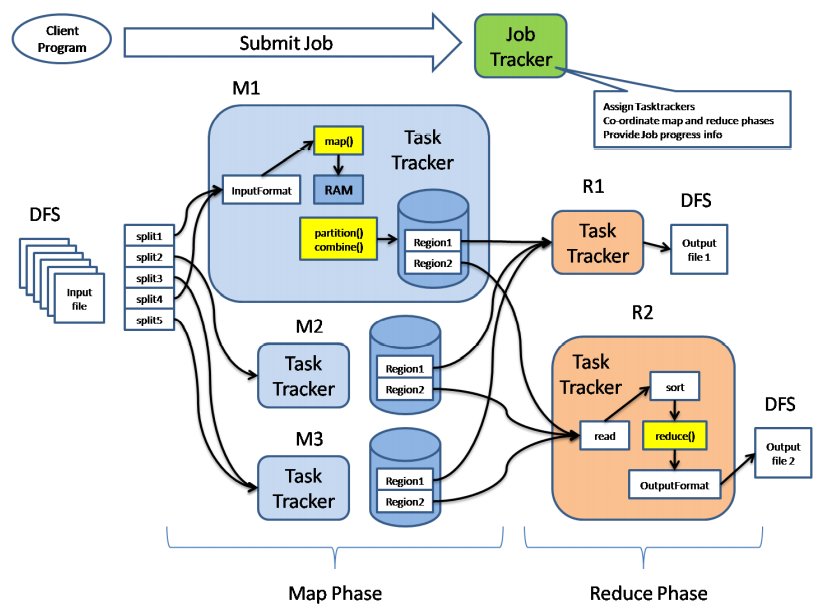

# Modern database systems


## Watched

- [x] Relační model dat, relační databáze. Historický přehled alternativních datových modelů a databázových systémů. Úvod do problematiky Big Data (historie, vlastnosti, datové modely).
- [x] Přehled a klasifikace databázových systémů a technologií pro efektivní správu a zpracování Big Data.
- [ ] Distribuované souborové systémy. MapReduce – princip, vlastnosti, kritika, alternativní přístupy.
- [ ] Základní principy Big Data managementu. Apache Spark.

- [ ] NoSQL databáze klíč/hodnota.
- [ ] NoSQL databáze sloupcové.
- [ ] NoSQL dokumentové databáze.
- [ ] Grafová data a grafové databáze.

- [ ] Data s více modely. Multi-model databáze.
- [ ] Další typy moderních databází. Jazyk SQL v prostředí Big Data. NewSQL databáze. Databáze polí.
- [ ] Vyhledávací nástroje. Polystores.
- [ ] Pokročilé principy Big Data managementu.

## Outline

- Intro
- Classification
- MapReduce
- BigData management
- KVP dbs
- Column dbs
- Document dbs
- Graph dbs
- Multi-model dbs
- Other dbs types
- Searching
- Advanced principles

## Intro

### Modeling layers

1. Conceptual
   - Highest level of abstraction
   - Modelling of real-world objects and relationships
   - e.g., ER, UML, …
2. Logical
   - Machine interpretable data structures for storing the modelled data
   - e.g., object, relational, object-relational, XML, graph, …
3. Physical
   - How logical database structures are implemented in a specific technical environment
   - e.g., data files, index structures, …

### Relational model

historically the pressumed be all end all model

Advantages:
 - Simplicity
   - of the model
   - of the respective query language
 - After so many years mature and verified database management
systems (DBMSs)
 - Strong mathematical background
 - …

Basic idea:
 - Storing of object and their mutual associations in tables
(relations)
   - A relation R from X to Y is a subset of the Cartesian product X × Y.
 - Row in a table (member of relation) = object/association
 - Column (attribute) = attribute of an object/association
 - Table (relational) schema = name of the schema + list of attributes and their types
 - Schema of a relational database = set of relational schemas

### History


 - First generation: navigational
   - Hierarchical model
   - Network model
 - Second generation: relational
 - Third generation: post-relational
   - Extensions of relational model
     - Object-relational
   - New models reacting to popular technologies
     - Object
     - XML
     - NoSQL (key/value, column, document, graph, …) - Big Data
   - Multi-model systems
   - …
   - Back to the relations
     - NewSQL


## Models

### Hierarchical model

- basically a JSON or an XML

 - forest of trees of records
 - One-to-many relationships
 - First independent = redundancy
   - A record cannot be stored in two different trees without duplication
 - Later links and sharing
 - Data processing: hierarchical, starting from the root, depth-first, leftto-right traversal order
   - First storage on tapes – linear access
   - Later (arrival of discs) direct access thanks to hashing and B-tree
techniques

### Network model (CODASYL)

 - basically a graph

Idea: data records connected through binary relationships
 - Data processing: navigational primitives according to which records are
accessed and updated one at a time
   - Relational query languages: set orientation

### Relational model

 - Optimal for may applications, **BUT**

 - hard to handle many rrelationas/chains or large amount of data

 - New application domains have appeared
   - e.g., GIS
   - Complex data types not supported by the relational model
 - Normalizing data into table form affects performance for
the retrieval of large, complex, and hierarchically
structured data
   - Numerous joins
 - Object-oriented programming languages (OOPLs) have
appeared
   - Defined the concept of user-defined classes

#### Object model and object databases

- Approach I - extend objects with data persistence, i.e., databases
- Approach II - extend databases with objects (`CREATE TYPE`, functions... )

### XML model and databases

 - XML – W3C markup language
   - DTD, XML Schema, XPath, XQuery, XSLT, …
 - XML databases
   - Native vs. XML-enabled
   - Support for XML data type + related technologies

 - SQL/XML - extension to SQL to query and publish XML data/values

## Big data

### Definition

There isnt one - VVV is the closest:

> Gartner: “Big Data” is high volume, high velocity, and/or high variety information assets that require new forms of  processing to enable enhanced decision making, insight discovery and process optimization.

high **v**olume, high **v**elocity, and/or high **v**ariety information assets

 - Gartner
   - Information technology research and advisory
company
   - Founded in 1979 by Gideon Gartner
   - HQ in Stanford, Connecticut, USA
     - /> 5,300 employees
     - /> 12,400 client organizations
   - Provides: competitive analysis reports, industry
overviews, market trend data, product evaluation
reports, …


Characteristics:
 - Volume
   - scale - Data volume is increasing exponentially, not linearly
 - Variety
   - complexity - Various formats, types, and structures (from semi-structured XML to unstructured multimedia)
   - Static data vs. streaming data
 - Velocity
   - speed - Data is being generated fast and need to be processed fast
   - Online Data Analytics
 - Veracity
   - uncertainty - Uncertainty due to inconsistency, incompleteness, latency, ambiguities, or approximations.
 - And there are new V-s like:
   - value,
   - validity,
   - volatility…

### Processing

 - OLTP: Online Transaction Processing (DBMSs)
   - Database applications
   - Storing, querying, multiuser access
 - OLAP: Online Analytical Processing (Data Warehousing)
   - Answer multi-dimensional analytical queries
   - Financial/marketing reporting, budgeting, forecasting, …
 - RTAP: Real-Time Analytic Processing (Big Data
Architecture & Technology)
   - Data gathered & processed in a real-time
     - Streaming fashion
   - Real-time data queried and presented in an online fashion
   - Real-time and history data combined and mined interactively

### Technologies

 - Distributed file systems
   - e.g., HDFS
 - Distributed databases
   - Primarily **NoSQL databases**
   - And many other types
 - Cloud computing
 - MapReduce and other new paradigms
 - Large scale machine learning
 - Data analytics
   - Batch
   - Real-time
   - Stream

### Relational Database Management Systems (RDMBSs)

- Predominant technology for storing structured
data
   - Web and business applications
 - Relational calculus, SQL

### NoSQL

> NoSQL movement = “the whole point of seeking alternatives is that you need to solve a problem that relational databases are a bad fit for”

**Not „no to SQL“**
 - Another option, not the only one
**Not „not only SQL“**
 - Oracle DB or PostgreSQL would fit the definition

Characteristics:
 - being non-relational,
 - distributed,
 - open-source,
 - horizontally scalable

 also:
 - for modern web-scale databases
 - schema-free,
 -  easy replication support,
 -  simple API,
 -  eventually consistent (BASE, not ACID),
 -  support for a huge data amount and more...

#### Relational databases are not going away
 - Compelling arguments for most projects
   - Familiarity, stability, feature set, and available support
 - We should see relational databases as one
option for data storage
   - Polyglot persistence – using different data stores in
different circumstances
   - Search for optimal storage for a particular application
     - Multi-model databases

#### Motivation for NoSQL Databases
 - Huge amounts of data are now handled in realtime
 - Both data and use cases are getting more and
more dynamic
 - Social networks (relying on graph data) have
gained impressive momentum
   - Special type of NoSQL databases: graph databases
 - Full-text has always been treated shabbily by
RDBMS

#### Example

Facebook stack:
 - Cassandra
 - Hadoop/Hive
 - Memcached
 - HBase

Every 60 seconds
 - 317,000 status updates
 - 147,000 photos uploaded
 - 54,000 shared links

#### Advantages

1. Elastic scaling
 - “Classical” database administrators scale up – buy
bigger servers as database load increases
 - Scaling out – distributing the database across multiple
hosts as load increases
2. Big Data
 - Volumes of data that are being stored have increased
massively
 - Opens new dimensions that cannot be handled with
RDBMS
3. Goodbye DBAs (see you later?)
 - Automatic repair, distribution, tuning, … vs. expensive,
highly trained DBAs of RDBMSs
4. Economics
 - Based on cheap commodity servers --> less costs per
transaction/second
5. Flexible Data Models
 - Non-existing/relaxed data schema --> structural changes
cause no overhead

#### Challanges

Over time less and less critical - they are being solved

1. Maturity
 - Still in pre-production phase
 - Key features yet to be implemented
2. Support
 - Mostly open source, result from start-ups
   - Enables fast development
 - Limited resources or credibility
3. Administration
 - Require lot of skill to install and effort to maintain
4. Analytics and Business Intelligence
 - Focused on web apps scenarios
   - Modern Web 2.0 applications
   - Insert-read-update-delete
 - Limited ad-hoc querying
   - Even a simple query requires significant programming expertise
5. Expertise
 - Few number of NoSQL experts available in the market

#### Assumptions


#### NoSQL Data Model

##### Aggregates

 - "inlined data" - duplicates data, but no need for a join, snapshots the data

 - Data model = the model by which the database
organizes data
 - Each NoSQL solution has a different model
   - Key-value, document, column-family, graph
   - First three orient on aggregates
 - Aggregate
   - A data unit with a complex structure
     - Not just a set of tuples like in RDBMS
   - Domain-Driven Design: “an aggregate is a collection
of related objects that we wish to treat as a unit”
     - A unit for data manipulation and management of consistency

Aggregates – aggregate-ignorant
 - RDBMS and graph databases are aggregateignorant

Aggregates – aggregate-oriented
 - Aggregate orientation
   - Aggregates give the database information about
which bits of data will be manipulated together
     - Which should live on the same node
   - Helps greatly with running on a cluster
 - We need to minimize the number of nodes we need to query
when we are gathering data
 - Consequence for transactions
   - NoSQL databases support atomic manipulation of a
single aggregate at a time

##### Materialized Views

 - Pre-computed and cached queries
 - Strategies:
   - Update materialized view when we update the base data
     - For more frequent reads of the view than writes
   - Run batch jobs to update the materialized views at regular
intervals

##### Schemalessness

 - there is usually an implicit schema present

Advantages:
 - Allows to easily change your data storage as we learn more
about the project
 - Easier to deal with non-uniform data


### Analysis Techniques

 - Association rule learning – discovering interesting relationships, i.e., “association rules,” among variables in large databases
   - e.g., market basket analysis
 - Classification – to identify the categories in which new data points
belong, based on a training set containing data points that have
already been categorized
   - Supervised learning
   - e.g., buying decisions
 - Cluster analysis – classifying objects that split a diverse group into
smaller groups of similar objects
   - Unsupervised learning
 - Data fusion and data integration
 - Signal processing
 - Crowdsourcing - collecting data submitted by a large group of
people or community
 - Data mining - extract patterns from large datasets
   - Involves association rule learning, cluster analysis, classification,
regression, …
 - Time series analysis and forecasting
   - e.g., hourly value of a stock market index
 - Sentiment analysis - identifying the feature/aspect/product about
which a sentiment is being expressed,
   - Determining the type (i.e., positive, negative, or neutral)
   - Determining the degree and strength of the sentiment
 - Visualization, ...

### Cloud computing

 - Way of creating SW
 - Idea: Providing shared IT technologies (HW/SW) and/or
data to computers and other devices on demand
   - Software as a Service (SaaS)
     - For end-users
   - Platform as a Service (PaaS)
     - For developers (tools for SW implementation/deployment)
   - Infrastructure as a Service (IaaS)
     - For providing robust expensive and inaccessible HW
 - Users pay for the usage (rent)
   - Time of usage, size of the data, …
 - Types
   - Private – for internal
usage of a company
   - Public – for anyone
   - Community – for a
selected community
     - Set of customers
   - … and their
combinations

Providers
- MS Azure,
- AWS,
- ...

#### Advantages

 - Users do not have to manage the technologies
   - Buy, install, upgrade, maintain, …
 - Thanks to the Internet can be used anywhere
 - Service provider can provide distinct solutions for
distinct requirements
   - Within the respective capabilities
 - Data stored at server(s) of the cloud can be easily
shared

#### Disadvantages

 - We store our private data on a public cloud
   - Theoretically vulnerable (but the protection techniques are
still being improved)
 - Vendor lock-in
   - Proprietary technologies and solutions
 - High prices
   - For small companies, universities, …

#### Cloud Computing and Big Data

 - We need a cluster of nodes
   - Expensive, demanding installation and maintenance, …

--> Use cloud computing
   - Scalable solutions without the maintenance part
   - For Big Data often cheaper than the HW
     - When the infrastructure is not used, it can be provided to other users
       - E.g. data analysis is done in particular time intervals
   - Easier solutions or even directly particular applications
   - Available “immediately”
 - We can focus on the specific functionality
   - E.g. efficient analytical processing of the data
 - But: the other disadvantages (safety, vendor lock-in) remain

## NoSQL databases

Types:
 - Core:
   - Key-value databases
   - Document databases
   - Column-family (column-oriented/columnar) stores
   - Graph databases
 - Non-core:
   - Object databases
   - XML databases
   - …
 - Further novel extensions:
   - Multi-model databases
   - Array databases
   - NewSQL databases
   - …

## Key-value store

Basic characteristics
 - The simplest NoSQL data stores
 - A simple hash table (map), primarily used when all
access to the database is via primary key
 - A table in RDBMS with two columns, such as ID and
NAME
   - ID column being the key
   - NAME column storing the value
     - A BLOB that the data store just stores
 - Basic operations:
   - Get the value for the key
   - Put a value for a key
   - Delete a key from the data store
 - Simple --> great performance, easily scaled
 - Simple --> not for complex queries, aggregation needs

Providers
- riak
- redis
- memcachedDB, hamsterDB

### Usecases

#### Ideal

Fast, fetch only usecases, no real need to aggregate etc.

 - Storing Session Information
   - Every web session is assigned a unique session_id value
   - Everything about the session can be stored by a single PUT request or retrieved using a single GET
   - Fast, everything is stored in a single object
 - User Profiles, Preferences
   - Every user has a unique user_id, user_name + preferences such as language, colour, time zone, which products the user has access to, …
   - As in the previous case:
     - Fast, single object, single GET/PUT
 - Shopping Cart Data
   - Similar to the previous cases

#### Not

 - Relationships among Data
   - Relationships between different sets of data
   - Some key-value stores provide link-walking features
     - Not usual
 - Multioperation Transactions
   - Saving multiple keys
     - Failure to save any one of them → revert or roll back the rest of the
operations
 - Query by Data
   - Search the keys based on something found in the value part
 - Operations by Sets
   - Operations are limited to one key at a time
   - No way to operate upon multiple keys at the same time

## Column-family stores
(“columnar” or “column-oriented”)

Basic Characteristics
 - Column families = rows that have many columns
associated with a row key
 - Column families are groups of related data that is often
accessed together
   - e.g., for a customer we access all profile information at the same
time, but not orders

Providers:
 - Cassandra
 - google big table, hbase, simpledb

### Example: Cassandra


 - Column = basic unit, consists of a name-value pair
   - Name serves as a key
   - Stored with a timestamp (expired data, resolving conflicts, …)
 - Row ~ value = a collection of columns attached or linked to a key
   - Columns can be added to any row at any time without having to add it to other rows
 - Column family = a collection of similar rows
   - Rows do not have to have the same columns

### Usecases

#### Ideal

Want to see a bit of the value part, have some predefined structure

 - Event Logging
   - Ability to store any data structures → good choice to store event information
 - Content Management Systems, Blogging Platforms
   - We can store blog entries with tags, categories, links, and trackbacks in different columns
   - Comments can be either stored in the same row or moved to a different keyspace
   - Blog users and the actual blogs can be put into different column families

#### Not

 - Systems that Require ACID Transactions
   - Column-family stores are not just a special kind of RDBMSs with variable set of columns!
 - Aggregation of the Data Using Queries
   - (Such as SUM or AVG)
   - Have to be done on the client side
 - For Early Prototypes
   - We are not sure how the query patterns may change
   - As the query patterns change, we have to change the column family design

## Document Databases

"document ~ json, xml"

Basic Characteristics
 - Documents are the main concept
   - Stored and retrieved
   - XML, JSON, …
 - Documents are
   - Self-describing
   - Hierarchical tree data structures
   - Can consist of maps, collections (lists, sets, …), scalar values, nested documents, …
 - Documents in a collection are expected to be similar
   - Their schema can differ
 - Document databases store documents in the value part of the key-value store
   - Key-value stores where the value is examinable

Providers:
- mongodb
- couchdb, rientdb, ravendb

Query language which is expressed via JSON
 - Where clause, sorting, count, sum, showing the execution plan, …

### Data - example

 - Data are similar, but have differences, e.g., in attribute names
   - Still belong to the same collection
 - We can represent
   - A list of cities visited as an array
   - A list of addresses as a list of documents embedded inside the main document


### Usecases

#### Ideal

 - Event Logging
   - Many different applications want to log events
     - Type of data being captured keeps changing
   - Events can be sharded (i.e. divided) by the name of the application or type
of event
 - Content Management Systems, Blogging Platforms
   - Managing user comments, user registrations, profiles, web-facing
documents, …
 - Web Analytics or Real-Time Analytics
   - Parts of the document can be updated
   - New metrics can be easily added without schema changes
     - E.g. adding a member of a list, set,…
 - E-Commerce Applications
   - Flexible schema for products and orders
   - Evolving data models without expensive data migration

#### Not

 - Complex Transactions Spanning Different Operations
   - Atomic cross-document operations
     - Some document databases do support (e.g., RavenDB)

 - Queries against Varying Aggregate Structure
   - Design of aggregate is constantly changing → we need to save the aggregates at the lowest level of granularity
     - i.e. to normalize the data

## Graph Databases

Basic Characteristics
 - To store entities and relationships between these entities
   - Node is an instance of an object
   - Nodes have properties
     - e.g., name
   - Edges have directional significance **(!!!)**
   - Edges have types
     - e.g., likes, friend, …
 - Nodes are organized by relationships
   - Allow to find interesting patterns
   - e.g., “Get all people (= nodes in the graph) employed by Big Co that like (book called) NoSQL Distilled”

Providers:
- neo4j
- rientdb, infinitegraph

### RDBMS vs. Graph Databases

 - When we store a graph-like structure in RDBMS, it is for a single type of relationship
   - “Who is my manager”
 - Adding another relationship usually means a lot of schema changes
 - In RDBMS we model the graph beforehand based on the Traversal we want
   - If the Traversal changes, the data will have to change
   - In graph databases the relationship is not calculated at query time but persisted

### Queries

 - We have to create a relationship between the nodes in
both directions
   - Nodes know about INCOMING and OUTGOING relationships

```java
Node martin = graphDb.createNode();
martin.setProperty("name", "Martin");
Node pramod = graphDb.createNode();
pramod.setProperty("name", "Pramod");
martin.createRelationshipTo(pramod, FRIEND);
pramod.createRelationshipTo(martin, FRIEND);
```

 - Properties of a node/edge can be indexed
 - Indices are queried to find the starting node to begin a traversal

```java
Transaction transaction = graphDb.beginTx();
try
{
    // creating index
    Index<Node> nodeIndex = graphDb.index().forNodes("nodes");

    // adding nodes
    nodeIndex.add(martin, "name", martin.getProperty("name"));
    nodeIndex.add(pramod, "name", pramod.getProperty("name"));
    transaction.success();
}
finally
{
    transaction.finish();
}

// retrieving a node
Node martin = nodeIndex.get("name", "Martin").getSingle();

// getting all its relationships
allRelationships = martin.getRelationships();
```

 - We are interested in determining if there are
multiple paths, finding all of the paths, the
shortest path, …

```java
Node barbara = nodeIndex.get("name", "Barbara").getSingle();
Node jill = nodeIndex.get("name", "Jill").getSingle();
PathFinder<Path> finder1 = GraphAlgoFactory.allPaths(Traversal.expanderForTypes(FRIEND,Direction.OUTGOING), MAX_DEPTH);
Iterable<Path> paths = finder1.findAllPaths(barbara, jill);
PathFinder<Path> finder2 = GraphAlgoFactory.shortestPath(Traversal.expanderForTypes(FRIEND, Direction.OUTGOING), MAX_DEPTH);
Iterable<Path> paths = finder2.findAllPaths(barbara, jill);
```

### Usecases

#### Ideal

 - Connected Data
   - Social networks
   - Any link-rich domain is well suited for graph databases
 - Routing, Dispatch, and Location-Based Services
   - Node = location or address that has a delivery
   - Graph = nodes where a delivery has to be made
   - Relationships = distance
 - Recommendation Engines
   - “your friends also bought this product”
   - “when invoicing this item, these other items are usually invoiced”

#### Not

 - When we want to update all or a subset of entities
   - Changing a property on all the nodes is not a straightforward operation
   - e.g., analytics solution where all entities may need to be updated with a changed property
 - Some graph databases may be unable to handle lots of data
   - Distribution of a graph is difficult

## NoSQL Data Model

Aggregates and NoSQL databases

 - Key-value database
   - Aggregate = some big blob of mostly meaningless bits
     - But we can store anything
   - We can only access an aggregate by lookup based on
its key
 - Document database
   - Enables to see the structure in an aggregate
     - But we are limited by the structure when storing (similarity)
   - We can submit queries to the database based on the
fields in the aggregate

 - Column-family stores
   - A two-level aggregate structure
     - The first key is a row identifier, picking up the aggregate of interest
     - The second-level values are referred to as columns
   - Ways to think about how the data is structured:
     - Row-oriented: each row is an aggregate with column families representing useful chunks of data (profile, order history)
     - Column-oriented: each column family defines a record type (e.g., customer profiles) with rows for each of the records; a row is the join of records in all column families
 - Multi-model stores
   - Combine various data models, including aggreagateoriented
   - Support references and queries across the models

## Apache Hadoop

Distributed filesystem

 - Open-source software framework
 - Running of applications on large clusters of commodity hardware
   - Multi-terabyte data-sets
   - Thousands of nodes
 - Derived from Google's MapReduce and Google File System (GFS)
   - Not open-source

### Modules

 - Hadoop Common
   - Common utilities
   - Support for other Hadoop modules
 - **Hadoop Distributed File System (HDFS)**
   - Distributed file system
   - High-throughput access to application data
 - Hadoop YARN
   - Framework for job scheduling and cluster resource management
 - **Hadoop MapReduce**
   - System for parallel processing of large data sets

### Related projects

 - Avro – a data serialization system
 - **Cassandra** – a scalable multi-master database with no single points
of failure
 - Chukwa – a data collection system for managing large distributed
systems
 - **HBase** – a scalable, distributed column-family database that
supports structured data storage for large tables
 - **Hive** – data warehouse infrastructure that provides data
summarization and ad hoc querying
 - Mahout – scalable machine learning and data mining library
 - Pig – high-level data-flow language and execution framework for
parallel computation
 - ZooKeeper – high-performance coordination service for distributed
applications

### HDFS

 - Free and open source
 - Crossplatform
   - Pure Java
   - Has bindings for non-Java programming languages
 - Fault-tolerant
 - Highly scalable

#### Idea

**“failure is the norm rather than exception”**

 - A HDFS instance may consist of thousands of machines
   - Each storing a part of the file system’s data
 -  Each component has non-trivial probability of failure
 - → **Assumption: “There is always some component that is non-functional.”**
   -  Detection of faults
   -  Quick, automatic recovery

#### Data Characteristics

 - Assumes:
   -  Streaming data access
   -  Batch processing rather than interactive user access
 - Large data sets and files
 - Write-once / read-many
   -  A file once created, written and closed does not need to be
changed
     - Or not often
   -  This assumption simplifies coherency
 - Optimal applications for this model: MapReduce, webcrawlers, …

#### Structure

NameNode, DataNodes
 - Master/slave architecture
 - HDFS exposes file system namespace
 - File is internally split into one or more blocks
   - Typical block size is 64MB (or 128 MB)
 - NameNode = master server that manages the file
system namespace + regulates access to files by clients
   - Opening/closing/renaming files and directories
   - Determines mapping of blocks to DataNodes
 - DataNode = serves read/write requests from clients +
performs block creation/deletion and replication upon
instructions from NameNode
   - Usually one per node in a cluster
   - Manages storage attached to the node that it runs on


##### Namespace
 - Hierarchical file system
   - Directories and files
 - Create, remove, move, rename, ...
 - NameNode maintains the file system
   - Any meta information changes to the file system are
recorded by the NameNode
 - An application can specify the number of replicas
of the file needed
   - Replication factor of the file
   - The information is stored in the NameNode

##### Data Replication
 - HDFS is designed to store very large files across machines in a large cluster
   - Each file is a sequence of blocks
   - All blocks in the file are of the same size
     - Except the last one
     - Block size is configurable per file
 - Blocks are replicated for fault tolerance
   - Number of replicas is configurable per file
 - NameNode receives HeartBeat and BlockReport from each DataNode
   - BlockReport contains a list of all blocks on a DataNode

##### Replica Placement

 - Placement of the replicas is critical to reliability and
performance
 - **Rack-aware** replica placement = to take a node's physical location into account while scheduling tasks and allocating storage
   - Needs lots of tuning and experience
 - Idea:
   - Nodes are divided into racks
   - Communication between racks through switches
   - Network bandwidth between machines on the same rack is
greater than those in different racks
 - NameNode determines the rack id for each DataNode

 - First idea: replicas should be placed on different racks
   - Prevents losing data when an entire rack fails
   - Allows use of bandwidth from multiple racks when reading data
     - Multiple readers
   - Writes are expensive (transfer to different racks)
     - We need to write to all replicas
 - Common case: replication factor is 3
   - Replicas are placed:
     - One on a node in a local rack
     - One on a different node in the local rack
     - One on a node in a different rack
   - Decreases the inter-rack write traffic

##### NameNode

 - Stores HDFS namespace
 - transaction log - **EditLog** - to record every change that occurs to the file system’s meta data
   - E.g., creating a new file, change in replication factor of a file, ..
   - EditLog is stored in the NameNode’s local file system
 - FsImage – entire file system namespace + mapping of blocks to files + file system properties
   - Stored in a file in NameNode’s local file system
   - Designed to be compact
 - Loaded in NameNode’s memory
 - 4 GB of RAM is sufficient

#### Workings

##### NameNode

Startup
1. It reads the FsImage and EditLog from disk
2. It applies all the transactions from the EditLog to the in-memory representation of the FsImage
3. It flushes out this new version into a new FsImage on disk = checkpoint
4. It truncates the edit log

 - Checkpoints are then built periodically
 - Recovery = last checkpointed state

##### DataNode

 - Stores data in files in its local file system
   - Has no knowledge about HDFS file system
 - Stores each block of HDFS data in a separate file
 - Does not create all files in the same directory
   - Local file system might not be support it
   - Uses heuristics to determine optimal number of files per directory
 - When the file system starts up:
   1. It generates a list of all HDFS blocks = BlockReport
   2. It sends the report to NameNode

#### Failures

 - Primary objective: to store data reliably in
the presence of failures
 - Three common failures:
   - NameNode failure
   - DataNode failure
   - Network partition

 - Network partition can cause a subset of DataNodes to
lose connectivity with NameNode
   -  NameNode detects this condition by the absence of a Heartbeat
message
   -  NameNode marks DataNodes without HearBeat and does not
send any IO requests to them
   -  Data registered to the failed DataNode is not available to the
HDFS
 - The death of a DataNode may cause replication factor of
some of the blocks to fall below their specified value →
re-replication
   -  Also happens when replica is corrupted, hard disk fails,
replication factor is increased, …

#### API

 - Java API for application to use
   - Python, C language access available
 - HTTP browser can be used to browse the files of a
HDFS instance
 - Command line interface called the FS shell
   - Lets the user interact with data in the HDFS
   - The syntax of the commands is similar to bash
   - e.g., to create a directory /foodir
     - `/bin/hadoop fs –mkdir /foodir`
 - Browser interface is available to view the namespace

### MapReduce Framework

"Divide and conquer"

 - A programming model + implementation
 - Developed by Google in 2008
 - Distributed, parallel computing on large data
   - > Google: “A simple and powerful interface that enables automatic parallelization and distribution of large-scale computations, combined with an implementation of this interface that achieves high performance on large clusters of commodity PCs.”

Programming model in general:
 - Mental model a programmer has about execution of application
 - Purpose: improve programmer's productivity
 - Evaluation: expressiveness, simplicity, performance

#### Models

 - Von Neumann model
   - Executes a stream of instructions (machine code)
   - Instructions can specify
     - Arithmetic operations
     - Data addresses
     - Next instruction to execute
     - …
   - Complexity
 - Billions of data locations and millions of instructions
 - Manages with:
   - Modular design
   - High-level programming languages

 - Parallel programming models
   - Message passing
     - Independent tasks encapsulating local data
     - Tasks interact by exchanging messages
   - Shared memory
     - Tasks share a common address space
     - Tasks interact by reading and writing from/to this space
       - Asynchronously
   - **Data parallelization**
     - Data are partitioned across tasks
     - Tasks execute a sequence of independent operations

#### DaC

 - Divide ~ Map breaks down a problem into sub-problems
   - Processes a key/value pair to generate a set of intermediate key/value pairs
 - Conquer ~ Reduce receives and combines the sub-solutions to solve the problem
   - Processes intermediate values associated with the same intermediate key
 - Many real-world tasks can be expressed this way
   - Programmer focuses on map/reduce code
   - Framework cares about data partitioning, scheduling execution across machines, handling machine failures, managing intermachine communication, ...

##### Formally

Map
 - Input: a key/value pair
 - Output: a set of intermediate key/value pairs
   - Usually different domain
 - (k1,v1) → list(k2,v2)

Reduce
 - Input: an intermediate key and a set of all values for
that key
 - Output: a possibly smaller set of values
   - The same domain
 - (k2,list(v2)) → (k2,possibly smaller list(v2))

###### Example

```java
map(String key, String value):
  // key: document name
  // value: document contents
for each word w in value:
  EmitIntermediate(w, "1");
```

```java
reduce(String key, Iterator values):
  // key: a word
  // values: a list of counts
int result = 0;
for each v in values:
  result += ParseInt(v);
Emit(key, AsString(result));
```


 - distributed grep
   - Map: emits <word, line number> if it matches a supplied pattern
   - Reduce: identity
 - URL access frequency
   - Map: processes web logs, emits <URL, 1>
   - Reduce: sums values and emits <URL, sum>
 - reverse web-link graph
   - Map: <target, source> for each link to a target URL found in a page named source
   - Reduce: concatenates the list of all source URLs associated with a given target URL <target, list(source)>
 - term vector per host
   - “Term vector” summarizes the most important words that occur in a document or a set of documents
   - Map: emits <hostname, term vector> for each input document
     - The hostname is extracted from the URL of the document
   - Reduce: adds the term vectors together, throws away infrequent terms
 - inverted index
   - Map: parses each document, emits <word, document ID>
   - Reduce: sorts the corresponding document IDs, emits <word, list(document ID)>
 - distributed sort
   - Map: extracts the key from each record, and emits <key, record>
   - Reduce: emits all pairs unchanged

#### Application Parts

  1. Input reader
     - Divides the input into appropriate size 'splits'
       - Each assigned to a single Map function
     - Reads data from stable storage
       - e.g., a distributed file system
     - Generates key/value pairs
  2. Map function
     - User-specified processing of key/value pairs
  3. Partition function
     - Map function output is allocated to a reducer
     - Partition function is given the key (output of Map) and the number of reducers and returns the index of the desired reducer
     - Default is to hash the key and use the hash value modulo the number of reducers
  4. Compare function
     - Sorts the input for the Reduce function
  5. Reduce function
     - User-specified processing of key/values
  6. Output writer
     - Writes the output of the Reduce function to stable storage
       - e.g., a distributed file system


#### Flow

 - Execution (Google) – Step 1
   1. MapReduce library in the user program splits the input files into M pieces
      - Typically 16 – 64 MB per piece
      - Controllable by the user via optional parameter
   2. It starts copies of the program on a cluster of machines


 - Execution – Step 2
   - Master = a special copy of the program
   - Workers = other copies that are assigned work by master
   - M Map tasks and R Reduce tasks to assign
   - Master picks idle workers and assigns each one a Map task (or a Reduce task)


 - Execution – Step 3
   - A worker who is assigned a Map task:
     - Reads the contents of the corresponding input split
     - Parses key/value pairs out of the input data
     - Passes each pair to the user-defined Map function
     - Intermediate key/value pairs produced by the Map function are buffered in memory


 - Execution – Step 4
   - Periodically, the buffered pairs are written to local disk
     - Partitioned into R regions by the partitioning function
   - Locations of the buffered pairs on the local disk are passed back to the master
     - It is responsible for forwarding the locations to the Reduce workers


 - Execution – Step 5
   - Reduce worker is notified by the master about data locations
   - It uses remote procedure calls to read the buffered data from local disks of the Map workers
   - When it has read all intermediate data, it sorts it by the intermediate keys
     -  Typically many different keys map to the same Reduce task      -  If the amount of intermediate data is too large, an external sort is used


 - Execution – Step 6
   - A Reduce worker iterates over the sorted intermediate data
   - For each intermediate key encountered:
     -  It passes the key and the corresponding set of intermediate values to the user's Reduce function
     -  The output is appended to a final output file for this Reduce partition


 - Combine
   - After a map phase, the mapper transmits over the network the entire intermediate data file to the reducer
   - Sometimes this file is highly compressible
   - User can specify function combine
     - Like a reduce function
     - It is run by the mapper before passing the job to the reducer
       - Over local data
 - Counters
   - Can be associated with any action that a mapper or a reducer does
     - In addition to default counters
       - e.g., the number of input and output key/value pairs processed
   - User can watch the counters in real time to see the progress of a job

#### Fault Tolerance

 - A large number of machines process a large number of data → fault tolerance is necessary
 - Worker failure
   - Master pings every worker periodically
   - If no response is received in a certain amount of time, master marks the worker as failed
   - All its tasks are reset back to their initial idle state → become eligible for scheduling on other workers

 - Master failure
   - Strategy A:
     - Master writes periodic checkpoints of the master data structures
     - If it dies, a new copy can be started from the last checkpointed state
   - Strategy B:
     - There is only a single master → its failure is unlikely
     - MapReduce computation is simply aborted if the master fails
     - Clients can check for this condition and retry the MapReduce operation if they desire

 - Straggler
   - is a machine that takes an unusually long time to complete one of the map/reduce tasks in the computation
   - Example: a machine with a bad disk
   - Solution:
     - When a MapReduce operation is close to completion, the master schedules backup executions of the remaining in-progress tasks
     - A task is marked as completed whenever either the primary or the backup execution completes

#### Task granularity

 - `M` pieces of Map phase and `R` pieces of Reduce phase
   - Ideally both much larger than the number of worker machines
   - How to set them?
 - Master makes `O(M + R)` scheduling decisions
 - Master keeps `O(M * R)` status information in memory
   - For each Map/Reduce task: state (idle/in-progress/completed)
   - For each non-idle task: identity of worker machine
   - For each completed Map task: locations and sizes of the R intermediate file regions
 - `R` is often constrained by users
   - The output of each Reduce task ends up in a separate output file
 - Practical recommendation (Google):
   - Choose `M` so that each individual task is roughly 16 – 64 MB of input data
   - Make `R` a small multiple of the number of worker machines we expect to use

#### Criticism

David DeWitt and Michael Stonebraker – 2008
1. MapReduce is a step backwards in database access based on
   - Schema describing data structure
   - Separating schema from the application
   - Advanced query languages
2. MapReduce is a poor implementation
   - Instead of indices it uses brute force
3. MapReduce is not novel (ideas more than 20 years old and overcome)
4. MapReduce is missing features common in DBMSs
   - Indices, transactions, integrity constraints, views, …
5. MapReduce is incompatible with applications implemented over DBMSs
   - Data mining, business intelligence, …

#### End

 - FaceBook used MapReduce in 2010
   - Hadoop

but…

 - Google has shifted towards: Google Cloud DataFlow
   - Based on cloud and stream data processing
   - Idea: no need to maintain complex infrastructure
     - Data can be easily read, transformed and analyzed in a cloud

#### Hadoop MapReduce

 - MapReduce requires:
   - Distributed file system
   - Engine that can distribute, coordinate, monitor and gather the results
 - Hadoop: HDFS + JobTracker + TaskTracker
   - JobTracker (master) = scheduler
   - TaskTracker (slave per node) – is assigned a Map or Reduce (or other operations)
     - Map or Reduce run on a node → so does the TaskTracker
     - Each task is run on its own JVM

##### Structure

JobTracker (Master)
 - Like a scheduler:
   1. A client application is sent to the JobTracker
   2. It “talks” to the NameNode (= HDFS master) and locates the TaskTracker (Hadoop client) near the data
   3. It moves the work to the chosen TaskTracker node

TaskTracker (Client)
 - Accepts tasks from JobTracker
   - Map, Reduce, Combine, …
   - Input, output paths
 - Has a number of slots for the tasks
   - Execution slots available on the machine (or machines on the same rack)
 - Spawns a separate JVM for execution of a task
 - Indicates the number of available slots through the hearbeat message to the JobTracker
   - A failed task is re-executed by the JobTracker



##### Job Launching

Job configuration
 - For launching program:
   1. Create a Job to define a job
 - Using class Configuration
   2. Submit Job to the cluster and wait for completion
 - Job involves:
   - Classes implementing Mapper and Reducer interfaces
     - `Job.setMapperClass()`
     - `Job.setReducerClass()`
   - Job outputs
     - `Job.setOutputKeyClass()`
     - `Job.setOutputValueClass()`
   - Other options:
     - `Job.setNumReduceTasks()`
     - …

 - `waitForCompletion()`– waits (blocks) until the job finishes
 - `submit()` – does not block
 - `monitorAndPrintJob()` – monitor a job and print status in real-time as progress is made and tasks fail

Mapper

 - The user provides an instance of Mapper
   - Implements interface `Mapper`
     - Overrides function `map`
   - Emits (k2 ,v2) using `context.write(k2, v2)`
 - Exists in separate process from all other instances of Mapper
   - No data sharing

```java
void map (
    Object key, // input key
    Text value, // input value
    Context context // collects output keys and values)
```

```java
public static class TokenizerMapper extends Mapper<Object, Text, Text, IntWritable>
{
    private final static IntWritable one = new IntWritable(1);
    private Text word = new Text();
    public void map (Object key, Text value, Context context) throws IOException, InterruptedException
    {
        StringTokenizer itr = new StringTokenizer(value.toString());
        while (itr.hasMoreTokens())
        {
            word.set(itr.nextToken());
            context.write(word, one);
        }
    }
}
```

Reducer
```java
reduce(Text key,
Iterable<IntWritable> values,
Context context)
```
 - Keys & values sent to one partition all go to the
same reduce task
 - Calls are sorted by key

```java
public static class IntSumReducer extends Reducer<Text,IntWritable,Text,IntWritable>
{
    private IntWritable result = new IntWritable();
    public void reduce (Text key, Iterable<IntWritable> values, Context context) throws IOException, InterruptedException
    {
        int sum = 0;
        for (IntWritable val : values)
        {
            sum += val.get();
        }
        result.set(sum);
        context.write(key, result);
    }
}
```

#### Basic Design Questions to Ask

 - From where will my input come?
 - How is my input structured?
 - Mapper and Reducer classes
 - Do I need to count anything while job is in progress?
 - Where is my output going?
 - Executor class
   - Must I block, waiting for job completion?


## Apache Spark

Data analytics tool
