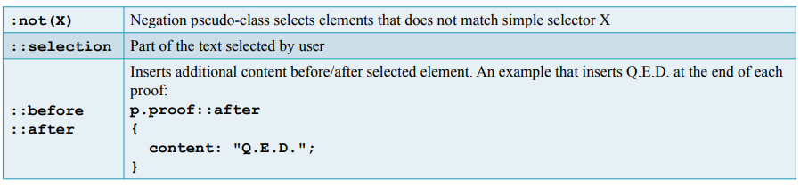
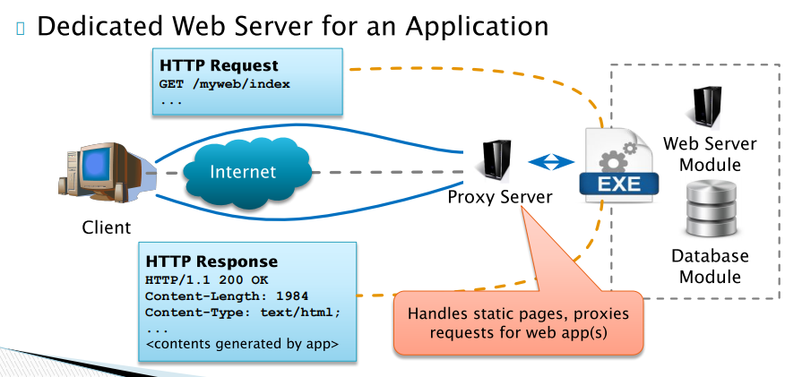
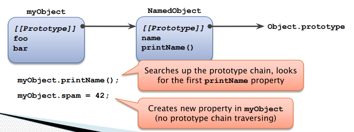

# WebApps

- [WebApps](#webapps)
  - [Basics](#basics)
    - [HTTP](#http)
      - [Request](#request)
        - [Structure](#structure)
      - [Response](#response)
      - [Versions](#versions)
    - [HTML](#html)
      - [Forms](#forms)
  - [CSS](#css)
      - [Selectors](#selectors)
    - [Properties](#properties)
      - [Display](#display)
    - [Box model](#box-model)
    - [Floating elements](#floating-elements)
    - [Filters](#filters)
    - [Transformations](#transformations)
    - [Transitions](#transitions)
    - [Animations](#animations)
    - [Media](#media)
    - [Layout](#layout)
    - [Basic layout](#basic-layout)
    - [Modern layout](#modern-layout)
      - [Flex box](#flex-box)
      - [Grid layout](#grid-layout)
    - [Hacks](#hacks)
    - [Responsive web](#responsive-web)
      - [Frameworks](#frameworks)
    - [Issues with CSS](#issues-with-css)
      - [SASS (Syntactically Awesome Stylesheets)](#sass-syntactically-awesome-stylesheets)
  - [Web Applications Fundamentals and Server-side Technologies](#web-applications-fundamentals-and-server-side-technologies)
    - [Platforms](#platforms)
    - [Integrated Web Server](#integrated-web-server)
    - [Node.js](#nodejs)
  - [PHP](#php)
    - [Language differences](#language-differences)
    - [Variables](#variables)
      - [Types](#types)
    - [String Literals](#string-literals)
    - [Functions](#functions)
    - [HTTP Wrapper](#http-wrapper)
    - [Arrays](#arrays)
    - [Variable variables](#variable-variables)
    - [References](#references)
    - [Functions](#functions-1)
      - [Indirect calling](#indirect-calling)
      - [Anonymous functions](#anonymous-functions)
    - [OOP in PHP](#oop-in-php)
      - [References](#references-1)
      - [Classes](#classes)
        - [Member access](#member-access)
        - [Cloning](#cloning)
    - [Internals and practices](#internals-and-practices)
      - [Verify (input) data](#verify-input-data)
      - [Sanitize output](#sanitize-output)
      - [Sanitization](#sanitization)
    - [File uploads](#file-uploads)
    - [Raw request body](#raw-request-body)
    - [Post processing](#post-processing)
    - [Session managment](#session-managment)
      - [Cookies](#cookies)
      - [PHP Session API](#php-session-api)
      - [Security Tokens](#security-tokens)
    - [Databases MySQL](#databases-mysql)
      - [MySQLi Procedural API](#mysqli-procedural-api)
      - [Quering](#quering)
      - [Prepared Statements](#prepared-statements)
      - [Examples](#examples)
      - [Frameworks](#frameworks-1)
    - [Best practices and design patterns](#best-practices-and-design-patterns)
      - [SWING practices](#swing-practices)
      - [Front-controller](#front-controller)
        - [Advantages](#advantages)
        - [Examples](#examples-1)
          - [Imperative VS Declarative](#imperative-vs-declarative)
      - [MVC (Model-View-Vontroller)](#mvc-model-view-vontroller)
        - [View](#view)
        - [Model](#model)
          - [Doctrine Example](#doctrine-example)
          - [NotORM (by Jakub Vrána) Example](#notorm-by-jakub-vrána-example)
      - [Controller](#controller)
        - [MVC VS MVP](#mvc-vs-mvp)
        - [Example](#example)
    - [Component-based Development](#component-based-development)
      - [Component Management](#component-management)
        - [Dependency Injection](#dependency-injection)
    - [Standardization Recommendations](#standardization-recommendations)
    - [Coding style](#coding-style)
    - [Single Page Applications](#single-page-applications)
      - [Disadvantages](#disadvantages)
      - [REST (Representational State Transfer) API](#rest-representational-state-transfer-api)
        - [Example](#example-1)
  - [Javascript](#javascript)
    - [ECMAScript](#ecmascript)
    - [Values](#values)
      - [Types](#types-1)
    - [Variables](#variables-1)
    - [Functions](#functions-2)
    - [Objects](#objects)
    - [Arrays](#arrays-1)
      - [Methods](#methods)
    - [Strings](#strings)
      - [Methods](#methods-1)
    - [Client-side scripting](#client-side-scripting)
      - [Challenges](#challenges)
      - [Utilization](#utilization)
        - [Technologies](#technologies)
    - [Embedding](#embedding)
    - [In web browser](#in-web-browser)
      - [DOM (Document Object Model)](#dom-document-object-model)
        - [Levels](#levels)
        - [Traversing](#traversing)
        - [Manipulation](#manipulation)
        - [Extra](#extra)
      - [DOM and CSS](#dom-and-css)
      - [Events](#events)
        - [Event object](#event-object)
      - [Window](#window)
    - [Details](#details)
      - [Revision](#revision)
      - [Functions](#functions-3)
        - [Closure](#closure)
      - [Objects](#objects-1)
        - [Revision](#revision-1)
        - [Classes](#classes-1)
        - [Ctors](#ctors)
      - [JS built-ins](#js-built-ins)
      - [ECMAScript 6](#ecmascript-6)
        - [Class](#class)
        - [Modules](#modules)
        - [Scopes and arrow functions](#scopes-and-arrow-functions)
        - [Variables and arguments](#variables-and-arguments)
        - [New structures](#new-structures)
      - [Functional approach](#functional-approach)
      - [Errors/Exceptions](#errorsexceptions)
      - [Explicit Evaluation](#explicit-evaluation)
  - [Client-side programming](#client-side-programming)
    - [UI](#ui)
      - [Bi-directional sync](#bi-directional-sync)
      - [Sync](#sync)
      - [Optimalization](#optimalization)
  - [AJAX (Asynchronous JavaScript and XML)](#ajax-asynchronous-javascript-and-xml)
    - [XMLHttpRequest object](#xmlhttprequest-object)
    - [JSON (JavaScript Object Notation)](#json-javascript-object-notation)
      - [Applications](#applications)
    - [Side note - script injection](#side-note---script-injection)
      - [CORS](#cors)
    - [Fetch API](#fetch-api)
      - [Promise](#promise)
    - [Form Data](#form-data)
    - [Redirects](#redirects)
      - [Example](#example-2)
        - [Page updates](#page-updates)
    - [HTML5 API](#html5-api)
      - [History](#history)
      - [Non-visible Data Attributes](#non-visible-data-attributes)
      - [Data Storage](#data-storage)
      - [Web Workers](#web-workers)
    - [Compatibility issues](#compatibility-issues)
    - [jQuery](#jquery)
      - [jQuery object](#jquery-object)
      - [“Select and Do” Philosophy](#select-and-do-philosophy)
      - [Selectors](#selectors-1)
      - [DOM manipulation functions](#dom-manipulation-functions)
    - [Single Page Application](#single-page-application)
    - [SPA Libraries](#spa-libraries)
  - [Security](#security)
    - [Symmetric Ciphers](#symmetric-ciphers)
      - [AES](#aes)
    - [Asymmetric ciphers (public-key)](#asymmetric-ciphers-public-key)
      - [Digital signature](#digital-signature)
      - [RSA](#rsa)
    - [Heartbleed bug](#heartbleed-bug)
    - [Hashing](#hashing)
      - [Functions](#functions-4)
    - [HTTP Secure (HTTPS)](#http-secure-https)
      - [X.509 Certificates](#x509-certificates)
    - [Security fundamentals](#security-fundamentals)
      - [Password](#password)
      - [Authentication](#authentication)
      - [Authorization](#authorization)
        - [Models](#models)
      - [Logging](#logging)

## Basics

### HTTP

#### Request

##### Structure

Line 1 - request method, uri, http version
> Method Request-URI HTTP-versio

Body

Headers - host, accept, authentication, user-agent...

Cookies - http is stateless-this serves as a state

#### Response

> HTTP-version Status-code Reason-phrase


#### Versions

/2 multiplexing, HTTPS "only"

/3 not widely supported

### HTML

html, head, title, /head, body, /body, /html

DOM Tree in infix serialization

WWW ~ Web of documents

Hyperlinks - resource references

Headings - section/article edit its size

Tables - care with colspan, rowspan

Meta elements

#### Forms

```html
<form method="get" action="http://www.example.org/newcustomer.php">
    Name: <input name="fullname" ... >
    Phone: <input name="phone" ... >
    Preferred delivery time: <input name="time" ... >
    Comments: <textarea name="comments"></textarea>
    <button type="submit">Submit Order</button>
</form>
```

Controls:
 - input
   - type
 - textarea
 - select
 - button

Attributes:
 - name
 - value

Other attributes
 - maxlength
 - pattern
 - required
 - placeholder
 - autocomplet

## CSS

Styles assigned to elements

- Inlined styles `<h1 style="color: red;">Red Heading</h1`
- `<style>` element in head
- linking from external file: `<link rel="stylesheet" type="text/css" href="styles.css">`

#### Selectors

 - by name
   - `p`
 - by id
   - `#theId`
 - by class
   - `.theClass`
 - universal
   - `*`

Combining:
 - `div.inf`
   - all div elements with class info
 - `h1#main`
   - h1 element with id main

Relative positions
- space
  - `E F`
    - F has ancestor E
- gt sign
  - `E > F`
    - E is (direct) parent of F
- plus
  - `E + F`
    - F immediately preceeded by E
- tilde
  - `E ~ F`
    - F preceeded by E

Aggregation:
- comma
  - `s1, s2`
    - use for s1 or s2

Pitfalls
- `ul li` vs `ul > li`
- `p.info` vs `p .info`
- `main ul, ol`

Pseudo-classes selectors:




Cascading
1. Transition declarations (will be explained later)
2. Important user agent declarations
3. Important user declarations
4. Important override (by client-script) declarations
5. **Important author declarations**
6. Animation declarations (will be explained in adv. lectures)
7. Normal override declaration
8. **Normal author declarations**
9. Normal user declarations
10. Normal user agent declarations

Specificity either by the number the different selectors and if same, then the latest declared.

### Properties

Fonts, colorsD

#### Display

- block
- inline
- inline-block
- none
- list-item
- table, table-*

### Box model


### Floating elements

`float:`
`clear`

### Filters

### Transformations

Some predefined, can use `matrix()`

### Transitions

For simple animations - between 2 states


### Animations

Multiple states

### Media

Media Limitations
 - Restricting styles for particular visualization medium

Media Types
 - Select style sheets for particular media
   - screen, print, speech, …

Media Features (Properties)
 - Add additional conditions to the types
   - width, height
   - device-width, device-height
   - orientation, aspect-ratio

### Layout

Variable - `--varName`
 - access via: `var()`

Calculations
- `calc()`

Counters:
```css
body { counter-reset: chapter; }
h1 { counter-reset: section; }
h2 { counter-reset: subsection; }
h1::before {
  content: "Chapter " counter(chapter) ": ";
  counter-increment: chapter;
  color: #900;
}
h2::before {
  content: counter(chapter) "." counter(section) " ";
  counter-increment: section;
}
h3::before {
  content: counter(chapter) "." counter(section) "."
           counter(subsection) " ";
  counter-increment: subsection;
}

```


### Basic layout


### Modern layout

#### Flex box

Flow of UI controls


#### Grid layout

Larger regular layouts


### Hacks

 - to center element: `margin-left: auto; margin-right: auto`

 - pre-`box-sizing`
   - martyoshka
     - double up `<div>`, outer width+margin and inner padding and border

### Responsive web

 - use relative widths in `%`
 - or use style sheets per different devices - use `media`

#### Frameworks

 - e.g. twitter bootstrap

### Issues with CSS

 - not DRY (dont repeat yourself) friendly
    - solution - preprocessing
      - LESS and SASS (Syntactically Awesome Stylesheets)

#### SASS (Syntactically Awesome Stylesheets)

Inheritance, variables, possible de-nesting of structures:
```css
nav {
    ul {
        margin: 0;
        li {
            display: inline-block;
        }
    }
    a {
        color: green;
    }
}
```

VS

```css

nav ul {
    margin...
}
nav ul li {
    display...
}
nav a {
    color...
}
```

## Web Applications Fundamentals and Server-side Technologies

CGI ~ common gateway interface - mostly server side

Scripting languages popular, already necessary on client side
 - drawback is speed

### Platforms

 - ASP.NET
   - WebForms
   - Razor - cshtml
   - MVC
 - JSP (Java Server Pages)
   - almost dead, lol (Spring boot, JSF)
 - Ruby on Rails
   - Convention over Configuration

### Integrated Web Server



### Node.js
 - Server-side JS platform

## PHP

interleaving with HTML or standalone scripts


### Language differences


### Variables

Variables - `$thisIsAVariable`

#### Types

 - Scalar (`boolean`, `integer`, `float`, or `string`)
 - Compound (`array`, `object`)
 - Special (`resource`, `NULL`)

### String Literals

 - Single quoted strings ('text') – no special treatment
 - Double quoted strings ("text") – interpreted
   - Special escaped characters (\n, \r, \t, …)
   - Variables are replaced by their contents
   - `$a = 'foo'; $b = "Say $a\n";`

### Functions


### HTTP Wrapper

`$_GET` / `$_POST` and others...

 - `REQUEST_METHOD` (GET/POST)
 - `SERVER_PROTOCOL` (HTTP/1.1)
 - `REQUEST_URI` (/index.php )
 - `REMOTE_ADDR`
 - `HTTP_ACCEPT`
 - `HTTP_ACCEPT_LANGUAGE`
 - `HTTP_ACCEPT_ENCODING`
 - `HTTP_ACCEPT_CHARSE`


### Arrays

```php
$a = [ 'a', 4 => 'b', 'c' ];
$a[42] = 'd';
$a[] = 'e';
// [ 0=>'a', 4=>'b', 5=>'c', 42=>'d', 43=>'e' ]
```


### Variable variables

`$a = 'b';  $$a = 42;  // the same as $b = 42;`

### References

```php
$a = 1;
$b = &$a;
$b++;
echo $a;
// prints 2
```

### Functions

Type hinting in arguments - at least some runtime check.

No overloading, can be overridden

#### Indirect calling

```php
function foo($x, $y) { … }
$funcName = 'foo';
$funcName(42, 54); // the same as foo(42, 54)

call_user_func('foo', 42, 54)
```

#### Anonymous functions

Nameless, lambda eqviv but obsolete

```php
$fnc = function ($arg) { …body… };
$fnc(42)
```

### OOP in PHP

```php
class Foo {
    public $var = 0; // a member variable

    public function bar() { // a method
        echo $this->var;
    }
}
$instance = new Foo(); // create new instance
$instance->var = 42;
$instance->bar();
$instance = null;
```
#### References


#### Classes

Implicit member declarations

The members can be oterated over - object treated as an array.

```php

class Foo {
    private $bar;
}
$foo = new Foo();
$foo->bar = 1;      // Error! 'bar' is private
$foo->barbar = 42;  // OK, new member is creat
```

`__constructor` VS `__destructor`

##### Member access


##### Cloning

Shallow - `$b = $a`
Deep - explicit clone call - `$b = clone $a`

### Internals and practices

#### Verify (input) data

ASAP from: `$_GET`, `$_POST`, `$_COOKIE`

`filter_input(), filter_var()`

`$foo = filter_input(INPUT_GET, 'foo', FILTER_VALIDATE_INT, $options);`

Invalid Inputs
 - Ostrich algorithm
 - Attempt to fix (e.g., select a valid part)
 - User error


#### Sanitize output

AL(ate)AP - before sending the response

 - `htmlspecialchars()` – encoding for HTML
 - `urlencode()` – encoding for URL
 - DBMS-specific functions (`mysqli_escape_string()`)
   - Better yet, use prepared statements

#### Sanitization

URL Handling
 - `http_build_query()` – construct URL query string
 - `parse_url()`

Base64
 - Encode (any) data into text-safe form (6-bits/char)
 - `base64_encode()`, `base64_decode()`
`
JSON
 - `json_encode()`, `json_decode()`, `json_last_error()`
 - Lists are arrays, collections are `stdClass` objects

### File uploads

`<input type="file" name=... />`

Metadata in ` $_FILES[name]`
 - `tmp_name`
 - `error` (`UPLOAD_ERR_OK`)
 - `name`, `type`, `size`

Other:
 - `is_uploaded_file()` – verification
 - `move_uploaded_file()` – a safe way to move files


### Raw request body

Access to Request Body Data
 - In case the data are sent in special format (e.g., JSON)
 - For other HTTP methods (e.g., PUT)
 - Read-only stream `php://input`
   - `$body = file_get_contents('php://input');`

 - There are other streams worth mentioning
   - `php://output`
   - `php://stdin`, `php://stdout`, `php://stderr`
   - `php://memory`, `php://temp`

### Post processing

 - Redirect Mechanism in HTTP
   - 3xx response code
   - 301 Moved Permanently
   - 302 Found (originally named Moved Temporarily)
   - 303 See Other

 - Additional header `'Location'` has the new URL
 - Browser must try to load the new URL (using GET method)
 - Loops in redirections are detected
Creating Redirect in PHP
 - `header("Location: my-new-url");`
 - Automatically changes the response code (to 302)


### Session managment

#### Cookies

 - A way to deal with stateless nature of the HTTP
 - Key-value pairs (of strings) stored in the web browser
   - Set by special HTTP response header
   - Automatically re-sent in headers with every request
   - Each page (domain) has it own set of cookies
 - Cookies in PHP
   - Cookies are set/modified/removed by setcookie()
     - The function modifies HTTP response headers
   - Cookies sent by browser are loaded to $_COOKIE[]


#### PHP Session API

 - Simple call to `session_start()` method
 - Checks `$_COOKIE` and `$_GET` arrays for `PHPSESSID` variable which should have the ID
 - If the variable is missing, new session is started
   - And a cookie with the new ID is set (if php.ini says so)

 - Accessing Session Data
   - In the $_SESSION global array
     - Automatically loaded when the session is opened and serialized (saved) at the end of the script
   - It can be read and written (incl. unset() on items)


#### Security Tokens

 - Can be generated/verified only at server
 - Has public payload that holds important data
   - E.g., user identity, expiration time, …
 - Digitally signed using crypto hash functions payload:salt:hash(payload:salt:secret)
 - Stored only at client side (unlike session IDs)
   - But they can be stolen the same
   - Complicated invalidation
 - See JSON Web Tokens (JWT) for example

### Databases MySQL

`mysql` API is deprecated (as of PHP 5.5) ===> MySQL Improved (`mysqli`) API
 - Dual object/procedural interface
   - Procedural interface is similar to original (deprecated) API
 - Advanced connectivity features
   - Persistent connections, compression, encryption
 - Directly supports transactions


MySQL Native Driver (`mysqlnd`) extension
 - More direct access to MySQL server
 - Additional features (e.g., asynchronous queries)

#### MySQLi Procedural API

```php
// Establishing connection with MySQL server
$mysqli = mysqli_connect("server", "login",
                         "password", "db_name");

// Performing queries
$res = $mysqli->query("SQL …");

// Terminating connection
$mysqli->close();

// Safe way to include strings in SQL query
mysqli_real_escape_string($mysqli, $str);
```

#### Quering


 - mysqli::query() result depends on the query type
   - On failure always returns false
 - Modification queries return true on success

 - Data queries (SELECT, …) return mysqli_result obj
```php
mysqli_result::fetch_assoc()
mysqli_result::fetch_object()
mysqli_result::fetch_all($format)
mysqli_result::fetch_fields()
mysqli_result::num_rows()
mysqli_result::free_result()
```

#### Prepared Statements

Prepare new MySQL statement
 - `$stmt = mysqli::stmt_init();  mysqli_stmt::prepare("SELECT ...");`

Binding parameters (by positional placeholders)
 - `mysqli_stmt::bind_param($types, $var1, …);`
 - Types string – one char ~ one parameter

Execute and get result object
 - `mysqli_stmt::execute();`
 - `$res = mysqli_stmt::get_result();`


#### Examples
```php
$mysqli = mysqli_connect("localhost", "login", "passwd", "dbname");
if (!$mysqli) ... // handle connection failure
$mysqli->set_charset("utf8");

$stmt = new mysqli_stmt($mysqli, 'SELECT * FROM lectures WHERE student_group = ?');
$studentGroup = '3rdyears';
$stmt->bind_param("s", $studentGroup);
$stmt->execute();
$res = $stmt->get_result();

while (($lecture = $res->fetch_object()) !== null) {
    echo "$lecture->id: $lecture->name";
}

$mysqli->close();
```


#### Frameworks

 - **Symfony** – one of the most popular
 - Laravel – one of the most popular
 - **Slim** - micro-framework
 - **Nette** – developed in Czechia (large Czech community)
 - Zend – one of the oldest (a bit outdated)
 - CodeIgniter
 - Yii 2
 - Phalcon
 - CakePHP
 - …

### Best practices and design patterns

#### SWING practices

 - Analysis
   - Gathering/anticipating user requirements
   - Pay extra attention to scaling problems
 - Development
   - Use appropriate scope
     - Trivial custom PHP for trivial applications, robust frameworks and design patterns for complex applications
 - Testing
   - User/Application Testing (e.g., Selenium)
   - Unit testing (e.g., PHPUnit)
   - Continuous Integration (e.g., Travis CI)

#### Front-controller

 - Application has a single point of entry (index.php)
   - All requests are directed to this script (bootstrap)
     - E.g., using mod_rewrite in Apache configuration
 - Bootstrap script ensures routing and dispatching
   - Routing – selection of target class (routine, method, …)
   - Dispatching – invocation of target (loading script, …)
     - Different handling for GET and POST (PUT, DELETE, …) requests

##### Advantages

 - More secure (only one gate to fortify)
 - Less error-prone for programmers

##### Examples

Redirecting everything to bootstrap (possibly with some URL rewriting)
 - Apache .htaccess file

###### Imperative VS Declarative

```php
switch ($_GET['page']) {
    case 'home':
        require 'home.php';
        break;
    case 'settings':
        require 'settings.php';
        break;
    ...
}
```

VS

```php
$pages = [
    'home'     => 'home.php',
    'settings' => 'settings.php',
    ...
];
$page = $_GET['page'];
if (isset($pages[$page])) {
    require $pages[$page];
}
```

Larger example:


```php
class Router {
    public function dispatch() {
        $page = empty($_GET['page']) ? $this->default : trim($_GET['page']);
        $controller = $this->container->getByName($page . 'Controller');
        if (!$controller) throw new Exception("Unknown page '$page'.");

        $reqMethod = strtolower($_SERVER['REQUEST_METHOD']);
        $action = empty($_GET['action']) ? '' : ucfirst(strtolower(trim($_GET['action'])));
        $method = $reqMethod . $action . 'Action';
        if (!method_exists($controller, $method)) throw new Exception("...");

        if ($reqMethod === 'post')
            $controller->$method($_POST, $_GET);
        else
            $controller->$method($_GET);
        }
    }
}
```

#### MVC (Model-View-Vontroller)

A guideline how to divide code and responsibility

Basis for many frameworks
 - Model
   - Uniform data API for the application
   - Communicates with DB/file storage/…
 - View
   - Provides user interface (HTML rendering)
 - Controller
   - Process requests (using view and model)
   - Business logic


##### View

 - User interface, data presentation
 - Typically responsible for generating HTML
 - Automatic sanitization of presented data (<,> chars)
 - Translations for multilingual applications
 - Templates
   - Mechanisms that separate HTML coding from application programming
   - Allow implementing View features (mentioned above) in declarative (instead of imperative) manner
   - Idea of Templates
     - Separate HTML (CSS, …) code from PHP scripts
     - Division of work (HTML coders vs. PHP programmers)
   - Template Systems
     - PHP-based
       - Template is also a PHP script
       - PHP-template only includes data into the HTML
     - Text-based
       - Special tags in HTML
         - {{tag_name}}, <%tag_name%>
       - Typically compiled into PHP-base templates

Latte templates example

```html
<h1 n:block=title>Latte Example</h1>

<ul n:if="$items">
    <li n:foreach="$items as $item">{$item|capitalize}</li>
</ul>

{if ($user)}
<h2>User {$user->login}</h2>
Name: {$user->name}
Home page: <a n:href="$user->homepage">{$user->homepage}</a>
{/if}
```

##### Model

Implementing Data Models
 - Direct SQL writing is inconvenient
   - Better to use some data abstraction layer
 - **Object-relational Mapping** (ORM)
   - Tables are mapped to classes or singleton objects (called repositories)
   - Rows are mapped to objects (constructed by repositories)
   - The corresponding code (classes) has to be generated from the database schema (or vice versa)
     - In typical case, the schema is generated from code (classes)
     - Allows migration handling – ORM framework generate SQL alter table commands by comparing actual state of code and the  - schema

###### Doctrine Example

 - uses anotations
```php
/** @Entity @Table(name="subjects") **/
class Lecture
{
    /** @Id @Column(type="integer") @GeneratedValue **/
    protected $id;

    /** @Column(type="string") **/
    protected $fullname;

    /** @ManyToOne(targetEntity="User", inversedBy="teach_lectures") **/
    protected $teacher;
    ...
    public function getDescriptionString() { ... }
    public function getStudents() { ... }
}
```

```php
$entityManager = EntityManager::create($conn, $config);
$subj = $entityManager->find('Lecture', (int)$id);
$subj->setName('Web Applications');
$entityManager->flush();

$subjs = $entityManager->getRepository('Lecture')
    ->findBy([ 'programme' => 'I2' ]);
foreach ($subjs as $subj) {
    echo $subj->getDescriptionString();
    foreach ($subj->getStudents() as $student) {
        ...
    }
}
```
###### NotORM (by Jakub Vrána) Example

(Implementing Data Models)
 - Keeping classes and DB schema in sync is very tedious in ORM systems
 - Another approach is to use universal object mapping using dynamic features of PHP

```php
$users = $db->users()
    ->select("id, login, name")
    ->where("active", true)
    ->order("name");
foreach ($users as $id => $user)
    echo $user["name"], "\n";
```

#### Controller

 - Integrates business (application) logic
 - Issues commands to view and model
 - Process user requests
   - Requests for displaying content (typically GET request)
   - Requests for modifying app. status (typically POST req.)
 - Typically implements other design patterns
   - Front controller, command, …

##### MVC VS MVP

 - Alternative – Model-View-Presenter
   - Slightly more advanced form of MVC
   - View is more separated and does not access model directly

##### Example

```php
class EditPresenter extends BasePresenter
{
    ...
    public function actionShowEditForm(string $id)
    {
        $object = $this->model->get($id);
        if ($object !== null) {
            $this->view->setArg('id', $id);
            $this->view->setArg('editedObject', $object);
        }
        $this->view->render();
    }
    ...
}
```

### Component-based Development

 - Modern applications use components to promote encapsulation and separation of concerns
   - Component – a software module that provides some functionality through a well defined interface
     - Typically a class that implements an interface (in the code terminology)
     - Possibly a façade for a small set of classes
   - Component may depend on other components
     - Typically declares a list of (code) interfaces
     - Dependencies must be satisfied by providing components that implement given interfaces (allows some level of modularity)


#### Component Management

 - Creation and interlinking may be tedious
   - Who creates components?
   - When are the components created?
   - Where is the component configuration?
   - How do one component find other components it needs to use?
   - What about different implementations of the same component “types”?
   - …


====>

##### Dependency Injection

 - Design pattern that implements inversion of control
   - Component is not responsible for seeking its own dependencies
   - Dependencies are injected externally (by the component manager)
 - Declaring required dependencies
   - In configuration, by annotations, using reflection, …
   - The problem of cyclic dependencies
     - DB component requires Log component to log errors
     - Log component requires DB component to save messages
 - Central Component Manager
   - Responsible for creating and initializing components

```php
/**
 * @component WelcomePage
 */
class WelcomePageController implements IController
{
    /** @inject IDatabase */
    public $db;

    /** @inject name="NewsService" */
    public $news;

    function __construct(ILog $log) { ... }
}
```

### Standardization Recommendations

 - Standardization beyond language specifications
 - Improves cooperation, library designs, …
 - Accepted
   - PSR-1, PSR-2, PSR-12 Coding style guidelines
   - PSR-3 Logger interface
   - PSR-4 Autoloading (classes)
   - PSR-7 HTTP message interface
   - …
 - Drafts, pending reviews
   - Container interface, PHPDoc standard, …

### Coding style


### Single Page Applications

 - The application logic runs in the browser
   - Provides more desktop-like user experience
   - HTTP requests are handled asynchronously (and covertly)
 - Traditional browsing is typically discouraged
   - Handled internally by changing DOM dynamically
 - Thin server architecture
   - Data storage, security verifications, via REST API

#### Disadvantages
   - Application boot - loading and initialization time
   - Less stable execution environment (many browser types)

#### REST (Representational State Transfer) API

 - Server API which offers retrieval and manipulation with application resources in a HTTP-compliant way
   - Resources are identified by URIs
   - Operations are performed by HTTP requests
 - REST formal constraints are
   - Client-server model
   - Stateless interface (no client context is cached at server)
   - Cacheable (response defines whether it can be cached)
   - Uniform interface
   - Layered system (proxies, servers may be replicated)


HTTP request methods reflect desired operations
 - GET – retrieve the resource (nullipotent)
 - POST – append new sub-entity in the resource
 - PUT – insert/replace the resource (idempotent)
 - DELETE – remove the resource (idempotent)
##### Example

API for photo gallery
 - `/gallery` – collection of all galleries
 - `/gallery/kittens` - photos in gallery with ID=kittens
 - `/gallery/kittens/kitten01` – photo kitten01


## Javascript

Name debunk - not from Java.

### ECMAScript

 - Ecma International - Non-profit standards org.
   - Standardizes only the language
 - We will cover ES v5.1, which is widely supported
 - Important differences in ES v6 (Harmony)
 - Current ES: v11 (ECMAScript2020) released this year


Scripting Languages
 - JavaScript – ECMAScript adapted for web browser
 - JScript – Microsoft variation on the JavaScript theme
 - ActionScript – ECMAScript used in Adobe Flash

### Values

#### Types

(`typeof`)
 - number,
 - string,
 - boolean,
 - object,
 - function, and
 - undefined

```js
"5" + 4  // is "54" (string)
"5" * 4  // is  20  (number)
console.log(myObject) // .toString() invoked
```
### Variables

Mnemonic holders for values
 - Rather “attachments” to values than “memory boxes”
 - No type defined (type is carried by the value)

Declared by var keyword
 - `var x;  var y = 1;  var a, b, c;`

The declaration is affected by the current scope
 - In global scope, the variables are assigned to the script environment (e.g., object window in the browser)
   - `var x = 1; (global)` and `window.x = 1;` are equivalent
 - In a function, the variable belongs to the local scope (more details later)


### Functions

"callable object"

```js
function foo(args) { body }
var foo = function(args) { body }
var foo = new Function(args, "body");
```

### Objects

Objects are unordered name-value collections

All members are public

```js
var myObject = {
    foo: 10,
    bar: function() {
        ...
    }
};
myObject.bar();
myObject.anotherFoo = 100;
delete myObject.foo;
```

### Arrays

Creating Arrays
```js
var arr = [ 1, 3, 19, 42 ];
var arr = new Array(1, 3, 19, 42);
var arr = new Array(length);
```

Accessing Elements
```js
var arr = [ 'x', 'y', 'z' ];
console.log(arr[1]);
arr[2] = 'zzz';
arr[arr.length] = 'another one';
delete arr[1];
```

#### Methods

```js
pop(), push(e1, …) // add/remove end of array
shift(), unshift(e1, …) // like pop/push at front
slice(begin, end) // get sub-array (range)
splice(idx, count, e1, …) // update sub-array
sort()
join(sep) // glue elements together into a string
indexOf(elem) // find element in array
forEach(fnc) // invoke a function for each element
filter(fnc) // return array filtered by a function
map(fnc) // generate elements by a map function
```

### Strings

String Literals
 - `var str1 = 'a string', str2 = "another string";`
 - No difference between quotes and double quotes
 - Operator + is used for concatenation
   - Beware that + is also used as numerical addition

String Object
 - Strings can also be represented by a String object
   - Transparent conversions between both representations
     - `"str".length` // == 3

#### Methods

```js
charAt(idx) // returns one character
concat(s1, …) // concatenate strings
indexOf(str) // finds a substring within a string
match(regexp) // test regular expression match
replace(old, new) // replace part of the string
slice(from, to) // return a substring
split(sep) // chop the string to array of tokens
toLowerCase() // return a new lower-cased string
trim() // remove leading and trailing whitespace
```

### Client-side scripting

 - Dynamic modifications of HTML and CSS
 - Handling user actions within the browser
 - Asynchronous communication with server

#### Challenges

Security
 - The script is completely isolated from the computer
 - It may interact only through the browser

Performance
 - Limited due to properties of scripting languages and security measures imposed by the browser

#### Utilization

 - User input processing and verification
 - Background data retrieval and synchronization
 - Generating graphics (SVG or with the canvas element)
 - Single Page Applications (SPA)

##### Technologies

 - JavaScript – dominating in current web applications
 - VBScript – used in MSIE in the past
 - 3rd party technologies (Flash, Silverlight, …)

### Embedding

Embedded Scripts
```html
<script type="text/javascript">
	the JavaScript code
</script>
```

Linked Scripts
 - `<script type="text/javascript" src="url"></script>`

Event handlers
 - ``

### In web browser

Global object window
 - API for current browser window/tab
 - Presents the global context
 - Encapsulates all prepared objects and APIs
   - window.document – DOM API for HTML document
   - window.location – Access/control current URL
   - window.history – Navigate through browser history
   - window.screen – Information about system screen
   - window.navigator – Information about the browser
   - …
  - Controls the pop-up message boxes

#### DOM (Document Object Model)

 - Object model representing HTML/XML tree
 - Class of each node corresponds with the node type
 - Different nodes allow different methods


##### Levels

Incremental standards for DOM issued by W3C
 - Level 0
   - Various technologies before standardization
   - Sometimes also denoted DHTML (dynamic HTML)
 - Level 1 – basic navigation and manipulation
 - Level 2 – added namespaces, events, and CSS
 - Level 3 – keyboard events, XPath, load and store
 - Level 4 – being developed

Browsers support entire level 1 and most of 2 and 3

##### Traversing

 - `Node.firstChild`, `Node.lastChild`
 - `Node.childNodes`
 - `Node.nextSibling`, `Node.previousSibling`
 - `Node.parentNode`, `Node.parentElement`
 - `Node.nodeName`, `Node.nodeValue`
 - `Node.attributes` – relevant for elements only
 - `Document.documentElement` – root element
 - `Document.getElementsByTagName(tagName)`
 - `Document.getElementById(id)`

##### Manipulation

 - `Document.createElement()`, …
 - `Node.appendChild()`, `Node.insertBefore()`
 - `Node.replaceChild()`, `Node.removeChild()`
 - `Element.getAttribute()`, `Element.setAttribute()`
 - `Element.removeAttribute()`
 - `Node.cloneNode(deep)`

##### Extra

 - `Node.innerHTML`, `Node.outerHTML`
 - `Document.evaluate(xpath)`


#### DOM and CSS

 - HTMLElement.style
   - Represent properties in style attribute
   - Properties are represented in CSS object model
     - `var hln = document.getElementById("headline");`
     - `hln.style.backgroundColor = '#ffeecc';`
   - Property names in model corresponds to names in CSS
     - Dashes are removed and following words are capitalized
 - `Element.className`, `Element.classList`
 - `Document.styleSheets[].cssRules[]`
   - `.selectorText` – string with CSS selector
   - `.style` – same as `Element.style`

#### Events

Events may be handled by callback functions
 - Attached directly in HTML (only in special cases!)
   - `<button onclick="js code handling the event">`
 - Or by Javascript code
   - `myButton.onclick = function(event) { ... }` or
   - `myButton.addEventListener('click', fnc, capture);`

The choice of the day – `addEventListener()`
 - Allows multiple handlers on one event
 - Works on any DOM element (not just visual elements)
 - Allows early event capturing

##### Event object

Event is represented by an object implementing Event interface
 - Special events may implement some other interface derived from `Event` (e.g., `MouseEvent`)

The object carries event information
 - `Event.target`, `Event.currentTarget`
 - `Event.bubbles`, `Event.cancelable`
 - Event specific information (e.g., mouse coordinates)

The event propagation may be disrupted
 - `Event.preventDefault()`
 - `Event.stopPropagation()`

#### Window

User interaction
 - `window.alert(msg)`, `window.confirm(msg)`
 - `window.prompt(msg, defaultText)`

Important events
 - `window.onload`
 - `window.onresize`
 - `window.onbeforeunload`, `window.onunload`

Timers
 - `window.setTimeout(code, ms)`
 - `window.setInterval(code, ms)`
 - `window.clearTimeout()`, `window.clearInterval()`

Location
 - Read/write value gets/sets URL in address bar
 - `location.host`, `location.pathname`, …
 - `location.assign(url)`, `location.replace(url)`
 - `location.reload()`

History
 - Manipulate the browser history of navigation
 - `history.length` – number of items in history
 - `history.back()`, `history.forward()`
 - `history.go(offset)` – move in history by offset

### Details

#### Revision

JavaScript
 - Weakly-typed, dynamic, C-like, object-oriented, prototyping, functional language
Values vs variables
 - Variable type is determined by the value
Available data types
 - number, string, boolean, object, function, and undefined
Functions
 - 1st class citizens (declare function = create value)
Objects
 - Dynamic name-value collections

#### Functions

```js
var a1; // global scope (obj. window in browser)
function foo() {
    var a2; // local scope of foo()
    function innerFoo() {
        var a3; // local scope of innerFoo()
        function innerInnerFoo() {
            // I can see a1, a2, and a3 from here …
            a2 = a1;
        }
    }
}
```

##### Closure

```js
function createAdder(x) {
    return function(y) {
        return x + y; // The Inner function can see variable x due to scoping rules
    }
}

var add3 = createAdder(3); // When the inner function is created, the closure captures value of x == 3
var add7 = createAdder(7); // New function have a new closure where x == 7

add3(10); // is 13
add7(10); // is 17
```

```js
function bindFirst(fnc, x) { // “Universal” binding function
    return function(y) {
        return fnc(x, y);
    }
}

function add(x, y) { return x + y; }
function mul(x, y) { return x * y; }

var add3 = bindFirst(add, 3);
var mul3 = bindFirst(mul, 3);

add3(14);  // is 17
mul3(14);  // is 42
```

#### Objects

##### Revision

 - Objects are unordered name-value collections
 - All members are public

```js
var myObject = { // Creates simple object with two members (foo and bar), where foo is a Number and bar is Function (i.e., in some sense a method).
    foo: 10,
    bar: function() {
        ...
    }
};
myObject.bar();
myObject.anotherFoo = 100; // Members may be added dynamically.
```

##### Classes

No real classes, PROTOTYPES




##### Ctors


 - Constructor Object
   - `var o = new Object(value);`
   - All objects are descendants of an Object
   - Interesting properties
     - `create(proto, [props])` – create new object
     - `getOwnPropertyNames(obj)` – return array of property names that are native to obj
     - `getPrototypeOf(obj)` – get prototype object of obj
     - `preventExtensions(obj)` – prevent properties from being added to obj object
     - `seal(obj)` – prevent adding/removing properties
     - `freeze(obj)` – prevent any property modifications


#### JS built-ins

 - General-purpose Constructors
   - Wrappers for basic types
     - Number, String, Boolean, Object, Function
     - Basic primitives (string, boolean, and number) are automatically converted to their respective wrappers
       - E.g., when a method is invoked upon them
     - Provide additional functionality
   - Array – object wrapper for “traditional” arrays
   - Date – time and date information
   - Iterator – implements iterator pattern
   - RegExp – regular expression

 - Non-constructor Functions
   - `encodeURI(str)` – encode string for URI
   - `decodeURI(str)` – decode URI to normal string
   - `parseInt(str, rdx)` – parse textual representation of an integer of given radix
   - `parseFloat(str)` – parse textual representation of a floating point number
   - `encode(str)` – encode non-ascii chars
   - `decode(str)` – reverse function to `encode()`
   - `eval(str)` – to be reviewed later…

#### ECMAScript 6

##### Class

```js
class Circle extends GeometricShape
{
    constructor (x, y, r) {
        super(x, y);
        this.r = r;
    }
    getArea () {
        return Math.PI * r * r;
    }
}

const circle = new Circle(10, 20, 5)
```

##### Modules

Way to export/import modular values without polluting the global context (avoiding name collisions)

```js
// mylib.js
export function explain() { return "because 6 x 9"; };
export var universalConst = 42;

// an application using mylib.js
import * as mylib from "mylib";
console.log(mylib.universalConst + " " + mylib.explain());

// another application using mylib
import { explain, universalConst } from "mylib";
console.log(universalConst + " " + explain()
```

##### Scopes and arrow functions


##### Variables and arguments


Default parameter values
 - `function inc(val, by = 1) { return val + by; }`

Aggregation of remaining arguments
 - `function merge(al, a2, ...restArrays) {}`

Spread collection elements as arguments
```js
var coords = [ 1, 2 ,3 ];
point.moveBy(...coords);   // moveBy(1, 2, 3);
var str = "bar";
var chars = [ "f", "o", "o", ...str ];   // b, a, r
```

Array matching
```js
var list = [ 1, 2, 3 ];
var [ x, y, z ] = list;	 // var x=1, y=2, z=3
[ z, x, y ] = [ x, y, z ];	 // rotate values x,y,z
var [ head, ...rest ] = list; // decapitation
var a = [ ...arr1, ...arr2 ]; // array concatenation
```

Object matching
```js
var { x, y, z } = get3Dpoint();
var { x: y, y: x, attrs: { depth: z } } = get2Dpoint();
```

Context argument matching
```js
function avgFirst2([a, b]) { return (a + b) / 2; }
function distanceTo({x, y, z = 1}) { … }
```


##### New structures

Set – a collection of unique items
```js
const s = new Set();
s.add("kitten").add("hippo").add("kitten");
s.size;            // === 3
s.has("hippo");    // === true
```

Map – a dictionary (key-value) structure
```js
const m = new Map();
m.set("answer", 42);
m.set("correct", 54);
m.get("correct");  // === 54
m.size;            // === 2
```

#### Functional approach

Shift in Paradigm
JavaScript is leaning steadily towards functional programming paradigm

```js
const data = [ 1, 2, 3, 4, 5, 6 ];
for (let i = 0; i < data.length; ++i) {
    if (data[i] % 2 !== 0) continue;
    let x = data[i] * data[i];
    console.log(x);
}
```

```js
const data = [ 1, 2, 3, 4, 5, 6 ];
data.filter(x => x % 2 === 0)
    .map(x => x * x)
    .forEach(x => console.log(x));
```

```js
const traverse = node =>
  (typeof(node) === 'object'
    ? Array.isArray(node)
      ? node.reduce((acc, val) =>
          [...acc, ...traverse(val)], [])
      : [node, ...traverse(Object.values(node))]
    : [])
  .filter(({id, command, priority, dependencies}) =>
    id && command && priority !== undefined
      && dependencies);
```


#### Errors/Exceptions

 - JavaScript is very error-prone language
 - Error usually stops current JavaScript code
 - Error handling is similar to exception catching:
```js
try { ... secured code ... }
catch(err) { ... error handling ... }
finally { ... finalization code ... }
```
 - Can be triggered manually
   - `throw something;`
 - Regular errors are created by Error constructor
 - Parameter message with human-readable description

#### Explicit Evaluation

 - The `eval(code)` function
 - The code is JavaScript code represented as string
 - The code is interpreted and its last value is returned
 - `eval("3+4");  // returns 7`


 - The eval() should be avoided whenever possible
   - `eval("var res = obj." + propName);` is equivalent with `var res = obj[propName];`
 - Functions as callbacks can be used in many places to avoid explicit `eval()` call


## Client-side programming

### UI

Web Application UI
Expressed in HTML and CSS
DOM is a data structure that holds part of application state
State (data) synchronization issue (single truth)

Solving State Synchronization Issue
The state is kept only in DOM
Example: Collapsible list
Nested item list
Each item with sub-list is collapsible
Collapsed/Expanded state is defined
by a presence of a CSS class
CSS class also hides the sub-list
On-click event toggles the class
Initial state can be encoded in HTML

```html
<li>Shopping list
  <ul>
    <li class="collapsed">Milk
      <ul>...
```

```css
li.collapsed > ul { display: none; }
```

```js
something.addEventListener(click, ev => {
  ev.target.classList.toggle('collapsed');
});

```


#### Bi-directional sync

 - Solving State Synchronization Issue
   - Data are kept both in JS memory and in DOM
   - Bi-directional synchronization is established
     - Preferably automated
     - Connections are defined in declarative manner


#### Sync


#### Optimalization

Tips:
 - Premature optimization is the root of all evil!
 - Efficient event handlers
   - Otherwise the browser may start to lag
 - Disjoint DOM nodes assembly
   - When creating DOM subtree, assemble it separately and then insert it to visible DOM all at once
   - Use cloning when possible
   - Prefer hiding/showing of existing nodes using CSS
 - Use CSS classes instead of style attributes
   - Especially when operating multiple nodes

## AJAX (Asynchronous JavaScript and XML)

A technique that combines three technologies
 - JavaScript
 - Asynchronous HTTP client API integrated in browser
 - XML or other semi-structured data format


Script invokes HTTP transfer
 - Providing URL, method, callbacks, …


The callback is invoked asynchronously
 - At the conclusion of the HTTP transfer
 - It may process the returned data (e.g., update the contents of the web page)

### XMLHttpRequest object

```js
var httpReq = new XMLHttpRequest();
httpReq.open("GET", "index.php?ajax=1", true);
httpReq.onreadystatechange = function() {
    if (httpReq.readyState != 4) return;
    if (httpReq.status == 200)
        processResponse(httpReq.responseText);
    else
        handleError(httpReq.status);
}
httpReq.send()
```

### JSON (JavaScript Object Notation)

 - Lightweight interchange format for structured data
 - Based on subset of JavaScript language
 - Otherwise language independent
   - Many parsers exist with frontends for many languages
 - Intended for replacing XML in simple scenarios

Syntax:
 - Two basic structures:
   - collections and
   - lists
 - Supports:
   - strings,
   - numbers,
   - bools, and
   - null type
 - Unicode safe

```json

[
    {
        "StudentId": 42,
        "Name": "John Smith"
    },
    {
        "StudentId": 54,
        "Name": "Jane Johnson",
        "Graduated": true
    }
]
```

#### Applications

 - Mainly for transfer of JavaScript structures
   - AJAJ – Asynchronous JavaScript and JSON
 - Parsing
   - ~~`var res = eval(jsonString);`~~
     - Fast but not safe (the string may contain malicious code)
   - `var res = JSON.parse(jsonString);`
     - JSON object was originally implemented in library and later added to ECMAScript 5 standard
 - Serialization
   - var jsonString = JSON.stringify(jsObject);

### Side note - script injection


#### CORS

Cross-site Scripting
 - User injects malicious JavaScript into regular data fields (registration form, e-mail body, …)
 - The field is displayed to another user -> the script may steal his/her identity

Prevention
 - Browser blocks HTTP requests to other domains
 - Browser hides secured cookies from the script

Programmer’s Discipline
 - All user inputs must be tested or sanitized


### Fetch API

New API for AJAX

`fetch(input[, init])`
 - input – URL or Request object
 - init – object with initialization parameters
   - method – HTTP method to be used
   - headers – request headers
   - body – request body
   - …
 - Returns a promise
   - Promises are async. objects designed to replace callbacks

#### Promise

Represents eventual completion/failure of async. operation (e.g., AJAX request)

Easy chaining
 - `.then(fnc)` – function called on success

```js
fetch(url).then(response => ...)
.catch(fnc) // function called on error
.finally(fnc) // called on completion (success or error)
```

Aggregation
 - `Promise.all([ promise1, promise2, … ])`
 - `Promise.race([ promise1, promise2, … ])`

```js
var p = new Promise((resolve, reject) => {
    window.setTimeout(() => {
        resolve('foo');
    }, 300);
});

p.then(value => {
    console.log(value);  // outputs "foo"
});
```

### Form Data

Wrapper for Form Data
 - Can be used as body for AJAX requests
 - Represents a collection of data (as key-value pairs)
   - Analogical to data sent by regular form submit
 - Assembled manually or loaded from <form>
   - `new FormData([ formElement ])`
   - `keys()`, `values()`, `entries()`
   - `has()`, `get()`, `getAll()`
   - `set()`, `append()`, `delete()`

### Redirects

 - Redirecting Asynchronous HTTP Requests
   - Works transparently – i.e., in the same way as all HTTP requests handled by the browser
   - Typically unnecessary after POST requests
     - A script should not be re-executed after reload, thus it can receive the updated HTML immediately
   - Uncertain semantics
     - Is the redirect meant for the AJAX result or should the whole page load a new URL?
   - Efficiency
     - AJAX typically optimizes network utilization – additional redirect may be suboptimal


#### Example

 - Let us have a data table, where each item has a delete button that triggers AJAX POST request

Solutions:
 - Trivial solution
   - After successful request, JS triggers reload of the page
     - URL may be in the response body (for location.href)
 - Slightly more optimized solution
   - After successful request, JS triggers reload of affected components (table) via separate AJAX GET request
 - Optimized solution
   - The POST response sends a HTML fragment or (better yet) component data for re-rendering the table

##### Page updates

Asynchronous Requests and Page Updates
 - E.g., item being deleted by AJAX call
 - How/when remove the related DOM contents

Approaches
 - Optimistic Updates
   - Item is removed (from DOM) when AJAX is started
   - Problematic if the operation fails
     - Item has to be returned, user may not notice

 - Pessimistic Updates
   - Item is removed after AJAX is completed
   - May take long time
     - Progress animation, other operations has to be blocked

### HTML5 API

#### History

New feature – script state (`history.state`)
 - `history.pushState()`, `history.replaceState()`
 - Captures hidden script-managed state
 - Allows backward/forward navigation over the states

#### Non-visible Data Attributes

 - Data for scripts, but associated with DOM elements
 - Special `data-*` attributes (e.g., `data-foo-bar`)
 - **Appear in `element.dataset` collection**
   - Ad example above – `element.dataset.fooBar`

#### Data Storage

 - Persistence data storage accessible from JS
   - Key-value database
 - Similar isolation like cookies
 - LocalStorage – persistent, per web application
 - SessionStorage – for each window/tab

#### Web Workers

 - Background workers executing JS code
 - Utilizing multiple cores
 - Communicate by messages with main loop

### Compatibility issues

Coding with Multi-browser Support
 - Browsers developers implement the web standards when they want and how they want
   - Especially problematic with their older versions

Test the functionality, not the browser type/version
```js
if ("XMLHttpRequest" in window) { AJAX code }
else { no AJAX }
```

Use libraries
 - Babel – JS transpilling and polyfill
 - Webpack – bundling the code (JS and CSS)

### jQuery

 - Modern JavaScript library for basic operations
   - Easy to learn and use
   - Lightweight footprint
   - Supports almost all currently used browsers
 - Key features
   - Simplified DOM traversal and manipulation
   - Event handling
   - CSS based animations and effects
   - Unified AJAX API with support for data (de)serialization
   - Extendable with plugins and UI libraries


#### jQuery object

Function object in global name jQuery and $
Acts as a function that returns set of nodes and as a container object for library functions


#### “Select and Do” Philosophy

 - Select a set of DOM nodes
 - Apply (a sequence of) operation(s) on the whole set of selected nodes
 - Most methods support invocation chaining
   - `$(selector).doIt().doAnother().doSometingElse();`

#### Selectors

Selects set of DOM nodes for further usage
 - `$("selector") or $(DOMnode) or $("HTMLfragment")`

jQuery Selectors are inspired by CSS3 selectors
 - "`div`" – select elements of given name
 - "`#id`" – select element by its ID
 - "`.class`" – select elements with specific CSS class
 - "`ancestor descendant`" – express DOM relations
 - `:disabled`, `:visible`, `:checked`, …

Subsequent operations work on the whole set
 - `$(".secret").hide();`

#### DOM manipulation functions

 - `prepend()`, `append()`, `before()`, `after()` – insert content before/after inside/outside selected elements
 - `remove()`, `empty()`, `detach()` – remove (child) nodes
 - `replaceAll()`, `replaceWith()`
 - `html()`, `text()` – manipulate with content
 - `clone()` – create a deep copy of the element
 - `attr()`, `prop()`, `removeAttr()`, `removeProp()`
   - Attr ~ HTML attributes, prop ~ properties (checked, …)

Reading methods take only the first element in set


### Single Page Application

 - Almost everything is handled by JS (and AJAX)
 - No traditional forms or browsing is used

### SPA Libraries

 - React
   - Uses smart component re-rendering
 - Angular
   - Uses bidirectional data bindings (DOM ⬄ data)
 - A few others
   - EmberJS, Vue, …

## Security

Main Objective
 - Make communication (data storage, …) secure
 - Secure = not readable by 3rd parties, guaranteed to be correct, …


### Symmetric Ciphers

 - Both sides need to share the same key
 - There must be another (secret channel) how they pass on the key
 - The key is used both for encryption and decryption


#### AES

Advanced Encryption Standard (AES) aka Rijndael
 - Probably the most popular cipher of the day
 - Can use any sequence of bytes as key
   - Keys are expanded into 128, 192, or 256bit blocks
 - Works with 4x4 blocks of bytes
 - Requires only basic operations (shift, add, xor, …)
 - https://en.wikipedia.org/wiki/Advanced_Encryption_Standard

### Asymmetric ciphers (public-key)

 - Separate encryption (public) and decryption (private) key
 - Does not require secure channel for transmitting the key


#### Digital signature

 - Reversed application of public-key cipher
   - Assumes the decryption/encryption procedures may be swapped
 - Sender transforms the message using decryption algorithmb (and private key)
 - Anyone transform it back to original using encryption (and public key)
   - And everyone will know that only the person with the corresponding private key could have created the message

#### RSA

encryption: c = m^e mod n
decryption: m = c^d mod n

### Heartbleed bug

Ping abuse - return me X letters

### Hashing

 - One-way transformation of data into a fingerprint of fixed size
 - Similar (but different) inputs have completely different hashes
 - Various applications
   - Integrity verification, passwords, security tokens, …

#### Functions

 - MD4, MD5, SHA1
   - Obsolete algorithms, still applicable for some cases (e.g., deduplication)
 - **SHA-256**, SHA-512, … (**SHA2**)
   - Quite old, but probably the most widely used hashing algorithm
 - SHA3-256, SHA3-512, …
   - New revision of SHA family, better than SHA2, but not widely used yet
 - **bcrypt**, scrypt
   - Specifically designed to be computationally demanding (especially scrypt)
   - More resistant to brute-force attacks (guessing the input)

### HTTP Secure (HTTPS)

 - Insert SSL/TLS layer between TCP and HTTP
 - SSL/TLS provides transparent asymmetric encryption
 - X.509 Certificates are used
   - Certificate carries the public and private key
   - Certificate has additional info (e.g., a domain name)
   - Every certificate must be signed by another certificate
     - By a certificate of a trustworthy authority
     - By itself (self-signed certificate)
   - Certificate is verified, before its keys are used
     - Usually only the server has a certificate


#### X.509 Certificates

 - Subject name (structured, Common Name = domain)
 - Issuer (also structured) – who created (and signed) the certificate
 - Validity (not before, not after)
 - Optional extensions (e.g., list of alternate domain names)
 - Certificate must be digitally signed by the issued
   - Self-signed certificate (issuer = subject)
   - Certificate chain


### Security fundamentals

Trusted Base
 - Secured server (physically), secured data storage, …
 - May be difficult to ensure (e.g., in Cloud)

Secure Communication
 - HTTPS (or other encrypted channels) for all communications
   - Including requests for unimportant things like styles or images
   - Susceptible to common mistakes (especially when dealing with absolute URLs)
 - HTTP Strict Transport Security (HSTS)
   - `Strict-Transport-Security` HTTP header instructs the client that given server must be accessed only by encrypted connections (for given period)

Attack Prevention
 - Up-to date software (system, libs)
 - Due validation/sanitization of inputs/outputs
 - Secure session management
   - HTTPS-only cookies, securing session storage or using security tokens, …
 - Second-level authentication and access denial systems
   - Preventing the user to log-in from IP addresses from different countries
   - Two phase authentication (e.g., secondary verification by cell phone)
 - Monitoring
   - Attack detection, blacklisting (users, IPs), …
 - Logging

Authentication
 - Verifies identity of a user
   - E.g., by user credentials, by a certificate, …
 - User identity must be held despite statelessness
   - In a (secured) session, in a cookie, …
 - Password security
   - Password should not be stored in plain text nor in decryptable form in the database, but rather hashed
     - `<salt>`, `hashfnc(<salt>,<password>)`
     - The hashfnc could be SHA-256, SHA-512, **bcrypt**, scrypt, …
   - Salt is necessary to prevent rainbow-table attacks
     - Also to assign different hashes to same passwords used by different users

```php
class User {
    private $passwordHash;

    public function setPassword(string $password): void
    {
        $this->passwordHash = password_hash($password,
            PASSWORD_BCRYPT, [ 'cost' => 12 ]);
    }

    public function verifyPassword(string $password): bool
    {
        return password_verify($password, $this->passwordHash);
    }
}
```

#### Password

care with artificially difficult password - easy to brute force


#### Authentication

(Authentication/Access Tokens)

 - Generated once the user is authenticated
   - Or to grant some specific action – e.g., password reset
 - Does not have to be private, but only server can create/verify them
 - Example of a security token
   - `user_id:salt:hash(user_id:salt:secret)`
   - Where secret is a string known only to the server
 - Token may hold additional public data (payload)
   - Expiration timestamp
   - Creation timestamp
   - Scope – restrictions on actions that the user may do

#### Authorization

 - Verification of the access permissions of the user
 - Security Model
   - Defines protected objects, authorities, operations
   - Simple (state-less) models
     - Function (object, authority, operation) -> yes/no
   - More complex models exist
   - Typically implemented in one class (component)
 - Roles
   - Authorities are typically not individual users, but roles
   - Each user have one (or multiple) roles

##### Models

Directory (Capability List)
 - Authorities have lists of accessible objects


Access List (ACL)
 - Protected objects have lists of users (+permissions)


Access Control Matrix
 - Rows ~ authorities, cols ~ objects, items ~ access rights


Bell-LaPadula (BLP)
 - Each authority has maximal level of access, each object has minimal required level of access


**Frontend (UI) vs Backend (REST API/CLI)**
 - Permissions are primarily tested in backend
 - User interface appearance should be in sync with operations the user is authorized to do
 - Example – editing an e-shop item
   - Users who do not have the permission to edit should not see the link leading to the page with editing form
   - What if the user gets to the page another way?
   - What if the user switches the role in the middle of editing?
   - How to reveal these permissions to the UI without compromising security?
   - What if the permissions change in the middle of editing?

#### Logging

Logging Important Events
 - Errors
 - Security breaches
   - Difficult how to detect them and what to log
 - All user actions
   - May be impossible for large systems, so at least “important” actions
   - Logging at request level
   - Logging at database level (DB triggers)


Delayed Operations
 - Soft-deletes
 - Queued operations

